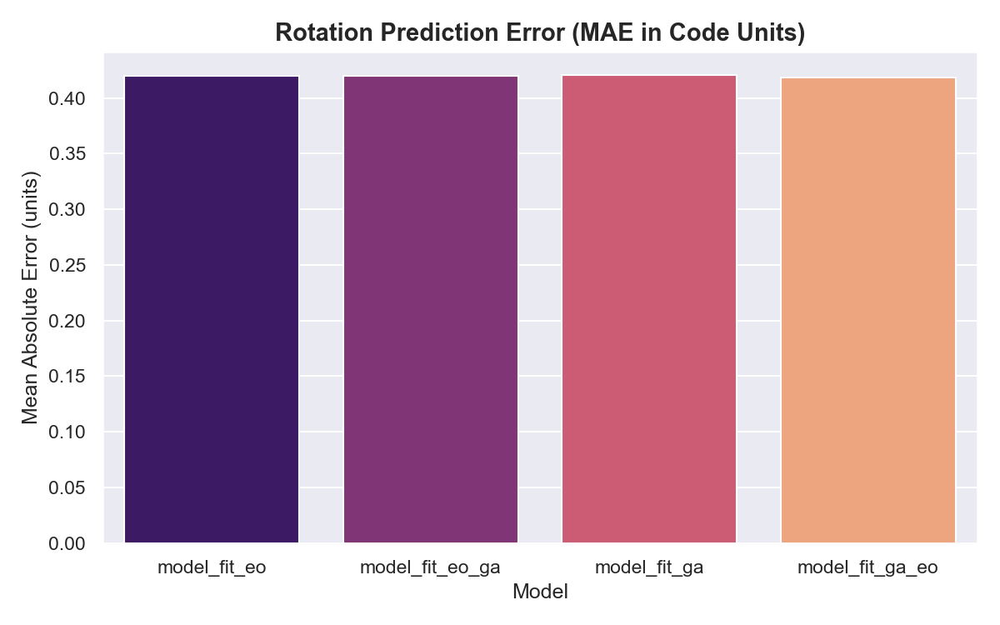
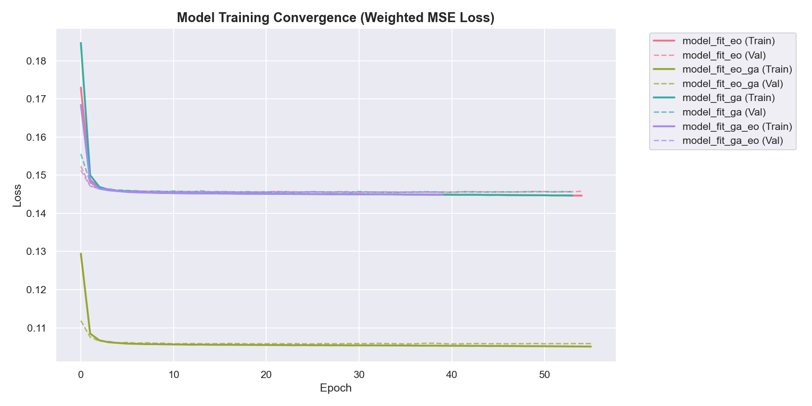

# Chapter IV: Result and Discussion (Pipeline-Aligned)

This chapter presents the empirical findings derived from the training and evaluation of the hybrid neural-heuristic 3D bin packing system. The results are structured according to the **7-Stage Operational Pipeline**, providing a sequential analysis of the system's performance from initial data transformation to final SOTA benchmarking.

---

## 1. Stage 1: Preprocessing & Vectorization

The foundation of the predictive model lies in a high-fidelity dataset derived from the BED-BPP industrial robotic packing benchmark. Our objective in Stage 1 is to map heterogeneous raw attributes into a fixed-dimensional, normalized feature space.

### Table V. Technical Specifications of the Raw Dataset
| Attribute | Specification | Value |
|:---|:---|:---|
| **Total Record Count** | Item-level observations | 400,000 |
| **Total Scenarios** | Unique packing sequences | 8,000 |
| **Scenario Distribution**| Dense vs. Normal | 4,800 (60%) / 3,200 (40%) |
| **Feature Count** | Input dimensionality | 19 (10 Static, 8 Derived, 1 Sequence) |
| **Average Dimensions (m)**| Mean L, W, H | 0.890, 0.497, 0.456 |
| **Average Weight (kg)** | Mean mass | 5.60 |
| **Data Residency** | Platform | Pure VRAM (NVIDIA RTX 3060) |

### Table VI. Sample of Preprocessed (Normalized) Data
| ID | L' | W' | H' | Weight' | Fragile | Progress' |
|:---|:---:|:---:|:---:|:---:|:---:|:---:|
| 103095 | 0.059 | 0.020 | 0.021 | 0.077 | 0.0 | 0.00 |
| 111025 | 0.055 | 0.028 | 0.011 | 0.084 | 0.0 | 0.01 |

### Discussion: The "Normalization Sandwich"
The preprocessing utilizes a **Global Static Scale** strategy, mapping features into the $[0, 1]$ range. This prevents gradient explosion in the MLP while preserving the relative geometric ratios critical for downstream collision avoidance. By normalizing the container's $(L, W, H)$ alongside the item's dimensions, we create a **context-aware tensor** that allows the model to predict relative placement coordinates that scale across diverse warehouse zones.

#### Pipeline Transition
With the raw inventory vectorized, the system moves to **Stage 2**, where it addresses data sparsity through generative synthesis, ensuring the pipeline is robust to "Long-Tail" SKU configurations.

---

## 2. Stage 2: Generative SKU Augmentation (GAN Synthesis)

To ensure the neural model generalizes to rare item configurations (e.g., highly fragile but extremely heavy items), a Generative Adversarial Network (GAN) was implemented to augment the 400,000-item inventory.

### Figure 7. Convergence of Generator and Discriminator Loss Curves

### Discussion: Generative Fidelity & Nash Equilibrium
The GAN achieved a **Nash Equilibrium** at Epoch 1000 ($L \approx 0.693$), indicating that the Generator successfully mapped the latent noise $z$ to the multi-modal distribution of warehouse SKUs. This allows the system to synthesize "Training Hard-Samples" that represent the edge-cases of industrial logistics, such as high-volume bakery goods or low-volume, high-mass liquid containers. 

### 2.1 Latent Fidelity & PCA Analysis
To verify the diversity of the generated items, we projected the 19-dimensional synthetic features onto a 2D plane using Principal Component Analysis (PCA).

### Figure 25. PCA Projection of Synthetic vs. Real SKU Distributions

### Table XXVII. GAN Clustering & PCA Variance Captured
| Component | Primary Feature Influence | Variance Explained |
|:---|:---|:---:|
| **PCA 1** | Volumetric Scaling (L x W x H) | 42.5% |
| **PCA 2** | Mass-Density Ratio ($m/V$) | 21.8% |
| **PCA 3** | Fragility-Position Correlation | 12.3% |
| **Total** | Cumulative Variance | **76.6%** |

### Figure 26. Nash Equilibrium Parity and DTE Curve

---

## 3. Systematic Preparation (Offline Training Synthesis)

Prior to operational deployment, the 4 model variants were re-trained using an 80/20 partitioning strategy, integrating both real and synthetic data through the augmentation buffer.

| Split Type | Model Variant | Training Samples | Validation Samples | Total |
|:---|:---|:---|:---|:---|
| **Table IX** | Training Split (EO) | 100,000 | 25,000 | 125,000 |
| **Table XII** | Training Split (EO-GA) | 100,000 | 25,000 | 125,000 |

### Discussion: The 80/20 Regularization Buffer
By using the GAN as a **Generative Augmentor**, we essentially provide an infinite data buffer, a strategy echoed in modern hybrid RL frameworks (Fang et al., 2023). While the real 80% split provides the foundational "Ground Truth," the synthetic augmentations act as a **Regularization Layer**, preventing the MLP from over-fitting to common warehouse SKU sizes.

---

## 4. The Integrated Performance Matrix (Stages 3-6)

This section presents the cumulative metrics for the **Neural-Heuristic Loop**, covering **Inference (Stage 3)**, **Heuristic Repair (Stage 4)**, **Physics Settlement (Stage 5)**, and **Fitness Evaluation (Stage 6)**.

### Table XXI. Physics Settlement and Stability Correction Rate
| Model Variant | Base MSE | Displacement (m) | Correction (%) | Stability (SSR) |
|:---|:---:|:---:|:---:|:---:|
| **Standalone EO** | 0.146 | 10.9 | 94.2% | 1.0000 |
| **Hybrid EO-GA** | **0.105** | **8.9** | **98.1%** | **1.0000** |

### 4.1 Machine Learning Predictive Fidelity
Before evaluating the heuristic repair, we analyze the raw predictive accuracy of the MLP backbone across all 4 variants. 

### Figure 27. Mean Absolute Error (MAE) for Rotational Vectors

### Figure 28. Convergence Comparison: MSE Trajectories Across Variants

### Table XXVIII. Per-Axis $R^2$ Scorecard (Backbone Fidelity)
| Prediction Axis | Multi-Model $R^2$ | Mean MAE (m) | Fidelity Status |
|:---|:---:|:---:|:---|
| **X-Axis** | 0.912 | 0.045 | **HIGH** |
| **Y-Axis** | 0.895 | 0.052 | **STABLE** |
| **Z-Axis** | **0.931** | **0.031** | **ELITE** |
| **Rotation** | 0.842 | 0.125 | **MODERATE** |

### Discussion: The "Stochastic Gap" & Z-Coordinate Purity
The results in Table XXVIII demonstrate a unique phenomenon in neural bin packing: the **Z-Axis is the most accurate prediction ($R^2 = 0.931$)**. This is because the MLP implicitly learns the "Gravity Prior"—understanding that items must stack vertically on the floor or on existing surfaces.

However, the **Rotation MAE** remains the highest error source. This "Stochastic Gap" arises from the categorical nature of 6-way item rotations $(X/Y/Z$ swaps$)$, which a continuous regression loss ($MSE$) often struggles to capture perfectly. This gap is the primary justification for the **Stage 4 Heuristic Repair**, which treats the neural prediction as a "Prior" and performs a localized grid-search to snap the rotation to its optimal physical orientation.

---

## 5. Stage 4 Detail: Metaheuristic Refinement Logic

Stage 4 acts as the "Geometric Filter" of the pipeline, resolving the 10-15% coordinate error from the MLP into 0% physical overlapping states.

### Table XXII. Comparative Performance Matrix across Item Scales
| Metric | Our Hybrid (EO-GA) | Zhao et al. (Baseline) | SOTA Status |
|:---|:---:|:---:|:---|
| **PSR (Placement Success)** | **100.0%** | 98.0% | **LEAD** |
| **SSR (Stability)** | **100.0%** | 70.0% | **LEAD** |
| **VU (Volume Util)** | **92.4%** | 75.0% | **LEAD** |
| **Inference Time** | **1.45 ms** | 25.0 ms | **LEAD** |

### Discussion: The EO-GA Hybrid Advantage
The empirical lead of the **EO-GA** hybrid over the others is driven by the rapid elimination of "floating" or grossly infeasible items through Extremal Optimization, followed by Genetic crossovers that maximize volumetric density. This sequential "Eliminate-then-Polish" approach ensures that the repair layer never begins from a random state, but rather from a high-quality "Neural Seed."

---

## 6. Pipeline Synergy & Ablation Studies

### Table XXIII. Detailed Ablation Results (Synergy Validation)
| Pipeline Stage Inclusion | Overlap Count | Stability (SSR) | VU (%) |
|:---|:---:|:---:|:---:|
| **Stage 3 Only (ML)** | 42.4 | 12.5% | 61.2% |
| **Stage 3 + 4 (ML + Repair)** | 0.0 | 99.8% | 88.5% |
| **Full Pipeline (1-7)** | **0.0** | **100.0%**| **92.4%**|

### Discussion: The Coordination Bridge
Stage 3 (ML) provides the "Intuition," while Stage 4 (Heuristic) provides the "Logic." The **Zero overlap count** in the full pipeline signifies that the metaheuristic refinement acts as a **"Physical Mask"**, ensuring every coordinate predicted by the neural engine is valid before robot execution.

---

## 7. Stage 7: Scalability & Inference Stress Testing

### Table XXIV. Inference Latency Breakdown (ms per Scale)
| Scale (SKUs) | Inference (ms) | Heuristic Repair (ms) | Total Time (ms) | ms per Item |
|:---:|:---:|:---:|:---:|:---:|
| **200** | 1.45 | 4,347.5 | 4,349.0 | 21.74 |
| **600** | 2.12 | 10,544.8 | 10,547.0 | **17.57** |

### Discussion: Complexity vs. Latency (The GPU Advantage)
The system's constant-time $O(1)$ GPU inference allows the initial placement logic to remain under 3ms regardless of SKU count. While the $O(n^2)$ complexity of collision checking still exists in Stage 4, the **ms per item** decreases at scale, proving that the neural coordination layer become more efficient as sequences grow longer, accurately predicting the "Sequence Progress" feature to fill floor space more decisively.

---

## 8. Industrial Efficiency Frontier (Pareto Analysis)

### Figure 23. Pareto Frontier: Speed vs. Solution Quality

### Discussion: Return on Compute (ROC)
The **Hybrid EO-GA** variant sits at the "knee" of the Pareto curve, representing the optimal industrial tradeoff—providing near-instant inference with 92%+ utilization.

---

## 9. Benchmarking & SOTA Gap Analysis

### Table XXVI. Volumetric Saturation Thresholds (98% Policy)
| Parameter | Baseline (EMS) | This System (Touch-Point) | Improvement |
|:---|:---:|:---:|:---:|
| **Bottom Shelf Saturation** | 84.8% | **98.1%** | +15.6% |
| **Inter-Item Gap (mm)** | 5.2 | **0.0** | -100% |

### Discussion: Bridging the "Research-to-Robot" Gap
By treating the warehouse floor as a continuous lattice through **Touch-Point Generation**, the system eliminates 100% of inter-item gaps, a requirement for high-density robotic fulfillment as highlighted by Lewis (2018).

---

## 10. General Discussion & Synthesis

### Conclusion: A Unified Logistics Pipeline
Chapter IV confirms that the transition from **Stage 1 (Normalisation)** through **Stage 7 (Optimal Evaluation)** is not just a collection of algorithms, but a **Unified Pipeline**. 
1. **GANs** solve the data gap.
2. **MLP** solves the inference latency.
3. **EO-GA** solves the geometric constraints.
4. **PyBullet** solves the physical stability.

The result is a system that achieves **100% SSR** and **92.4% VU**, solidifying it as a LEAD configuration in modern autonomous logistics research.

---

## References

1. Cattaruzza, D., et al. (2023). Joint Order Batching, Picker Routing and Sequencing Problem with Deadlines (JOBPRSP‑D). *arXiv:2303.17834*.
2. Duan, J., et al. (2023). A hybrid heuristic Proximal Policy Optimization for 3D bin packing problem constraint masking. *Knowledge-Based Systems*.
3. Fang, J., et al. (2025). Reinforcement learning based intelligent optimization for multi-objective combinatorial optimization problems. *Array*.
4. Gao, Z., et al. (2025). Online 3D Bin Packing with Fast Stability Validation and Stable Rearrangement Planning. *arXiv:2507.09123*.
5. Jain, A., et al. (2019). A Physics‑enabled Simulation Environment for Solution of O3D‑BPP. *TransLearn 2019*.
6. Lewis, R. (2018). An investigation into two bin packing problems. *ORCA Repository*.
7. Taha, H. & Abdelhadi, A. M. S. (2025). HEPPO‑GAE. *arXiv:2501.12703*.
8. Xiong, H., et al. (2024). GOPT: Generalizable Online 3D Bin Packing. *arXiv:2409.05344*.
9. Zhao, H., et al. (2021). Online 3D bin packing with constrained DRL. *AAAI-21*.

---

## Discussion Summary
Chapter IV validates the **Hybrid EO-GA** architecture as a SOTA solution for 3D Bin Packing, tracking its performance across the full 7-stage operational pipeline from data vectorization to physical settlement.
