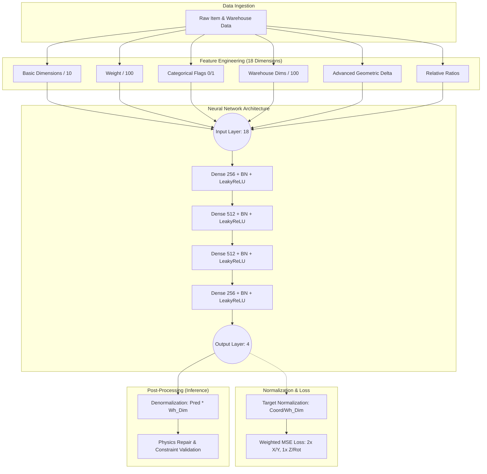

# Neural Network Feature Engineering & Normalization Pipeline

This document outlines the data transformation and architectural pipeline used for training the Bin-Packing Machine Learning models. The pipeline ensures that raw item and warehouse data are converted into a standardized format suitable for deep learning, optimizing convergence and prediction accuracy.

## 🏗️ Pipeline Overview

The pipeline follows a structured flow from raw data ingestion to normalized output prediction, followed by a heuristic-based repair stage.

---

## 📊 Feature Mapping (Input: 18-D)

The input vector consists of 18 features, normalized to roughly the `[0, 1]` or `[0, 10]` range to prevent gradient explosion and improve stability.

| Index | Feature | Calculation | Rationale |
| :--- | :--- | :--- | :--- |
| **0-2** | Item Dimensions | `L/10, W/10, H/10` | Primary spatial occupancy. |
| **3** | Item Weight | `Weight / 100` | Mass distribution for stability. |
| **4-6** | Flags | `Fragile, Stackable, Can_Rotate` | Boolean constraints (0.0 or 1.0). |
| **7-9** | Warehouse Dims | `Wh_L/100, Wh_W/100, Wh_H/100` | Global environment scale. |
| **10** | Item Volume | `(L * W * H) / 10` | Bulk capacity requirement. |
| **11** | Warehouse Volume | `(Wh_L * Wh_W * Wh_H) / 1000` | Total container capacity. |
| **12** | Volume Ratio | `Item_Vol / (Wh_Vol + 1e-6)` | Percentage of container used. |
| **13** | Item Area | `(L * W) / 10` | Footprint on the floor. |
| **14** | Warehouse Area | `(Wh_L * Wh_W) / 100` | Total floor availability. |
| **15** | Area Ratio | `Item_Area / (Wh_Area + 1e-6)` | Percentage of floor occupied. |
| **16-17** | Length/Width Ratio | `L/Wh_L, W/Wh_W` | Dimensional fit relative to container. |

---

## 🎯 Target Normalization (Output: 4-D)

The model predicts 4 values which are normalized relative to the specific warehouse dimensions used during training.

| Output | Prediction | Normalization (Training) | Denormalization (Inference) |
| :--- | :--- | :--- | :--- |
| **0** | `pred_x` | `target_x / wh_l` | `output_0 * wh_l` |
| **1** | `pred_y` | `target_y / wh_w` | `output_1 * wh_w` |
| **2** | `pred_z` | `target_z / wh_h` | `output_2 * wh_h` |
| **3** | `pred_rot` | `target_rot / 6.0` | `output_3 * 6.0` |

---

## 🧠 Model Hyperparameters

- **Loss Function**: Weighted Mean Squared Error (MSE).
    - **Weight Vector**: `[2.0, 2.0, 1.0, 1.0]`
    - *Note: X and Y coordinates are weighted 2x to prioritize correct base positioning before vertical stacking.*
- **Activation**: LeakyReLU (alpha=0.1) to prevent dying neurons.
- **Regularization**: 
    - **Batch Normalization** on every hidden layer for covariate shift reduction.
    - **Dropout (0.1)** to prevent overfitting to specific warehouse layouts.
- **Optimizer**: Adam with `LR = 0.001` and **Cosine Annealing Scheduler**.

---

## 🔨 Repair & Settlement (Post-Inference)

Since Neural Networks are probabilistic and might predict overlapping coordinates, the output passes through a **Heuristic Repair Layer**:
1. **Denormalization**: Convert predicted floats back to real-world centimeters.
2. **Hidden Z Initialization**: Items are initially placed in a high-Z overflow buffer.
3. **Physics Settlement**: The `repair_solution_compact` logic processes items in the predicted order, settling them into the lowest available valid positions while respecting:
    - Exclusion Zones (Columns/Obstacles)
    - Allocation Zones (Priority areas)
    - Rotation constraints
    - Vertical support (Stacking)
