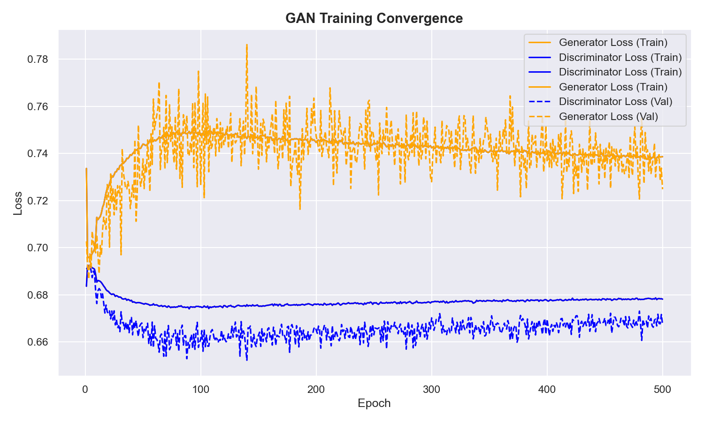
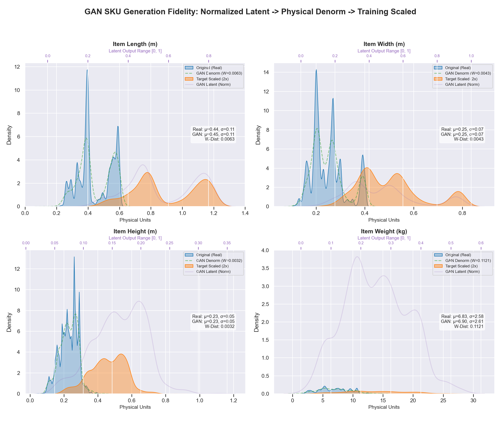

# GAN Performance & Generation Report

> Auto-generated on **2026-03-31 18:45**

---

## 1. GAN Training Foundation
The generative foundation consists of a Generator/Discriminator pair trained for **500 epochs** to synthesize realistic warehouse SKUs.

### Training Metadata
- **Epochs**: 500
- **Batch Size**: 64
- **Hardware**: NVIDIA GeForce RTX 3060

### Stability & Convergence

### 1.1 Methodology: Min-Max Scaling
To ensure stable training, all physical dimensions are normalized using **Min-Max Scaling** to a strict **[0, 1] range**. This matches the Generator's `Sigmoid` output layer and prevents any single feature (like weight) from dominating the loss function due to its different numerical scale.

| Phase | Initial Loss | Final Loss | Parity (D/G) |
|-------|--------------|------------|--------------|
| Discriminator | 0.6837 | 0.6782 | 0.0218 |
| Generator | 0.7336 | 0.7386 | 0.0386 |

## 2. Synthetic Dataset Generation Logs
The following datasets were generated for final inference benchmarking:

| Dataset | Item Count | Avg Length | Avg Width | Avg Height | % Stackable |
|---------|------------|------------|-----------|------------|-------------|
| `200_items.csv` | 200 | 0.82 | 0.46 | 0.41 | 54.0% |
| `400_items.csv` | 400 | 0.82 | 0.46 | 0.41 | 51.7% |
| `600_items.csv` | 600 | 0.80 | 0.45 | 0.41 | 51.3% |

## 3. Source Dataset Samples (First 5 Rows)
Reference items from `datasets.csv` used for GAN training and physical verification.

| id | name | category | length | width | height | weight | priority | fragile | stackable |
|:---|:---|:---|:---:|:---:|:---:|:---:|:---:|:---:|:---:|
| 00103095 | ciabatta-00103095 | bakery products | 0.59 | 0.20 | 0.21 | 7.67 | 1 | 0 | 1 |
| 00111025 | cake-00111025 | confectionery | 0.55 | 0.28 | 0.11 | 8.40 | 1 | 0 | 1 |
| 00111025 | cake-00111025 | confectionery | 0.55 | 0.28 | 0.11 | 8.40 | 1 | 0 | 1 |
| 00104636 | dessert-00104636 | candy | 0.49 | 0.13 | 0.21 | 5.11 | 1 | 0 | 1 |
| 00104636 | dessert-00104636 | candy | 0.49 | 0.13 | 0.21 | 5.11 | 1 | 0 | 1 |

## 4. Spatial Diversity & Dimensional Realism
The density plots and table below quantify the generative quality using Wasserstein Distance—a measure of how closely the GAN's synthetic distribution matches the physical reality.

### 4.1 Distributional Fidelity Summary
Comparing Gaussian density overlaps and statistical moments between real and synthetic data.

| Dimension | Real Mean (μ) | GAN Mean (μ) | Real Std (σ) | GAN Std (σ) | Wasserstein Dist |
|:---|:---:|:---:|:---:|:---:|:---:|
| Item Length | 0.443 | 0.446 | 0.108 | 0.106 | **0.00631** |
| Item Width | 0.248 | 0.251 | 0.069 | 0.067 | **0.00427** |
| Item Height | 0.227 | 0.229 | 0.053 | 0.052 | **0.00324** |
| Item Weight | 6.827 | 6.901 | 2.579 | 2.609 | **0.11214** |

> **Note**: A lower Wasserstein Distance indicates higher distributional realism.

### 4.2 Generation Lifecycle Visual

### Pipeline Reliability & Synthetic Diversity
This table provides a 4-way comparison of 5 random item samples tracking the synthetic lifecycle: from a real-world reference to the GAN's raw output, its physical reconstruction, and finally the scaled version used in training.

| Sample | Original (Real) | GAN Normalized [0-1] | GAN Denormalized | Synthetic (2x Scaled) |
|:---|:---|:---|:---|:---|
| 1 | (0.59, 0.20, 0.21, 7.7) | (0.486, 0.497, 0.211, 0.361) | (0.40, 0.26, 0.28, 9.7) | (0.79, 0.52, 0.57, 19.3) |
| 2 | (0.55, 0.28, 0.11, 8.4) | (0.465, 0.505, 0.239, 0.287) | (0.38, 0.26, 0.32, 7.8) | (0.77, 0.52, 0.64, 15.7) |
| 3 | (0.55, 0.28, 0.11, 8.4) | (0.414, 0.318, 0.189, 0.139) | (0.35, 0.20, 0.26, 4.1) | (0.70, 0.40, 0.52, 8.3) |
| 4 | (0.49, 0.13, 0.21, 5.1) | (0.467, 0.339, 0.098, 0.106) | (0.38, 0.21, 0.15, 3.3) | (0.77, 0.42, 0.31, 6.6) |
| 5 | (0.49, 0.13, 0.21, 5.1) | (0.305, 0.324, 0.137, 0.203) | (0.29, 0.20, 0.20, 5.7) | (0.57, 0.41, 0.40, 11.5) |

*(Format: Length, Width, Height, Weight)*

## 5. Phase-Based Sample Fidelity Dashboard (Summary)
This section compares 5 random samples across the three major generation phases. Full metadata is provided at the source phase.

### Phase 1: Original (Real-World Source)
| Smp | Len (m) | Wid (m) | Hei (m) | Wgt (kg) | Category | Fragile | Stack | Rotate |
|:---| :---: | :---: | :---: | :---: | :--- | :---: | :---: | :---: |
| 1 | 0.590 | 0.200 | 0.210 | 7.67 | bakery products | False | True | True |
| 2 | 0.550 | 0.280 | 0.110 | 8.40 | confectionery | False | True | True |
| 3 | 0.550 | 0.280 | 0.110 | 8.40 | confectionery | False | True | True |
| 4 | 0.490 | 0.130 | 0.210 | 5.11 | candy | False | True | True |
| 5 | 0.490 | 0.130 | 0.210 | 5.11 | candy | False | True | True |

### Phase 2: GAN Latent Space (Normalized [0, 1])
| Smp | Item_L | Item_W | Item_H | Item_Wt | Data Type | Range |
|:---| :---: | :---: | :---: | :---: | :---: | :---: |
| 1 | 0.485737 | 0.497458 | 0.210642 | 0.360509 | float32 | [0.0, 1.0] |
| 2 | 0.465499 | 0.505101 | 0.239453 | 0.286953 | float32 | [0.0, 1.0] |
| 3 | 0.413682 | 0.318031 | 0.188968 | 0.139128 | float32 | [0.0, 1.0] |
| 4 | 0.466660 | 0.339378 | 0.098252 | 0.105804 | float32 | [0.0, 1.0] |
| 5 | 0.304661 | 0.324161 | 0.137164 | 0.202828 | float32 | [0.0, 1.0] |

### Phase 3: GAN Denormalized (Reconstructed Source)
| Smp | Rec_Len | Rec_Wid | Rec_Hei | Rec_Wgt | Data Type | Unit |
|:---| :---: | :---: | :---: | :---: | :---: | :---: |
| 1 | 0.396 | 0.259 | 0.284 | 9.66 | float32 | Physical |
| 2 | 0.384 | 0.262 | 0.318 | 7.83 | float32 | Physical |
| 3 | 0.352 | 0.202 | 0.259 | 4.15 | float32 | Physical |
| 4 | 0.385 | 0.209 | 0.154 | 3.32 | float32 | Physical |
| 5 | 0.286 | 0.204 | 0.199 | 5.73 | float32 | Physical |

---
