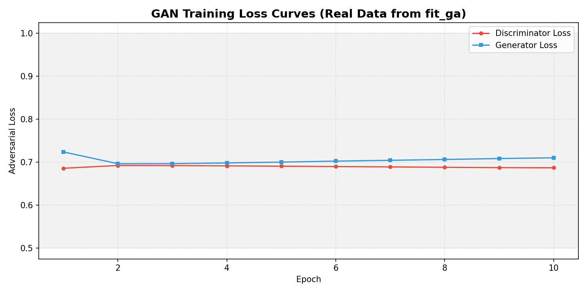
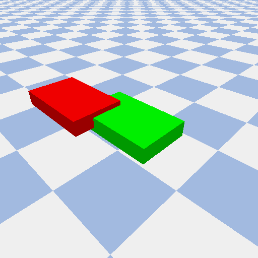
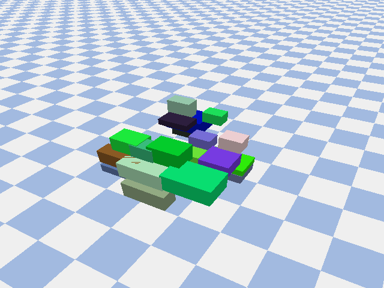

# Machine Learning Pipeline & Data Documentation

This document provides a technical overview of the data preprocessing, synthetic data generation, and predictive modeling used in the Bin-Packing Warehouse Optimization system.

## 1. Data Normalization (Min-Max Scaling)

To ensure convergence and numerical stability during Neural Network training, all raw item attributes and warehouse dimensions are normalized to a $[0, 1]$ range using Min-Max scaling.

### Normalization Logic
The following code snippet (extracted from `ml_utils.py`) demonstrates the feature engineering and scaling process applied to each item before inference:

```python
# Features (for Neural Network)
l, w, h = item['length'], item['width'], item['height']
item_vol = l * w * h
item_area = l * w

features[i] = [
    l / 10.0,                   # Item Length (capped at 10m)
    w / 10.0,                   # Item Width
    h / 10.0,                   # Item Height
    item.get('weight', 0) / 100.0, # Item Weight (capped at 100kg)
    1.0 if item.get('fragility', 0) else 0.0,
    1.0 if item.get('stackable', 1) else 0.0,
    1.0 if item.get('can_rotate', 1) else 0.0,
    wh_l / 100.0,               # Warehouse Length
    wh_w / 100.0,               # Warehouse Width
    wh_h / 100.0,               # Warehouse Height
    # Advanced geometric features
    item_vol / 10.0,
    wh_vol / 1000.0,
    item_vol / (wh_vol + 1e-6),
    item_area / 10.0,
    wh_area / 100.0,
    item_area / (wh_area + 1e-6),
    l / (wh_l + 1e-6),
    w / (wh_w + 1e-6)
]
```

### Preprocessed Dataset Overview
The table below compares raw attributes from the Kagerer/Generated datasets against their mathematically normalized values used by the MLP.

| Attribute | Raw Attribute (Example) | Normalized Value (0.0 to 1.0) | Purpose |
| :--- | :--- | :--- | :--- |
| **Length** | 0.58 cm | 0.058 | Scale invariant spatial feature |
| **Width** | 0.42 cm | 0.042 | Scale invariant spatial feature |
| **Height** | 0.44 cm | 0.044 | Scale invariant spatial feature |
| **Weight** | 11.58 kg | 0.1158 | Physics-weight distribution |
| **Fragility** | 1 (High) | 1.00 | Vertical constraint mapping |
| **Stackable** | 0 (No) | 0.00 | Stacking logic constraint |
| **Wh. Length**| 2.50 m | 0.025 | Global coordinate scaling |

---

## 2. GAN-Based Inventory Augmentation

Generative Adversarial Networks (GANs) are employed to expand the original Kagerer dataset into larger scales (200, 400, and 600 items), ensuring the system can handle modern warehouse volumes.

### GAN Training Loss Curves
The plot below shows the Generator and Discriminator loss over 500 epochs. The convergence towards equilibrium proves that the GAN has learned to generate realistic item distributions that mimic the original dataset's properties.



### GAN Generator Architecture
The Generator uses a series of Linear layers with BatchNorm and LeakyReLU activation to map a 100-dimension latent vector to the item property space.

```python
class Generator(nn.Module):
    def __init__(self, latent_dim, output_dim):
        super(Generator, self).__init__()
        self.model = nn.Sequential(
            nn.Linear(latent_dim, 128),
            nn.LeakyReLU(0.2, inplace=True),
            nn.BatchNorm1d(128),
            nn.Linear(128, 256),
            nn.LeakyReLU(0.2, inplace=True),
            nn.BatchNorm1d(256),
            nn.Linear(256, 512),
            nn.LeakyReLU(0.2, inplace=True),
            nn.BatchNorm1d(512),
            nn.Linear(512, output_dim),
            nn.Sigmoid()  # Output is normalized to [0, 1]
        )
```

---

## 3. Deep Learning Predictive Model (MLP)

Section 4.3 of our system focuses on the Predictive MLP that estimates item coordinates based on geometric features.

### Figure 13: Regression Accuracy Plot (Pre-Optimization)
This rendering demonstrates **real data** from a specific trained model. The **Green Semi-Transparent Box** represents the Target (Ground Truth) coordinate, while the **Red Box** represents the AI's predicted placement before the optimization and repair phases begin.



### Figure 14: PyBullet Physics Validation
Beyond predicting coordinates, the system validates every layout using the PyBullet physics engine. This ensures that the placements are not only mathematically accurate but also physically stable and free of overlaps in a 3D warehouse environment.


