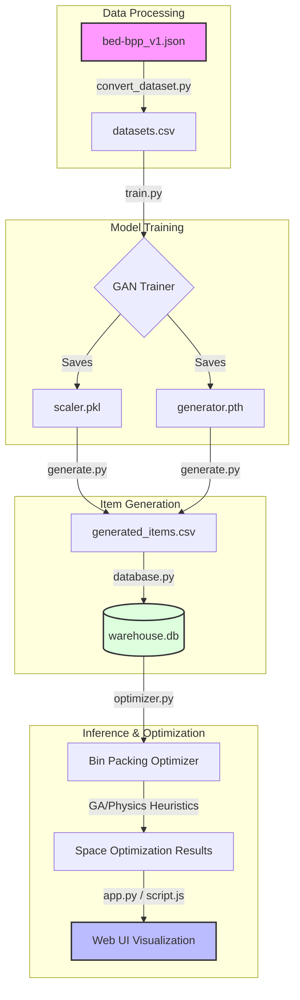

# BPP to GAN Generation & Inference Workflow

This document outlines the end-to-end data pipeline from the raw dataset to synthetic item generation and final optimization.

## Workflow Flowchart

## Component Details

### 1. Data Processing (`bed-bpp` to [datasets.csv](file:///c:/Users/TotoBakod/Documents/Github/Training-Bin-Packing/datasets/datasets.csv))
- **Tool**: [datasets/convert_dataset.py](file:///c:/Users/TotoBakod/Documents/Github/Training-Bin-Packing/datasets/convert_dataset.py)
- **Goal**: Extracts key physical properties from the raw JSON dataset (mm to meters conversion, weight extraction, category mapping).
- **Features**: `length`, `width`, `height`, `weight`, [category](file:///c:/Users/TotoBakod/Documents/Github/Training-Bin-Packing/gan/generate.py#29-36), `priority`, etc.

### 2. Model Training
- **Tool**: [gan/train.py](file:///c:/Users/TotoBakod/Documents/Github/Training-Bin-Packing/gan/train.py)
- **Architecture**: Generative Adversarial Network (GAN) with a Generator and Discriminator.
- **Output**: 
    - [scaler.pkl](file:///c:/Users/TotoBakod/Documents/Github/Training-Bin-Packing/gan/scaler.pkl): The `MinMaxScaler` used to normalize dimensions.
    - `generator.pth`: The trained weights for the Generator model.

### 3. GAN Generation
- **Tool**: [gan/generate.py](file:///c:/Users/TotoBakod/Documents/Github/Training-Bin-Packing/gan/generate.py)
- **Process**: 
    1. Generates 4-dimensional latent vectors (representing l, w, h, weight).
    2. Uses heuristics to assign categorical properties (fragility, stackability) based on real-world distributions found in [datasets.csv](file:///c:/Users/TotoBakod/Documents/Github/Training-Bin-Packing/datasets/datasets.csv).
    3. Outputs `gan/generated_items.csv`.

### 4. Inference & Tools
- **Data Loading**: [database.py](file:///c:/Users/TotoBakod/Documents/Github/Training-Bin-Packing/database.py) imports the synthetic items into the SQLite database ([warehouse.db](file:///c:/Users/TotoBakod/Documents/Github/Training-Bin-Packing/warehouse.db)).
- **Optimization**: [optimizer.py](file:///c:/Users/TotoBakod/Documents/Github/Training-Bin-Packing/optimizer.py) uses the synthetic items to perform complex 3D bin packing calculations using:
    - **Genetic Algorithms**: Evolving better spatial arrangements.
    - **Physics Heuristics**: Ensuring stability, gravity support, and accessibility.
- **Visualization**: [app.py](file:///c:/Users/TotoBakod/Documents/Github/Training-Bin-Packing/app.py) serves the data to a 3D Web UI ([index.html](file:///c:/Users/TotoBakod/Documents/Github/Training-Bin-Packing/index.html) + [script.js](file:///c:/Users/TotoBakod/Documents/Github/Training-Bin-Packing/script.js)) for real-time visualization of the packing solutions.
