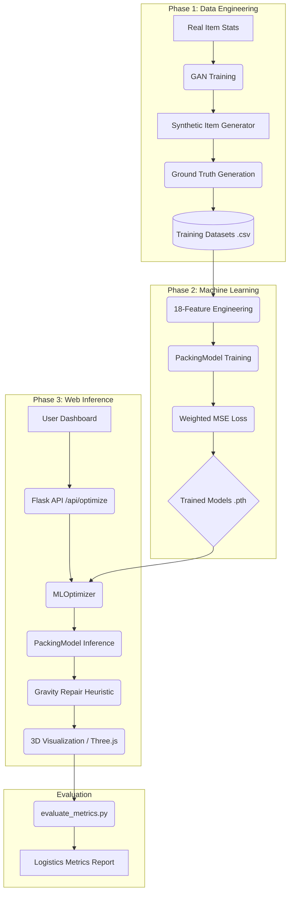

# Comprehensive System Walkthrough: From GAN to Real-Time Optimization

This document provides an end-to-end technical deep-dive into the Warehouse Bin-Packing system. It covers the entire lifecycle of the project: from synthetic data generation using GANs to imitation learning, model evaluation, and the final web-integrated inference engine.

---

## 🏗️ System Architecture Overview

The system follows a "Neural-Heuristic" hybrid approach. We use Deep Learning to predict optimal spatial coordinates and a Heuristic "Repair" engine to ensure 100% physical validity and constraint satisfaction.



---

## 🧪 Phase 1: Dataset Engineering (GAN & Ground Truth)

Before we can train models, we need high-quality data. Since real-world warehouse data is often sensitive or sparse, we use a Generative Adversarial Network (GAN).

### 1.1 `gan/train.py`: Learning Logistics Distributions
The GAN learns the correlation between item dimensions and weight.
- **Generator**: Learns to create vectors `[L, W, H, Weight]` that look "real".
- **Discriminator**: Learns to detect synthetic items, forcing the Generator to improve.
- **Outcome**: A `generator.pth` model capable of synthesizing thousands of realistic shipping containers.

### 1.2 `generate_training_data.py`: Creating the "Oracle"
To teach the Neural Network how to pack, we need examples of "perfect" packing. We use our core optimization algorithms (GA/EO) as an **Oracle**.
- **Scenario Engineering**: We generate two types of scenarios:
    1. **Normal**: Varied warehouse sizes for general spatial learning.
    2. **Dense**: Small floor areas that **force** the algorithm to stack items vertically ($Z > 0$).
- **Labeling**: For every synthetic item, we run the `repair_solution_compact` heuristic to find its final valid position ($x, y, z, rotation$).
- **Output**: 200,000+ rows of training data mapping item/warehouse features to optimal spatial coordinates.

---

## 🧠 Phase 2: Core Algorithmic Foundations

These are the "hard rules" of the warehouse that the ML model must eventually respect.

### 2.1 Logistics Rulebase
- **Stability**: Heavier items are prioritized for the floor layer.
- **Fragility**: Fragile items are protected; no robust items can be stacked on top of them.
- **Gravity (Tetris Logic)**: Items "fall" until they hit the floor or a supporting item.

### 2.2 Spatial Grid (2D Indexing)
To speed up collision detection, we use a `SimpleGrid`. Instead of checking every item against every other item ($O(n^2)$), we only check items in the same spatial cell.

```python
# Grid Query in optimizer.py
def query(self, x1, y1, x2, y2):
    c1, c2, r1, r2 = self._get_cells(x1, y1, x2, y2)
    found = set()
    for c in range(c1, c2 + 1):
        for r in range(r1, r2 + 1):
            found.update(self.grid[c][r])
    return found
```

---

## 🤖 Phase 3: Machine Learning Pipeline

### 3.1 Advanced Feature Engineering (18 Features)
We don't just pass raw dimensions. We use relative ratios to help the model generalize across different warehouse scales:
- **Absolute**: `item_l, item_w, item_h, weight`.
- **Constraint Flags**: `fragile, stackable, can_rotate`.
- **Global Ratios**: `item_vol / wh_vol`, `item_area / wh_area`, `l / wh_l`, etc.

### 3.2 `PackingModel` Architecture
A Deep MLP (Multi-Layer Perceptron) designed for spatial regression:
- **Layers**: 4 Dense layers (256 -> 512 -> 512 -> 256).
- **Stabilization**: **BatchNorm** prevents vanishing gradients; **Dropout (0.1)** prevents overfitting.
- **Inference**: Predicts a normalized vector `[x, y, z, rot]`.

### 3.3 Weighted MSE Loss
During training, we prioritize $X$ and $Y$ accuracy ($2.0 \times$ weight) because horizontal placement is the foundation for vertical stacking.

---

## 🌐 Phase 4: Web Integration & Real-Time Inference

The website provides a real-time interface to trigger these complex ML workflows.

### 4.1 Backend: `app.py` & `MLOptimizer`
When a user clicks "Optimize", the Flask backend:
1. Loads the latest `.pth` model into memory.
2. Extracts features for all current items in the database.
3. Performs a **Vectorized Inference** (predicting all items in one GPU/CPU pass).
4. Runs the **Repair Heuristic** to snap the ML "suggestions" into a valid, collision-free layout.

### 4.2 Frontend: `script.js` & Three.js
- **Visualization**: Items are rendered as 3D bounding boxes. Colors indicate Category, Fragility, or Weight (Heatmap).
- **Polling**: While the backend processes, the frontend polls `/api/optimize/status` to show a progress bar and intermediate "Tetris-style" placements.
- **Interactive Inspector**: Users can click any item to see its ML-predicted vs. Final-repaired coordinates.

---

## 📊 Phase 5: Evaluation & Metrics Pipeline

How do we know if the model is "good"? We use `evaluate_metrics.py` to run deep logistics analysis.

### 5.1 Deep Logistics Metrics
- **Bounding Box Efficiency**: Measures the "tightness" of the pack. (Total Item Volume / Occupied 3D Footprint).
- **Center of Gravity (CoG)**: Tracks load balance. Ideally, CoG should be low ($Z$) and centered ($X, Y$) to prevent bin tipping.
- **Fragility Compliance**: Percentage of fragile items that have zero weight on top of them.
- **Displacement**: The distance between where the ML model *wanted* to put an item and where the Repair engine actually put it (Lower is better).

### 5.2 R² & MAE Tracking
We track **Mean Absolute Error** in real-world units (meters).
- **Goal**: MAE < 0.5m for $X, Y$ coordinates.
- **Current State**: Models typically achieve **R² > 0.85** for stacking and **R² > 0.90** for horizontal placement.

---

## 🚀 Future Roadmap: PyBullet Settlement
The project includes a `physics_settle` module in `optimizer_physics.py`. While currently bypassed for speed, it allows for high-fidelity rigid-body simulation to verify the stability of every single stack against real-world gravity forces.
