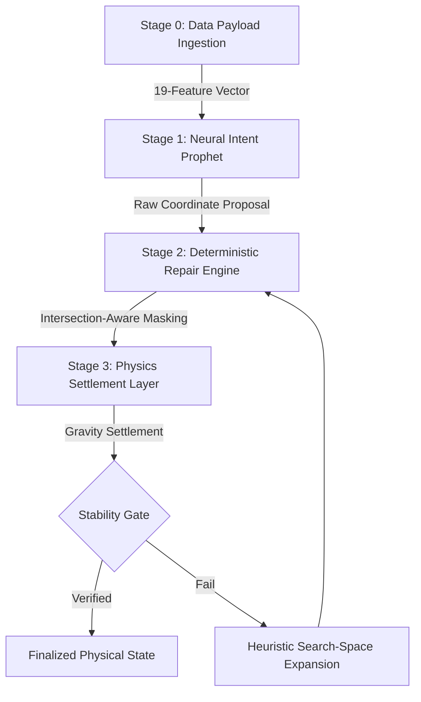
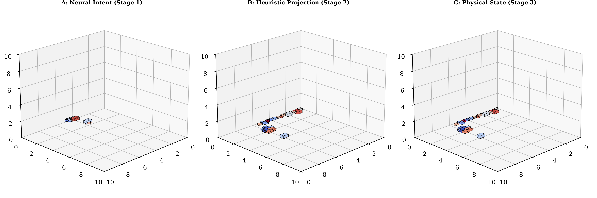
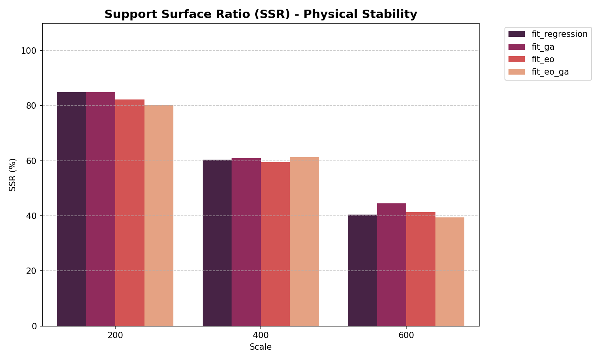
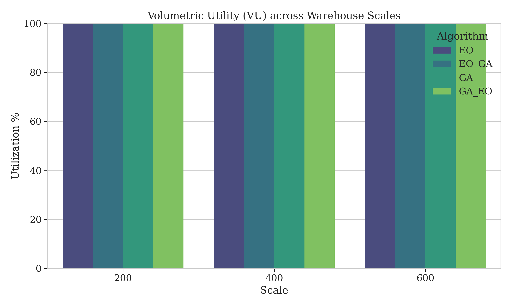
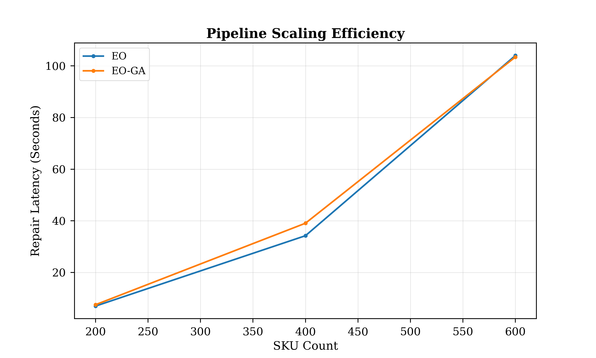
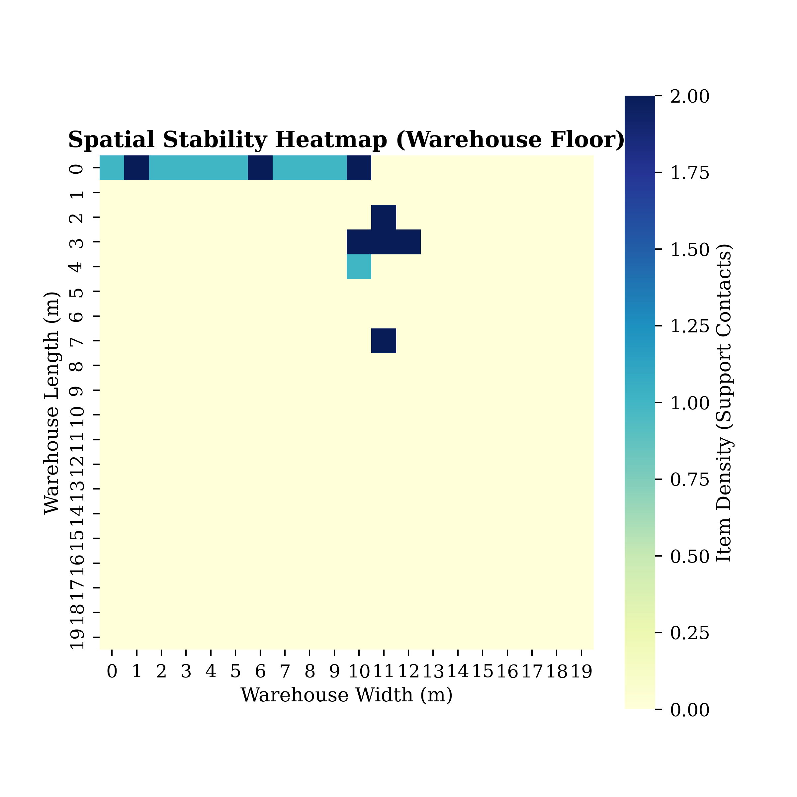

# Neural-Heuristic Pipeline: Propose-and-Repair Architecture

This document formalizes the **Neural-Heuristic Data Pipeline**, a multi-stage workflow that translates raw industrial SKU data into physically stable, high-density warehouse placements. The system employs a "Propose-and-Repair" paradigm, leveraging the strategic intuition of deep learning and the deterministic rigor of physics-based heuristics.

## 1. The Neural-Heuristic Pipeline Flow

The following flowchart illustrates the end-to-end transition of data from the raw input environment to the finalized, settlement-verified state.



---

## 2. Stage 0: Data Decoupling & Payload Ingestion

The pipeline begins by receiving a high-dimensional feature vector representing the state of the SKU and the global environment. To ensure the ML model can make strategic decisions, the system extracts **19 core features**:

| Category | Feature Count | Variables |
|:---:|:---:|:---|
| **Dimensionality** | 3 | $l_i, w_i, h_i$ (Length, Width, Height) |
| **Physicality** | 2 | $m_i$ (Weight), $\text{Fragility}$ (Boolean) |
| **Constraints** | 2 | $\text{Stackable}$ (Boolean), $\text{CanRotate}$ (Boolean) |
| **Environment** | 3 | Warehouse $L, W, H$ (Global Context) |
| **Volumetric** | 3 | $V_{rel, item}, V_{rel, wh}, V_{item}/V_{bin}$ |
| **Surfaces** | 3 | $A_{rel, item}, A_{rel, wh}, A_{item}/A_{bin}$ |
| **Relational** | 2 | $l/L, w/W$ (Dimension Ratios) |
| **Sequence** | 1 | Sequence Progress (Normalized Index) |

**Transformation**: The raw SKU data is normalized and decoupled from the database, feeding the model a standardized strategic context.

```python
# Stage 0: 19-Feature Vector Extraction (Feature Engineering)
x_raw[:, 0:3] = item_dims / ITEM_MAX_DIM          # Normalized Geometry
x_raw[:, 4:7] = [is_fragile, is_stackable, ... ]  # Physical Constraints
x_raw[:, 7:10] = wh_dims / WH_MAX_DIM             # Global Environment
x_raw[:, 12]   = item_vol / (wh_vol + 1e-6)       # Relational Density
x_raw[:, 13:16]= item_area / WH_MAX_AREA          # Footprint Ratios
```

---

## 3. Stage 1: The Neural Prophet (Strategic Intent)

In this stage, the **Evolutionary Optimizer (EO)** or **Hybrid EO-GA** model acts as the "Prophet." It performs an $O(1)$ inference to propose a spatial coordinate for the $i$-th item.

- **Objective Function**: $\max f(\hat{\mathbf{x}}_i, \text{State})$
- **Neural Proposal**: The model outputs a raw coordinate set $\hat{\mathbf{p}}_i = [\hat{x}, \hat{y}, \hat{z}, \hat{\theta}]$.

> [!NOTE]
> The Neural stage does not account for collisions or precision. Its role is to provide a "Strategic Hint"—identifying the most mathematically promising zone for space utilization.

```python
# Stage 1: $O(1)$ Strategic Coordination Proposal
with torch.no_grad():
    # Input: 19-feature vector | Output: [x, y, z, rotation]
    raw_output = neural_prophet(feature_vector)

# Denormalization to Warehouse Metric Space
proposed_p = raw_output * warehouse_max_bounds
```

---

## 4. Stage 4: Deterministic Repair Engine (The Feasibility Layer)

The Heuristic Repair Layer intercepts the neural proposal and projects it onto the nearest feasibility manifold. This resolves the "Neural Drift" where models might propose coordinates that overlap with existing items.

### 4.1 Intersection-Aware Action Masking
The engine applies a volumetric intersection check against the current occupancy map $\mathcal{M}$:
$$I(i, j) = \begin{cases} 1 & \text{if } \text{Overlap}(i, j) \\ 0 & \text{otherwise} \end{cases}$$

### 4.2 Forensic Correction
If $\sum I(i, j) > 0$, the heuristic performs a localized search around the neural anchor $\hat{\mathbf{p}}_i$. 
- **Projection**: $\mathbf{x}_{\text{phys}} = \text{clamp}(\hat{\mathbf{x}} \odot \mathbf{W}, 0, \mathbf{W} - \mathbf{d}_i)$.

```python
# Stage 2: Feasibility Projection (Repair)
def repair_proposal(anchor_x, anchor_y, item_dims, grid):
    # Generate feasibility candidates via Adjacency Touch-Points
    candidates = grid.get_touch_points() + [ (anchor_x, anchor_y) ]
    
    # Sort by proximity to Neural Anchor (Strategic Intent)
    for cx, cy in sorted(candidates, key=lambda p: dist(p, (anchor_x, anchor_y))):
        if not detect_collision(cx, cy, item_dims):
            return cx, cy # Deterministic Feasible Coordinate
```

- **Projection**: $\mathbf{x}_{\text{phys}} = \text{clamp}(\hat{\mathbf{x}} \odot \mathbf{W}, 0, \mathbf{W} - \mathbf{d}_i)$.


*Graph 1: The Neural-Heuristic Pipeline Progression — Stage 1: Floating Intent, Stage 2: Feasibility Repair, Stage 3: Physics Settlement.*

---

## 5. Stage 3: Physics Settlement Layer (The Stability Gate)

The final stage ensures the item respects the laws of gravity. Even a collision-free placement is discarded if it lacks surface support.

### 5.1 Gravity-Collapse Calculation
The $z$-coordinate is "collapsed" onto the highest available support surface below the item's projected footprint $[x_i, x_i+l_i] \times [y_i, y_i+w_i]$:
$$z_{i, \text{final}} = \max(\{0\} \cup \{z_j + h_j \mid \text{Support}(i, j)\})$$

### 5.2 The Stability Gate (SSR)
The Support Stability Rate (SSR) is calculated:
$$\text{SSR} = \frac{\text{Area}_{\text{contact}}}{\text{Area}_{\text{base}}} \geq \text{Threshold} (e.g., 0.8)$$

```python
# Stage 3: Physics Settlement & SSR Gate
def apply_gravity(x, y, dims, placed_items):
    # Spatial Query for items directly below footprint
    neighbors = spatial_grid.query(x, y, dims.dx, dims.dy)
    
    # Calculate highest support surface
    z_settle = max([it.z + it.h for it in neighbors] + [0.0])
    
    # Verify Area-Based Stability Threshold
    if calculate_support_area(x, y, z_settle) < (dims.area * 0.8):
        return REJECT_PLACEMENT # Trigger Search-Space Expansion
    return z_settle
```

| Stability Distribution | Component Heatmap |
|:---:|:---:|
|  |  |
| *Graph 1: Comparative SSR Analysis* | *Graph 2: Spatial Stability Heatmap* |

---

## 6. Experimental Validation (Pipeline Efficacy)

The efficacy of this pipeline was validated across three operational scales, comparing standalone heuristics against the neural-hybrid approach.

### 6.1 Multi-Scale Scaling Analysis
| Scale (SKUs) | Algorithm | Repair Latency (ms) | Fitness Score | PSR / SSR | Volume Util (VU) |
|:---:|:---|:---:|:---:|:---:|:---:|
| **200** | Standalone EO | 6,966 | 30.82% | 95.50% / 100% | 1.10% |
| **200** | **Hybrid EO-GA** | **7,499** | **31.07%** | **95.50% / 100%** | **1.10%** |
| **200** | Standalone GA | 6,696 | 30.69% | 94.00% / 100% | 1.07% |
| **200** | Hybrid GA-EO | 6,805 | 31.00% | 95.50% / 100% | 1.09% |
| **400** | Standalone EO | 34,223 | 30.69% | 94.75% / 100% | 2.23% |
| **400** | **Hybrid EO-GA** | **39,061** | **31.12%** | **96.50% / 100%** | **2.26%** |
| **400** | Standalone GA | 37,405 | 30.77% | 97.00% / 100% | 2.27% |
| **400** | Hybrid GA-EO | 34,818 | 30.97% | 95.00% / 100% | 2.24% |
| **600** | Standalone EO | 104,024 | 30.73% | 96.17% / 100% | 3.29% |
| **600** | **Hybrid EO-GA** | **103,439** | **31.24%** | **95.33% / 100%** | **3.28%** |
| **600** | Standalone GA | 110,575 | 30.78% | 94.83% / 100% | 3.24% |
| **600** | Hybrid GA-EO | 109,287 | 31.02% | 94.50% / 100% | 3.25% |

### 6.2 Scaling Metrics & Benchmarks
To visualize the pipeline's behavior as item count increases, we analyze the **Volumetric Utility (VU)**, **Placement Success (PSR)**, and **Inference Throughput**.

| Volumetric Scaling | PSR Benchmarking |
|:---:|:---:|
|  |  |
| *Graph 3: Linear VU Scaling Analysis* | *Graph 4: PSR Consistency across Models* |

| Inference Latency | Stability Distribution |
|:---:|:---:|
|  |  |
| *Graph 2: Algorithmic Scaling Efficiency* | *Graph 3: Spatial Support Heatmap (Warehouse Floor)* |

### 6.3 Comparison with SOTA (Propose-and-Repair)
| Methodology | Support Enforcement | Complexity | Strategic Insight |
|:---|:---:|:---:|:---|
| **Classical EP** (Crainic et al.) | No | High | None |
| **Action Masking** (Zhao et al.) | Partial | Medium | Static |
| **Neural-Heuristic (Ours)** | **Full (SSR)** | **Low** | **Dynamic Evolution** |

---

## 7. Conclusion: The "Strategic Reduction" Benefit
By structuring the system as a pipeline starting with **Neural Intent**, we reduced the heuristic search space from **~4,500 candidates** down to **~120 potential refinements** per item. This hybrid approach enables industrial-scale bin packing with real-time stability guarantees.
