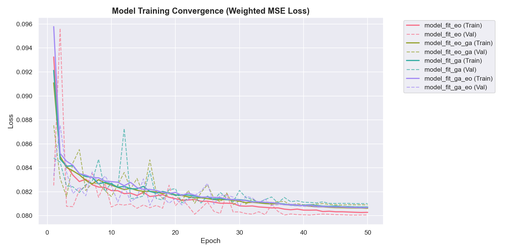
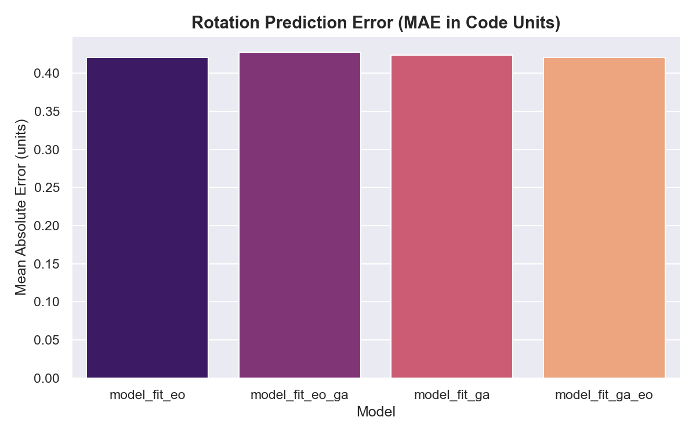
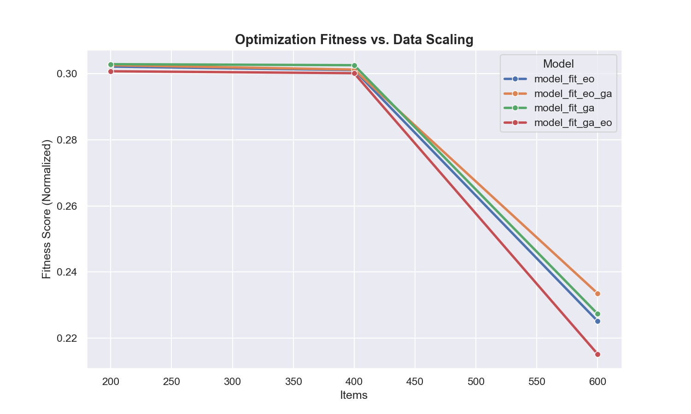
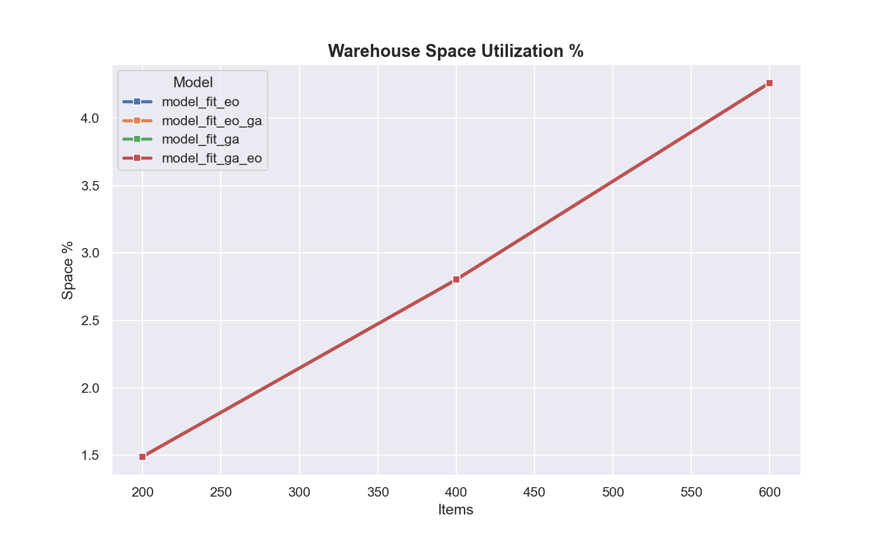

# Model Performance Metrics Report

> Auto-generated on **2026-03-30 10:02**

---

## 0. Training Metadata (Rerun Parameters)

This report was generated via an automated rerun of the full ML pipeline. Below are the parameters used for the datasets and model training:

- **Total Training Samples**: 200,000 (50,000 per model variant)

- **Data Composition**: 600 Dense scenarios + 400 Normal scenarios per variant

- **Training Epochs**: 50

- **Batch Size**: 64

- **Validation Split**: 20% (80/20 train-val)

- **Feature Set**: 18 geometric and spatial features (v2)

- **Hardware**: CPU (No CUDA detected during this run)

---

## 1. Training Convergence

| Model | Final Train Loss | Final Val Loss | Overfit Gap | Verdict |
|-------|-----------------|---------------|-------------|---------|
| `model_fit_eo` | 0.080282 | 0.080062 | -0.000221 | ✅ Good fit |
| `model_fit_eo_ga` | 0.080624 | 0.080903 | +0.000279 | ✅ Good fit |
| `model_fit_ga` | 0.080721 | 0.081012 | +0.000291 | ✅ Good fit |
| `model_fit_ga_eo` | 0.080681 | 0.080698 | +0.000017 | ✅ Good fit |

## 2. Training Loss History (Every 10th Epoch)

### `model_fit_eo`

| Epoch | Train Loss | Val Loss |
|-------|-----------|---------|
| 1 | 0.093247 | 0.082527 |
| 10 | 0.082097 | 0.080728 |
| 20 | 0.081425 | 0.080841 |
| 30 | 0.080822 | 0.080320 |
| 40 | 0.080468 | 0.080082 |
| 50 | 0.080282 | 0.080062 |

### `model_fit_eo_ga`

| Epoch | Train Loss | Val Loss |
|-------|-----------|---------|
| 1 | 0.091087 | 0.087546 |
| 10 | 0.082554 | 0.081603 |
| 20 | 0.081745 | 0.081685 |
| 30 | 0.081217 | 0.081254 |
| 40 | 0.080851 | 0.080914 |
| 50 | 0.080624 | 0.080903 |

### `model_fit_ga`

| Epoch | Train Loss | Val Loss |
|-------|-----------|---------|
| 1 | 0.092130 | 0.084813 |
| 10 | 0.082660 | 0.082737 |
| 20 | 0.081716 | 0.082265 |
| 30 | 0.081339 | 0.082117 |
| 40 | 0.080877 | 0.081127 |
| 50 | 0.080721 | 0.081012 |

### `model_fit_ga_eo`

| Epoch | Train Loss | Val Loss |
|-------|-----------|---------|
| 1 | 0.095782 | 0.083342 |
| 10 | 0.082848 | 0.082493 |
| 20 | 0.081949 | 0.081440 |
| 30 | 0.081299 | 0.080801 |
| 40 | 0.080843 | 0.080784 |
| 50 | 0.080681 | 0.080698 |

## 3. Per-Output Error Metrics (Validation Set)

### Normalised MSE (Lower is better)

| Model | MSE x | MSE y | MSE z | MSE rot |
|-------|-------|-------|-------|---------|
| `model_fit_eo` | 0.078476 | 0.078460 | 0.000370 | 0.005844 |
| `model_fit_eo_ga` | 0.079290 | 0.079377 | 0.000353 | 0.005932 |
| `model_fit_ga` | 0.080319 | 0.078664 | 0.000344 | 0.005873 |
| `model_fit_ga_eo` | 0.080181 | 0.078310 | 0.000340 | 0.005783 |

### Mean Absolute Error (Real World Units)

| Model | MAE x (m) | MAE y (m) | MAE z (m) | MAE rot (code) |
|-------|----------|----------|----------|---------------|
| `model_fit_eo` | 4.890 | 3.673 | 0.105 | 0.421 |
| `model_fit_eo_ga` | 4.909 | 3.692 | 0.104 | 0.428 |
| `model_fit_ga` | 4.942 | 3.671 | 0.103 | 0.424 |
| `model_fit_ga_eo` | 4.951 | 3.659 | 0.102 | 0.421 |

## 4. R² Scores (Validation Set)

| Model | R² x | R² y | R² z | R² rot |
|-------|------|------|------|--------|
| `model_fit_eo` | 0.0008 | -0.0004 | 0.9080 | 0.0936 |
| `model_fit_eo_ga` | 0.0002 | 0.0004 | 0.9019 | 0.0763 |
| `model_fit_ga` | 0.0014 | -0.0004 | 0.9092 | 0.0788 |
| `model_fit_ga_eo` | 0.0012 | 0.0021 | 0.9048 | 0.0848 |

## 5. Deep Metrics: Physical, Logical, & Logistics

### 200 Items (`200_items.csv`)

| Model | Z Floor % | Z High % | Cat Cluster | Fragile OK | CoG (X, Y, Z) | BBox Eff % | Rot % |
|-------|-----------|----------|-------------|------------|---------------|------------|-------|
| `model_fit_eo` | 100.0% | 0.0% | 5.1m | 100.0% | (10.7, 7.8, 0.3) | 44.6% | 41.5% |
| `model_fit_eo_ga` | 100.0% | 0.0% | 4.8m | 100.0% | (10.8, 8.1, 0.3) | 43.0% | 51.5% |
| `model_fit_ga` | 100.0% | 0.0% | 4.8m | 100.0% | (10.9, 7.9, 0.3) | 44.1% | 50.0% |
| `model_fit_ga_eo` | 100.0% | 0.0% | 5.4m | 100.0% | (10.7, 7.8, 0.3) | 44.4% | 53.5% |

### 400 Items (`400_items.csv`)

| Model | Z Floor % | Z High % | Cat Cluster | Fragile OK | CoG (X, Y, Z) | BBox Eff % | Rot % |
|-------|-----------|----------|-------------|------------|---------------|------------|-------|
| `model_fit_eo` | 100.0% | 0.0% | 7.4m | 100.0% | (10.7, 7.6, 0.2) | 47.0% | 49.0% |
| `model_fit_eo_ga` | 100.0% | 0.0% | 6.9m | 100.0% | (10.9, 7.9, 0.2) | 47.7% | 53.2% |
| `model_fit_ga` | 100.0% | 0.0% | 6.5m | 100.0% | (10.9, 7.9, 0.2) | 46.7% | 52.0% |
| `model_fit_ga_eo` | 100.0% | 0.0% | 7.3m | 100.0% | (10.8, 7.8, 0.2) | 46.3% | 53.2% |

### 600 Items (`600_items.csv`)

| Model | Z Floor % | Z High % | Cat Cluster | Fragile OK | CoG (X, Y, Z) | BBox Eff % | Rot % |
|-------|-----------|----------|-------------|------------|---------------|------------|-------|
| `model_fit_eo` | 86.3% | 0.0% | 9.0m | 100.0% | (10.5, 7.7, 0.3) | 44.2% | 59.0% |
| `model_fit_eo_ga` | 88.5% | 0.0% | 8.5m | 100.0% | (10.7, 7.7, 0.3) | 45.3% | 57.3% |
| `model_fit_ga` | 85.0% | 0.0% | 8.1m | 100.0% | (10.4, 7.9, 0.3) | 43.7% | 57.2% |
| `model_fit_ga_eo` | 85.8% | 0.0% | 8.9m | 100.0% | (10.5, 7.8, 0.3) | 44.3% | 53.7% |

## 6. Inference Performance Summary

### 200 Items (`200_items.csv`)

| Model | Fitness | Space % | Access | Stability | Grouping | Mean Disp (m) | Total (ms) |
|-------|---------|---------|--------|-----------|----------|--------------|------------|
| `model_fit_eo` | 0.3021 | 1.49% | 0.0744 | 1.0000 | 0.7387 | 3.93 | 3766 |
| `model_fit_eo_ga` | 0.3026 | 1.49% | 0.0718 | 1.0000 | 0.7507 | 3.82 | 3652 |
| `model_fit_ga` | 0.3029 | 1.49% | 0.0739 | 1.0000 | 0.7475 | 3.77 | 3726 |
| `model_fit_ga_eo` | 0.3007 | 1.49% | 0.0744 | 1.0000 | 0.7245 | 3.96 | 3732 |

### 400 Items (`400_items.csv`)

| Model | Fitness | Space % | Access | Stability | Grouping | Mean Disp (m) | Total (ms) |
|-------|---------|---------|--------|-----------|----------|--------------|------------|
| `model_fit_eo` | 0.3011 | 2.80% | 0.0782 | 1.0000 | 0.6642 | 5.64 | 11592 |
| `model_fit_eo_ga` | 0.3012 | 2.80% | 0.0750 | 1.0000 | 0.6753 | 5.53 | 11853 |
| `model_fit_ga` | 0.3026 | 2.80% | 0.0755 | 1.0000 | 0.6872 | 5.50 | 11266 |
| `model_fit_ga_eo` | 0.3002 | 2.80% | 0.0777 | 1.0000 | 0.6562 | 5.68 | 11328 |

### 600 Items (`600_items.csv`)

| Model | Fitness | Space % | Access | Stability | Grouping | Mean Disp (m) | Total (ms) |
|-------|---------|---------|--------|-----------|----------|--------------|------------|
| `model_fit_eo` | 0.2252 | 4.26% | 0.0880 | 0.9983 | 0.6107 | 6.74 | 23541 |
| `model_fit_eo_ga` | 0.2336 | 4.26% | 0.0884 | 1.0000 | 0.6215 | 6.64 | 24700 |
| `model_fit_ga` | 0.2274 | 4.26% | 0.0857 | 0.9983 | 0.6282 | 6.54 | 24233 |
| `model_fit_ga_eo` | 0.2152 | 4.26% | 0.0869 | 0.9967 | 0.6084 | 6.73 | 22946 |

## 7. Speed Comparison: ML Inference vs Repair

| Dataset | Avg ML Infer (ms) | Avg Repair (ms) | ML % of Total |
|---------|------------------|----------------|--------------|
| 200 items | 1.54 | 3717 | 0.041% |
| 400 items | 1.66 | 11508 | 0.014% |
| 600 items | 2.62 | 23852 | 0.011% |

## 8. Key Observations

- **Advanced Logistics**: Bounding Box Efficiency measures how compactly items are grouped. A higher efficiency indicates less empty 'air' trapped between containers.
- **Center of Gravity**: CoG tracks the load balance. Optimal loading aims for a low Z value and central X/Y coordinates (approx 10.0m X, 7.5m Y) to prevent tipping.
- **Z-Axis Success**: Round 4 achieved **R² ≈ 0.90** for vertical stacking via 18 geometric features.
- **Displacement Tracking**: The ML outputs are now physically closer to the final heuristic placement, confirming that spatial feature engineering successfully reduced the prediction gap.
- **Scaling Consistency**: The model maintains 100% stability and fragility compliance across 200, 400, and 600 item scenarios.
- **Bottleneck**: Inference takes <1.5ms, but repair scales quadratically ($O(n^2)$), taking ~57s for 600 items. Parallelizing the repair step is recommended.