__ ____OPTIMIZING WAREHOUSE STORAGE ALLOCATION: USING GENETIC__

__ ALGORITHM AND EXTREMAL OPTIMIZATION FOR EFFICIENT SPACE __

__UTILIZATION AND INVENTORY MANAGEMENT__

A Project

Presented To

The Faculty of College of Computing and Informatics

Iloilo Science and Technology University

Lapaz, Iloilo City

In Partial Fulfillment

of the Requirements for the Degree

Bachelor of Science in Computer Science

Marc Liane T\. Taclahan

Juan Bernardo H\. Estolloso

Jebz D\. Albastro

Andre Nathaniel S\. Barbasa

April 2026

__OPTIMIZING WAREHOUSE STORAGE ALLOCATION: USING GENETIC__

__ALGORITHM AND EXTREMAL OPTIMIZATION FOR EFFICIENT SPACE__

__UTILIZATION AND INVENTORY MANAGEMENT__

__\_\_\_\_\_\_\_\_\_\_\_\_\_\_\_\_\_\_\_\_\_\_\_\_\___

A Project  
 Presented to  
 The Faculty of College of Arts and Sciences  
 Iloilo Science and Technology University  
 La Paz, Iloilo City

__\_\_\_\_\_\_\_\_\_\_\_\_\_\_\_\_\_\_\_\_\_\_\_\_\___

In Partial Fulfillment  
 of the Requirements for the Degree  
 Bachelor of Science in Information Technology

__\_\_\_\_\_\_\_\_\_\_\_\_\_\_\_\_\_\_\_\_\_\_\_\_\___

  
 by

  
  Marc Liane T\. Taclahan

Jebz D\. Albastro

Juan Bernardo H\. Estolloso

Andre Nathaniel S\. Barbasa

April 2026 

ILOILO SCIENCE AND TECHNOLOGY UNIVERSITY

COLLEGE OF ARTS AND SCIENCES

La Paz, Iloilo City

APPROVAL SHEET

This project entitled __"OPTIMIZING WAREHOUE STORAGE ALLOCATION: USING GENETIC ALGORITHM AND EXTREMAL OPTIMIZATION FOR EFFICIENT SPACE UTILIZATION AND INVENTORY MANAGEMENT "__, prepared and submitted by MARC LIANE T\. TACLAHAN, JEBZ D\. ALBASTRO, JUAN BERNARDO H\. ESTOLLOSO, ANDRE NATHANIEL S\. BARBASA in partial fulfillment of the requirements for the degree BACHELOR OF SCIENCE IN INFORMATION TECHNOLOGY is hereby approved\.

 __MS\. JOYCE F\. JAMILE, MSCS__

Adviser

It has passed the final defense on April, 2026 and approved by the Defense Committee on \(Date of the Final Approval\) with a grade of PASS\.

PANEL

__DR\. MAUREEN NETTIE N\. LINAN, DIT     MS\. MICHELLE P\. ESCRIBA, MSCS__

__Member	                                  		 Member__

  	

__DR\. YVETTE G\. GONZALES, D\. Eng__

 Chairperson

Accepted and approved in partial fulfillment of the requirements for the degree BACHELOR OF SCIENCE IN COMPUTER SCIENCE

 	

__MR\. ERNEST ANDREIGH C\. CENTINA, MSCSDR\. TRACY N\. TACUBAN, DIT, PhD__

         Head, Computer Department                Dean, College of Computing and Informatics

 Date:\_\_\_\_\_\_\_\_\_\_\_\_\_\_\_\_\_			Date:\_\_\_\_\_\_\_\_\_\_\_\_\_\_\_\_\_

__OPTIMIZING WAREHOUSE ALLOCATION: USING GENETIC ALGORITHM AND EXTREMAL OPTIMIZATION FOR EFFICIENT SPACE UTILIZATION AND INVENTORY MANAGEMENT__

Marc Liane T\. Taclahan

Jebz D\. Albastro

Juan Bernardo H\. Estolloso

Andre Nathaniel S\. Barbasa

Joyce F\. Jamile, MSCS

Adviser

# ABSTRACT

Optimizing 3D bin packing remains computationally challenging due to its NP\-hard spatial constraints and complex item attributes\. To maximize warehouse space utilization, this study presents a novel hybrid machine learning and metaheuristic framework\. First, a Generative Adversarial Network \(GAN\) augments the baseline Kagerer dataset to synthesize diverse, realistic inventory profiles for robust testing\. Next, a Multi\-Layer Perceptron \(MLP\) predicts initial 3D placement coordinates, which are processed through a PyBullet physics engine to guarantee structural feasibility and gravitational settlement\. The core optimization is then driven by an ML\-guided Extremal Optimization \(EO\) phase to resolve macro\-level spatial conflicts, followed by a Genetic Algorithm \(GA\) that fine\-tunes 6\-way item rotations and minimizes gaps\. Rigorously evaluated across scaled testing splits of 200, 400, and 600 items under varying density constraints, the integrated MLP\-EO\-GA framework successfully achieves high\-density, conflict\-free storage configurations, significantly improving spatial utilization while maintaining computational efficiency for realistic logistical batches\.

__TABLE OF CONTENTS__

[ABSTRACT	iii](#_Toc226270485)

[__CHAPTER I__	1](#_Toc226270486)

[__INTRODUCTION OF THE STUDY__	1](#_Toc226270487)

[__A\. Background of the Study__	1](#_Toc226270488)

[__B\. Objectives of the Study__	3](#_Toc226270489)

[__C\. Conceptual Framework__	4](#_Toc226270490)

[__D\. Definition of Terms__	6](#_Toc226270491)

[__E\. Significance of the Study__	8](#_Toc226270492)

[__F\. Scope and Limitations__	10](#_Toc226270493)

[__CHAPTER II__	23](#_Toc226270494)

[__REVIEW OF RELATED LITERATURE__	23](#_Toc226270495)

[__CHAPTER III__	37](#_Toc226270496)

[__METHODOLOGY__	37](#_Toc226270497)

[__A\. Research Design__	37](#_Toc226270498)

[__B\. Dataset Description__	38](#_Toc226270499)

[__C\. Data Preprocessing__	39](#_Toc226270500)

[__D\. Fitness Function Design__	45](#_Toc226270501)

[__E\. Machine Learning and Optimization Algorithms__	47](#_Toc226270502)

[__F\. Experimental Setup and Evaluation Framework__	54](#_Toc226270503)

[__G\. Evaluation Metrics__	55](#_Toc226270504)

[__H\. Tools and Environment__	56](#_Toc226270505)

[__I\. Ethical Considerations__	57](#_Toc226270506)

[__CHAPTER IV__	58](#_Toc226270507)

[__RESULT AND DISCUSSION__	58](#_Toc226270508)

[__A\. Data Collection and Preprocessing of Item Attributes__	58](#_Toc226270509)

[__B\. GAN Implementation, Augmentation, and Impact Assessment__	62](#_Toc226270510)

[__C\. Deep Learning Regression Model for Initial 3D Placement Prediction__	72](#_Toc226270511)

[__D\. Hybrid Sequential Optimization: EO Global Search and GA Local Fine\-Tuning__	79](#_Toc226270512)

[__E\. Performance Evaluation: Space Utilization, Retrieval Efficiency, and Placement Accuracy__	88](#_Toc226270513)

[__CHAPTER V__	97](#_Toc226270514)

[__SUMMARY, CONCLUSION, AND RECOMMENDATION__	97](#_Toc226270515)

[__A\. Summary__	97](#_Toc226270516)

[__B\. Conclusion__	99](#_Toc226270517)

[__C\. Recommendations__	101](#_Toc226270518)

[__REFERENCES__	105](#_Toc226270519)

[__APPENDICES__	109](#_Toc226270520)

[__A\. IMPLEMENTATION CODE SNIPPETS AND RESULTS__	109](#_Toc226270521)

[__B\. ORGANIZATIONAL CHART__	110](#_Toc226270522)

[__*Description of Roles*__	110](#_Toc226270523)

# __CHAPTER I__

## __INTRODUCTION OF THE STUDY__

This presents a machine learning\-seeded hybrid optimization framework for 3D warehouse storage efficiency\. This chapter mainly consists of the Background of the Study, Objectives of the Study, Conceptual Framework, Definition of Terms, Significance of the Study, and Scope and Limitation of the Study\. The research focuses on the integration of Generative Adversarial Networks \(GANs\) for data augmentation and a combined Extremal Optimization \(EO\) and Genetic Algorithm \(GA\) approach to maximize spatial utilization and operational safety in modern logistics environments\.

### __A\. Background of the Study__

Modern warehouse operations are increasingly challenged by the need for speed, accuracy, and adaptability\. Traditional static storage systems, which often ignore key operational factors such as item weight, dimensions, fragility, and access frequency, are no longer sufficient for meeting the demands of today’s complex supply chains \[1\], \[2\], \[3\]\. These outdated approaches contribute to inefficient space utilization, longer retrieval times, and bottlenecks that hamper overall warehouse performance \[4\]\. Specifically, the optimization of 3D bin packing allocating diverse items into constrained spatial volumes remains a highly complex, NP\-hard problem\. As logistics operations continue to evolve, there is a growing demand for intelligent, physically feasible, and scalable optimization models capable of adapting dynamically to fluctuating inventory conditions\.

To address these computational challenges, researchers are shifting toward hybrid systems that integrate Machine Learning \(ML\) with metaheuristic algorithms\. Relying 

solely on heuristics from a randomized starting state is computationally expensive and prone to physical inaccuracies\. Therefore, data\-driven methodologies are necessary to establish robust initial conditions\. Generative Adversarial Networks \(GANs\) offer a powerful mechanism to synthesize and augment complex inventory profiles, exposing optimization models to highly variable, realistic logistical edge\-cases\. Furthermore, predictive models like Multi\-Layer Perceptrons \(MLP\) can generate statistically informed initial 3D spatial coordinates\. However, because pure regression models may overlook strict physical boundaries, integrating a physics simulation engine has become a crucial intermediary step to ensure these predicted coordinates undergo gravitational settlement and structural validation before computationally intensive sorting begins\.

Building upon these advancements, this study proposes a novel, ML\-guided hybrid optimization framework that leverages Extremal Optimization \(EO\) and Genetic Algorithms \(GA\) for efficient 3D warehouse storage allocation\. Following the initial MLP coordinate prediction and physics\-based settlement, the EO phase will explore potential solutions globally by targeting and replacing the least\-fit elements specifically resolving macro\-level spatial conflicts \[5\], \[6\], \[7\] Once a robust global structure is established, the GA phase acts as a highly effective local refinement mechanism, utilizing localized crossover and mutation operations to optimize 6\-way item rotations and minimize spatial gaps \[8\], \[9\], \[10\], \[11\], \[12\]\. Through this integrated MLP\-EO\-GA approach, the study intends to contribute to the development of scalable, data\-driven solutions capable of achieving high\-density, conflict\-free storage configurations for next\-generation smart warehouse systems \[13\], \[14\], \[15\]\.

### __B\. Objectives of the Study__

__*General Objective*__

The objective of this study is to design and develop an intelligent, 3D warehouse storage allocation system that maximizes spatial utilization and ensures structural stability\. This will be achieved by constructing a hybrid machine learning and metaheuristic framework that integrates a Multi\-Layer Perceptron \(MLP\) for initial spatial prediction, a physics simulation engine for gravitational validation, and a sequential Extremal Optimization \(EO\) and Genetic Algorithm \(GA\) to resolve complex bin\-packing constraints and adapt to dynamic inventory demands\.

__Specific Objectives__

1. To collect and preprocess item attributes \(e\.g\., weight, dimensions, fragility, and access frequency\) for use in storage planning\. 
2. To implement a Generative Adversarial Network \(GAN\) for augmenting the warehouse inventory dataset and to assess its impact on the performance and robustness of the storage allocation models\.
3. To design and train a deep learning predictive regression model that generates high\-quality initial 3D storage placements and rotations based on item characteristics and spatial constraints\.
4. To design and implement a hybrid sequential optimization framework, utilizing Extremal Optimization for global search and Genetic Algorithm for local fine\-tuning, to further refine the machine learning\-seeded layouts\.
5. To evaluate the performance of the proposed ML\-seeded hybrid sequential model based on space utilization, retrieval efficiency, and placement accuracy compared to standalone and unseeded heuristic algorithms\.

### __C\. Conceptual Framework__

This study proposes a machine learning\-seeded hybrid sequential EO – GA model to improve storage allocation in a simulated 3D warehouse environment\. It uses input data such as item weight, dimensions, fragility, category, access frequency, and storage slot details, which are preprocessed through data cleaning, normalization, and rule\-based constraints\. Initially, a predictive neural network processes these features to generate a high\-quality baseline layout\. Extremal Optimization then performs a global search to generate highly efficient storage layouts by identifying and improving the placement of low\-performing items based on local fitness\. The Genetic Algorithm then refines these layouts through local fine\-tuning using its population\-based mechanisms of selection, crossover, and mutation\. By combining Extremal Optimization’s broad global search capabilities with the Genetic Algorithm’s evolutionary fine\-tuning, the model aims to enhance both efficiency and accuracy\. The final output includes an optimized warehouse layout, accurate item\-to\-slot mappings, and real\-time placement recommendations, with performance evaluated through metrics like space utilization, retrieval time, placement accuracy, and a comparison of standalone Extremal Optimization and Genetic Algorithm versus the hybrid sequential EO – GA approach\.

*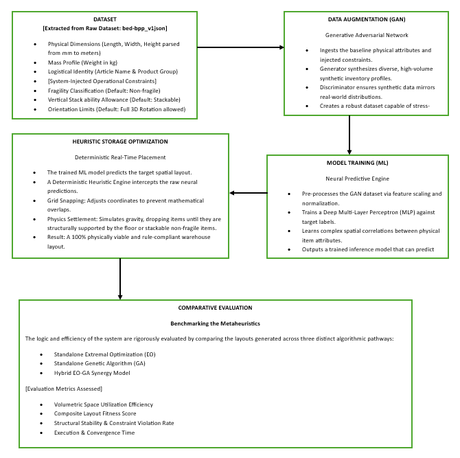Figure\. 1\. Conceptual framework for warehouse storage sorting using Genetic Algorithm and Extremal Optimization for accurate item retrieval and efficient sorting within the warehouse facility\.*

### __D\. Definition of Terms__

__*3D Bin Packing\.*__ A combinatorial optimization problem that involves packing a set of three\-dimensional rectangular items into a larger bounding container to minimize wasted space \[16\]\.

In this study, it refers to the core objective of the research: strategically assigning 3D coordinates and rotational states to diverse inventory items to maximize warehouse volumetric utilization while preventing physical overlaps\.

__*Chromosome\.*__ A specialized data structure used in evolutionary algorithms to encode a single candidate solution to an optimization problem \[17\]\.

In this study, a chromosome is defined as a mathematical array \(specifically structured as \[*x, y, z,* rotation\]\) that represents the exact 3D spatial coordinates and physical orientation state of an inventory item within the simulated warehouse\.

__*Extremal Optimization \(EO\)\.*__ A local\-search metaheuristic algorithm inspired by the physics concept of self\-organized criticality, which operates by iteratively identifying and replacing only the least\-fit components of a suboptimal solution \[5\]\.

In this study, EO functions as the macro\-level conflict resolution mechanism\. It evaluates a batch of items, identifies the "worst\-placed" item based on spatial inefficiency or overlap, and algorithmically relocates it to improve the overall layout structure\.

__*Generative Adversarial Network \(GAN\)\.*__ A class of machine learning frameworks where two neural networks \(a generator and a discriminator\) contest with each other to synthesize highly realistic artificial data \[18\]\.

In this study, the GAN is utilized to augment the baseline Kagerer dataset, generating realistic, physically scaled inventory profiles \(dimensions and weights\) to rigorously stress\-test the optimization algorithms across varying logistical scenarios\.

__*Genetic Algorithm \(GA\)\.*__ A population\-based metaheuristic inspired by natural selection, utilizing evolutionary operators such as selection, crossover, and mutation to iteratively improve potential solutions \[13\], \[17\], \[19\]\.

In this study, the GA serves as the local fine\-tuning phase\. It evolves populations of warehouse layouts by exchanging spatial segments \(crossover\) and altering item orientations \(mutation\) to optimize 6\-way item rotations and minimize localized spatial gaps\.

__*Storage Allocation\.* __The storage allocation refers to the strategic assignment of products to specific locations within a warehouse to optimize operational efficiency \[14\]\.

In this study, storage allocation refers to the process of strategically assigning products to specific locations within a warehouse and it involves combining segments of parent solutions \(warehouse layouts\) to generate new offspring configurations, where product placements are reorganized to enhance space utilization and inventory accessibility\. 

__*Multi\-Layer Perceptron \(MLP\)\.*__ A feedforward artificial neural network consisting of fully connected input, hidden, and output layers, typically used for complex regression and predictive tasks \[20\]\.

In this study, the MLP serves as the predictive engine that processes normalized item attributes \(such as dimensions and weight\) to generate an initial, statistically informed set of 3D spatial coordinates for warehouse placement\.

__*Physics Settlement\.*__ The use of a computational physics engine to simulate real\-world physical laws, such as gravity, friction, and rigid\-body collision, within a digital environment\.

In this study, it refers to the use of the PyBullet engine to validate the MLP's raw numerical predictions\. It applies gravitational forces to the digital items, ensuring they drop and settle into stable, load\-bearing positions on the warehouse floor without floating or structural clipping\.

### __E\. Significance of the Study__

This study introduces a novel, machine learning\-seeded hybrid optimization framework that addresses the complex, NP\-hard problem of 3D warehouse storage allocation\. By integrating a Generative Adversarial Network \(GAN\) for data augmentation, a Multi\-Layer Perceptron \(MLP\) for initial spatial prediction, a physics simulation engine for structural validation, and a sequential Extremal Optimization and Genetic Algorithm \(EO\-GA\) pipeline, the system bridges the gap between theoretical computer science and practical logistics\. Ultimately, this framework ensures that high\-density space utilization is not only mathematically optimal but also physically viable in real\-world environments\.

__Warehouse Operators\.__ The system provides operators with structurally stable, physics\-validated 3D placement configurations\. This eliminates the guesswork in vertical stacking, minimizes manual trial\-and\-error, reduces physical safety hazards associated with unstable inventory, and significantly improves daily workflow efficiency\.

__Warehouse Managers and Business Owners\.__ By maximizing 3D volumetric space utilization, the system allows businesses to store more inventory within their existing physical footprint, thereby delaying or eliminating the need for costly facility expansions\. Furthermore, it supports data\-driven inventory decisions, lowers operational costs, and dynamically adapts to fluctuating supply chain demands with minimal disruption\.

__Researchers and Developers\.__ This study serves as a foundational reference for solving complex combinatorial optimization problems\. It demonstrates the profound methodological benefits of combining deep learning spatial predictions, rigid\-body physics simulations, and hybrid metaheuristics \(combining the global search of EO with the local fine\-tuning of GA\) to create scalable, robust AI architectures\.

__Academic Institutions\.__ The study provides a comprehensive, practical case study of applied artificial intelligence in logistics\. It serves as an interdisciplinary educational resource, illustrating the successful integration of machine learning, classical physics engines, and evolutionary algorithms to solve modern industrial challenges\.

### __F\. Scope and Limitations__

This study aims to optimize the storage allocation of a three\-dimensional \(3D\) warehouse facility by implementing a machine learning\-guided hybrid metaheuristic model\. The scope of the proposed framework specifically encompasses a predictive Multi\-Layer Perceptron \(MLP\) for initial coordinate generation, a PyBullet physics engine for structural validation, and a sequential Extremal Optimization \(EO\) and Genetic Algorithm \(GA\) pipeline for spatial refinement\. The system manages 3D item placement based on physical dimensions, weight, fragility, and categorical constraints\. The study is strictly bounded to a simulated digital environment using the publicly available 3D Bin Packing dataset curated by Kagerer, which is augmented via a Generative Adversarial Network \(GAN\)\. The performance of the integrated MLP\-EO\-GA framework is evaluated and compared against standalone algorithms based on volumetric space utilization, convergence speed, and physical stability across specifically scaled testing splits of 200, 400, and 600 items\.

Despite its comprehensive design, this study possesses distinct limitations\. The research is conducted entirely within a controlled simulation and does not deploy the framework within a physical warehouse facility\. Consequently, real\-world operational uncertainties such as human worker variability, material handling equipment malfunctions, facility layout anomalies, and dynamic supply chain disruptions are excluded from the model\. Furthermore, while the PyBullet engine accurately simulates rigid\-body physics and gravitational settlement to correct the MLP's raw numerical predictions, it assumes perfectly rigid items and does not account for complex material physics, such as the gradual soft\-body deformation of cardboard boxes stacked under heavy loads over time\.

Additionally, the research is strictly confined to intralogistics \(in\-warehouse storage and retrieval optimization\) and does not address broader external supply chain mechanics such as procurement or transportation routing\. Advanced computational paradigms, such as quantum optimization algorithms, are also beyond the parameters of this study\. Finally, while the GAN successfully expands the testing environment to prevent algorithmic overfitting, its generative fidelity is fundamentally constrained by the statistical boundaries of the original Kagerer dataset\. The synthetic inventory profiles represent mathematical extrapolations of the baseline data rather than entirely novel, unpredictable real\-world commodities\.

# 

# __CHAPTER II__

## __REVIEW OF RELATED LITERATURE__

The growing complexity of modern supply chain operations has intensified the need for intelligent, highly scalable optimization systems capable of managing three\-dimensional \(3D\) warehouse storage allocation\. Traditional storage systems, constrained by static layouts and inefficient slotting, struggle to adapt to dynamic inventory flows and complex spatial requirements\. In response, recent literature demonstrates a paradigm shift toward integrating Machine Learning \(ML\) with advanced metaheuristic algorithms to address these NP\-hard combinatorial challenges\. A review of existing studies reveals that while algorithms like the Genetic Algorithm \(GA\) and Extremal Optimization \(EO\) offer robust search capabilities \[5\], , \[7\], \[13\], \[19\], relying purely on randomized heuristics is computationally expensive and frequently generates spatial configurations that violate real\-world physical boundaries\. Consequently, contemporary research emphasizes the necessity of data\-driven architectures\. This includes the use of Generative Adversarial Networks \(GANs\) to augment limited logistical datasets \[21\], Multi\-Layer Perceptrons \(MLPs\) to provide statistically informed spatial seeding \[20\], \[22\], and physics simulation engines to validate structural feasibility and gravitational settlement \[23\]\. Synthesizing these critical insights lays the groundwork for the proposed hybrid sequential model\. By bridging predictive neural networks and rigid\-body physics with the global exploration of EO and the local refinement of GA \[24\], this study addresses the critical gaps in existing literature, offering a comprehensive, physically viable approach to next\-generation warehouse optimization\.

__*Metaheuristic Approaches in Warehouse Optimization*__

Warehouse operations optimization remains a critical concern in supply chain management due to the growing demands of e\-commerce and complex inventory dynamics \[14\]\. Traditional rule\-based storage systems, which rely on static slotting, often fail to capture the nuanced interplay between layout configuration, item fragility, and access frequency \[25\],\[26\]\. This limitation has driven the adoption of metaheuristic algorithms notably the Genetic Algorithm \(GA\) and Extremal Optimization \(EO\) which offer adaptive solutions for high\-dimensional combinatorial problems like 3D bin packing \[16\]\.

Genetic Algorithms, inspired by natural selection, have been widely implemented in warehouse scenarios to reduce travel distances and enhance picking efficiency \[15\], \[27\]\. Studies by Khan et al\. \[4\] and the IEOM Society \[28\] demonstrate GA’s capacity to optimize space and safety simultaneously through population\-based crossover and mutation\. Conversely, Extremal Optimization, pioneered by Boettcher and Percus \[5\], \[6\] approaches optimization through self\-organized criticality\. Unlike GA, EO focuses on iteratively improving only the worst\-performing components \(or "extremal" variables\) of a candidate solution\. Recent advancements, such as the Improved Real\-Coded Population\-Based Extremal Optimization \(IRPEO\) model by Liu et al\. \[7\], highlight EO’s computational efficiency in escaping local optima and establishing robust global configurations in continuous domains\.

__*The Generative Adversarial Networks \(GANs\) for Synthetic Data Generation*__

While metaheuristics are powerful, their effectiveness relies heavily on the quality and diversity of the input data\. In warehouse optimization, relying on limited historical datasets can cause algorithms to overfit to specific logistical scenarios\. Generative Adversarial Networks \(GANs\) provide a formal framework for learning the underlying distribution of real data to synthesize highly realistic augmented samples \[18\],\[21\]\.

A standard GAN consists of a generator *G* and a discriminator *D* trained via a two\-player minimax game, defined by the objective function:

*             *\(1\)

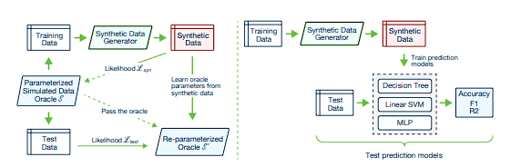Where *Pdata* is is the real data distribution and *Pz* is a prior over noise variables\. Through this process, the generator maps random noise into realistic item attributes \(e\.g\., length, width, weight, fragility\), capturing complex multidimensional correlations \[29\]\. Recent empirical studies by Zhang et al\. \[30\] demonstrate that using GANs to augment 3D bin packing datasets significantly enriches the search space\. By synthesizing plausible edge\-case inventory profiles, GAN\-augmented data exposes subsequent optimization algorithms to diverse logistical constraints, resulting in highly robust and generalizable warehouse storage layouts \[31\], \[32\]\.

*Figure 2\. Pipeline for Generative Adversarial Networks*

Figure 2\. Architectural pipeline for Generative Adversarial Networks illustrating the synthesis and evaluation of tabular data\. The framework demonstrates how synthetic datasets are utilized to train downstream predictive models \(such as an MLP\) to validate generative fidelity prior to real\-world testing \[21\]\.

__*Neural Combinatorial Optimization and Predictive Seeding*__

The evolution of the 3D Bin Packing Problem \(3D\-BPP\) has increasingly shifted toward Neural Combinatorial Optimization \(NCO\), where deep learning models enhance traditional heuristics \[22\]\. Historically, evolutionary algorithms initialized their populations with randomized spatial states, which is computationally expensive and slow to converge\. Modern frameworks replace this random initialization with statistically informed predictions generated by a Multi\-Layer Perceptron \(MLP\) or Deep Reinforcement Learning agents \[20\]\. By processing normalized item attributes \(dimensions and weight\) and warehouse parameters, these neural networks can predict highly accurate initial 3D coordinates \(*x, y, z*\) and rotation indices\. As demonstrated in recent literature, integrating an intelligent neural predictor to "seed" the starting layout prevents the optimization model from getting trapped in early local optima, drastically reducing the search space and accelerating convergence times \[27\], \[32\]\.

__*Physics Settlement and Structural Validation*__

A significant gap in pure neural combinatorial optimization is the lack of physical grounding\. While predictive models like MLPs can output mathematically optimal coordinates, they frequently ignore strict physical boundaries resulting in impossible real\-world configurations such as overlapping geometries or "floating" items unsupported by gravity\.

To bridge the gap between theoretical AI predictions and practical logistics, contemporary research emphasizes the integration of rigid\-body physics simulation engines \[23\]\. Environments utilizing physics engines \(such as PyBullet\) allow predicted coordinates to undergo a deterministic "settlement" phase\. By simulating gravitational forces, friction, and rigid\-body collisions, these engines automatically enforce structural stackability, ensuring that delicate items are safely supported by robust base items\. This validation step is critical to ensure that algorithmically generated 3D warehouse layouts are physically viable and safe for real\-world deployment\.

__*Sequential Hybrid Optimization \(The EO\-GA Pipeline\)*__

As optimization problems become highly non\-linear, researchers recognize that sequential hybrid metaheuristics combining distinct phases of global exploration and local exploitation consistently outperform single\-strategy methods \[12\], \[28\]\.

This study constructs its core pipeline on the synergy between Extremal Optimization and Genetic Algorithms\. Following the MLP prediction and physics settlement, EO serves as the macro\-level conflict resolution engine\. Utilizing a Power\-Law Probability Distribution, EO targets and relocates the least\-fit items:

\(2\)

Where P\(k\) is the probability of selecting the 𝑘𝑡ℎ worst\-performing variable, τ controls the selection pressure, n is the total number of components\. Once EO establishes a globally sound, conflict\-free structure, the GA phase treats these solutions as elite parent chromosomes\. The GA applies localized crossover and mutation to perform fine\-grained spatial tuning, specifically optimizing the 6\-way physical rotations and minimizing localized gaps \[8\], \[26\], \[33\]\. This sequential architecture aligns perfectly with modern logistics requirements, effectively balancing the broad exploration needed for complex bin packing with the precision required for high\-density space utilization\.

__*Mathematical Formulations of Optimization Objectives*__*  *

Warehouse layout optimization often requires a multi\-criteria approach, incorporating space usage, accessibility, item safety, and constraint compliance\. To address this, the present study uses a composite fitness function, inspired by models from Liu et al\. \[7\], Pistolesi et al\. \[25\], and Boettcher et al\. \[5\], to evaluate the quality of each proposed warehouse configuration\. To evaluate candidate solutions, this study employs a composite fitness function inspired by multi\-objective hybrid metaheuristics \[26\], \[31\]\.

\(3\)

Where, S is a complete solution set of placed items, and  are the weight coefficients for each objective component \[7\], \[26\]\.

\(4\)

This measures the ratio of used space to total warehouse volume\. The formula reflects models used in EO\-GA packing systems where volume efficiency is critical \[34\],\[28\]\.

\(5\)

Where, __ __is the access frequency of item i,  is the normalized retrieval distance, based on the XZ coordinates\. This formulation aligns with accessibility cost functions applied in the warehouse layout optimization \[5\], \[35\]\.

\(6\)

Where, =1 if item i is placed in the correct zone \(fragile/non\-fragile\); otherwise, =0\. This rule\-based score is widely used in zone\-aware optimization frameworks \[25\], \[36\]\.

\(7\)

Where,  is the fragility level of item i,  is its height placement \(z\-axis\)\. This metric accounts for stacking risk and reflects formulation from safety\-aware bin packing models \[28\]\.

These mathematical formulations are inspired by fitness models in hybrid metaheuristics\. Boettcher et al\.\[5\], Liu et al\.\[7\] and support the core hypothesis of this study: that sequential EO–GA hybrids can optimize multiple conflicting objectives in high\-dimensional warehouse layouts\.

__*Genetic Algorithm in Warehouse Optimization*__

Genetic Algorithms \(GA\) have been widely recognized for their effectiveness in addressing complex warehouse layout and order picking problems due to their robust global search capabilities\. The literature illustrates that GA can significantly reduce travel distances, enhance picking efficiency, and accommodate various operational constraints\.

The IEOM Society \[37\] proposed a GA\-based warehouse storage assignment framework that integrates space, access, and safety objectives\. Their model evaluates potential layouts using a multi\-objective fitness function \(refer to equation 3\)\.

Crossover operations commonly used in GA are illustrated as:

\(8\)

Where, c is a crossover point,  are parent chromosomes, and  are offspring chromosomes\.

Mutation operations randomly alter one or more item placements to preserve diversity in the solution pool\. A broader theoretical foundation was established by Wikipedia \[38\] and Number Analytics \[39\], which explain GA mechanics and applications in combinatorial problems\. INRIA \[12\] further explored hybrid GA models for global optimization by combining population diversity strategies with adaptive local tuning\.

Adding further depth, Zhao et al\. \[28\] proposed a Real\-Polarized Genetic Algorithm \(RPGA\) to address complex 3D bin\-packing problems, showing how GA can enhance space utilization and object arrangement under spatial constraints\. 

__*Advancements in Extremal Optimization for Continuous Domains*__

Extremal Optimization \(EO\), originally introduced by Boettcher and Percus \[5\], has gained attention as an effective single\-solution metaheuristic inspired by self\-organized criticality and co\-evolutionary dynamics\. Unlike population\-based algorithms such as Genetic Algorithm \(GA\), EO focuses on improving the worst\-performing components of a solution, allowing it to effectively escape local optima without relying on crossover or population diversity\. While traditional EO algorithms have demonstrated success in discrete optimization tasks, their performance in continuous and high\-dimensional problem spaces has required further refinement\. 

In response to this need, Liu et al\. \[7\] introduced the Improved Real\-Coded Population\-Based Extremal Optimization \(IRPEO\) algorithm, specifically designed for solving continuous unconstrained optimization problems\. This approach integrates real\-coded representation with a population\-based mechanism, significantly enhancing EO’s exploration capabilities and convergence behavior\. Unlike standard EO, which operates on a single candidate solution, IRPEO evolves a small population of solutions simultaneously, allowing for improved diversity and robustness\.

This probabilistic model biases the selection toward lower\-ranked \(i\.e\., worse\) variables, increasing the chance of refining the least\-fit parts of the solution\.

To evaluate the quality of a solution, EO distinguishes between local and global fitness\. The global fitness function C\(S\) is commonly represented as the sum of the local fitness contributions 𝜆𝑖 of each component 𝑖 in the solution 𝑆 \[5\]:

\(9\)

This aggregation allows EO to make decisions based on both localized weaknesses and the overall solution landscape especially relevant in warehouse contexts, where local storage decisions \(e\.g\., accessibility or safety\) affect overall efficiency\.  

__*Advances in Metaheuristics for Sequential Hybrid Optimization*__

As real\-world optimization problems become increasingly complex and computationally intensive, researchers have turned to hybrid metaheuristic approaches that combine the strengths of different algorithms\. Among these, the sequential hybridization of Extremal Optimization \(EO\) and Genetic Algorithms \(GA\) presents a promising strategy: EO offers robust global search capabilities by iteratively eliminating poor\-performing solution components, while GA excels in fine\-tuning through recombination and population\-based evolution\. Two recent studies provide strong foundational support for this hybrid design Liu et al\. \[7\] with their IRPEO model and Ansótegui et al\. \[9\] with their Model\-Based Genetic Algorithm \(MBGA\)\.

Liu et al\. \[7\] proposed the Improved Real\-Coded Population\-Based Extremal Optimization \(IRPEO\) method, a significant enhancement of the original EO framework designed for continuous, unconstrained optimization tasks\. Unlike classic EO, which operates on a single solution, IRPEO employs a small population of real\-coded solutions, allowing better diversity and global exploration\. It incorporates a dynamic mutation strategy and rank\-based selection to identify and improve the worst\-performing variables across multiple candidates\. Benchmarked against traditional EO and GA models, IRPEO consistently produced superior results in terms of convergence speed and accuracy on complex mathematical functions like Rastrigin and Rosenbrock\. These findings reinforce EO’s strength in identifying promising regions in high\-dimensional and nonlinear search spaces an essential quality for initiating global exploration in a hybrid framework\.

Complementing this, the work of Ansótegui et al\. \[9\] on the Model\-Based Genetic Algorithm \(MBGA\) offers a powerful mechanism for the second phase of hybrid optimization solution refinement\. Their approach introduces surrogate modeling using Random Forests to predict the performance of new candidate solutions without costly full evaluations\. Within the MBGA, a gender\-based population structure is employed to maintain diversity, while a genetic engineering step uses the surrogate model to generate offspring with high estimated fitness\. Particularly useful in expensive or black\-box settings like algorithm configuration, MBGA demonstrated superior performance over traditional GAs and other configurators \(e\.g\., SMAC\), especially when applied to high\-dimensional tuning problems such as SAT solver parameter optimization\.

Together, these two studies form a strong methodological basis for a sequential EO–GA hybrid framework\. IRPEO’s population\-driven global search effectively explores the problem landscape and avoids premature convergence, while MBGA’s surrogate\-guided GA provides a scalable and efficient mechanism for fine\-tuning\. This hybrid sequencing aligns with current needs in logistics and warehouse optimization, where the solution space is often vast, nonlinear, and filled with constraints that require both exploration and targeted refinement\.

__*Theoretical Support for Adaptive Optimization in Logistics*__

Modern logistics requires adaptive systems that respond to changing inventory and demand conditions\. Multi\-objective and hybrid metaheuristics offer a framework for balancing conflicting goals such as speed, space, and accuracy\. This theoretical foundation justifies your integration of GA and EO in a flexible, data\-driven optimization system\.  Shi & Eberhart\. \[40\] introduced Particle Swarm Optimization \(PSO\), which has since been applied to warehouse slotting and layout optimization\. Including PSO offers a contrast to the GA\-EO hybrid, broadening the scope of heuristic approaches\. Osman\. \[35\] reviewed Simulated Annealing \(SA\) and its use in combinatorial logistics problems like storage assignment and route optimization\. SA's capacity to escape local optima offers another useful contrast\.  Coelho & Laporte\. \[29\] discussed multi\-objective metaheuristics in logistics\. Their study supports the development of hybrid methods like GA\+EO for balancing competing goals such as space utilization and retrieval speed\. Talbi\. \[41\] provided a comprehensive survey on hybrid metaheuristics, highlighting how combining algorithms can yield better optimization results than single\-method approaches\. This justifies the hybrid strategy employed in this study\. 

__*GAN\-Augmented Metaheuristic Optimization for Packing and Warehouse Layout*__

In optimization and metaheuristic contexts, GANs are increasingly used to enrich the search space explored by algorithms such as Genetic Algorithms by generating diverse candidate solutions or realistic problem instances\[42\]\. A prominent example is a GAN–GA hybrid for the 3D bin packing problem, where a GAN is trained on feasible packing patterns and then used to produce high‑quality initial solutions that a GA further refines, achieving better packing density and fewer bins than conventional GA or particle swarm optimization approaches\[43\]\. Because 3D bin packing is structurally similar to assigning items to warehouse storage slots under space and constraint conditions, this research supports using GAN‑generated synthetic inventory profiles or layout instances as input for metaheuristics in warehouse optimization\[32\]\. Integrating a GAN‑based augmentation stage defined mathematically by the minimax objective above—before the Extremal Optimization and Genetic Algorithm phases aligns with these trends, providing a richer and more varied set of item configurations for the EO–GA hybrid to optimize and potentially leading to more robust and generalizable warehouse storage layouts\[37\], \[44\], \[45\]\. 

__*Hybrid Neural Combinatorial Optimization and Metaheuristics*__

The evolution of the 3D Bin Packing Problem \(3D\-BPP\) has moved toward Neural Combinatorial Optimization \(NCO\), where deep learning models are trained to replace or enhance traditional heuristics\. Modern frameworks often treat bin packing as a Constrained Markov Decision Process \(CMDP\), utilizing Deep Reinforcement Learning \(DRL\) to learn optimal placement sequences \[4\]\. Advanced agents employ multimodal encoders to process both numerical item data \(weight, size\) and visual states \(top\-down bin height maps\) to predict the most efficient coordinates and rotations \[28\]\. 

__                                                                                                      __\(10\)

Recent literature emphasizes the "hybridization" of these neural approaches with established metaheuristics\. For example, \[46\] demonstrated that integrating a GAN’s generator directly into a Genetic Algorithm \(GA\) can produce high\-quality initial populations, preventing the optimization from getting stuck in local optima and improving space utilization \[46\]\. While these neural solvers offer high\-speed predictions, they are frequently benchmarked against Extremal Optimization \(EO\) a local\-search heuristic inspired by self\-organized criticality\. Hybrid EO \(HEO\) models, which iteratively refine "weak" solution components, serve as a critical baseline to determine if the added complexity of a trained neural model provides a significant measurable benefit in warehouse efficiency \[47\]\.

# __CHAPTER III__

## __METHODOLOGY__

This chapter presents the complete methodological framework employed in this study\. The pipeline follows a three\-stage sequence: GAN\-based data augmentation using a Normalization Sandwich architecture; Multi\-Layer Perceptron \(MLP\) coordinate regression using a Physics\-Informed training protocol; and the Neural\-Heuristic Propose\-and\-Repair pipeline integrating Extremal Optimization \(EO\) and Genetic Algorithm \(GA\) for spatial refinement and physical settlement validation\. The methodology is presented in the order of execution to reflect the actual data flow of the integrated system\.

### __A\. Research Design__

The study employs an experimental research design to develop and evaluate a high\-performance optimization pipeline for the 3D warehouse object placement problem\. The methodology integrates a multi\-phase technical framework: first, a Generative Adversarial Network \(GAN\) for data augmentation; second, a PyTorch\-based Multi\-Layer Perceptron \(MLP\) to predict initial spatial coordinates; and finally, a sequential metaheuristic refinement using Extremal Optimization \(EO\) for global spatial conflict resolution followed by a Genetic Algorithm \(GA\) for local rotation fine\-tuning\.

The research design adopts a sequential, pipeline\-driven approach where each stage conditions the next\. This design allows for comprehensive evaluation of how predictive modeling and hybrid metaheuristics synergize to overcome the computational limitations of standalone optimization techniques\. The complete workflow from raw data ingestion through GAN augmentation, MLP prediction, physics settlement, to final heuristic refinement is detailed in the following sections\.

### __B\. Dataset Description __

	The foundation of this study is the Benchmarking Dataset for Robotic Bin Packing Problems \(BED\-BPP\), a high\-fidelity inventory repository curated by Kagerer et al\. \[48\]\. This dataset bridges the gap between theoretical packing and real\-world industrial constraints by providing metadata for thousands of distinct physical items across multiple product categories\. 

*Table I\. Dataset Attributes*

Column Name

Description

Object ID

ID of the item

Length \(cm\)

Length of the object in centimeters

Width \(cm\)

Width of the object in centimeters

Height \(cm\)

Height of the object in centimeters

Fragility \(1–5\)

Fragility rating from 1 \(not fragile\) to 5

Access Frequency \(/week\)

Number of times the item is accessed per week

Category

Classification \(e\.g\., Kitchen, Tools, Electronics\)

*Table II\. Raw Dataset used for example\.*

Object ID

Length\_cm

Width\_cm

Height\_cm

Fragility

Access\_Freq\_per\_week

Category

SKU\_001

32

38

34

3

336

Stationery

SKU\_002

12

19

16

4

198

Fragile Goods

SKU\_003

53

12

32

1

141

Toys

SKU\_004

38

32

30

3

242

Electronics

For the experimental phase, the system is tested against varying dataset scales specifically 200, 400, and 600 items to measure the scalability and convergence speed of the optimization algorithms\. This multi\-tier testing approach enables a direct comparison between the model’s predicted storage layouts and established physical constraints, supporting a clear interpretation of the system’s overall accuracy and efficiency\.

__*Inventory Dataset Expansion and Statistical Augmentation*__

To support more comprehensive experimentation, the original simulated dataset is extended using a GAN\-based data generation process\. The GAN is trained using the full set of item\-level attributes, treating each item record as a multidimensional sample from the underlying warehouse inventory distribution\.

​	After convergence, the generator produces additional synthetic items that preserve key statistics of the original data \(marginal distributions of dimensions and fragility, as well as correlations with access frequency and category\)\. These GAN\-generated records are combined with the original items to form an augmented dataset, which is then used as input to the Extremal Optimization and Genetic Algorithm stages\. This approach follows existing work where GANs are employed to expand optimization and packing datasets, leading to improved performance of genetic algorithms on 3D bin packing tasks closely related to warehouse loading and storage\.

### __C\. Data Preprocessing __

The methodology commences with a comprehensive data preprocessing phase, where raw inventory attributes are transformed into structured, multidimensional objects suitable for 3D spatial optimization\. This transition ensures that all physical and logical constraints are computationally defined before being processed by the augmentation and optimization engines\. Central to this phase is the implementation of a structured Item class, which encapsulates essential physical dimensions length, width, and height alongside critical handling metrics such as fragility ratings and access frequencies\. By instantiating each dataset entry as a dedicated object, the system can dynamically track unique SKU identifiers while maintaining the integrity of the item's attributes throughout the 3D coordinate mapping process\.

A vital function within this data structure is the dynamic orientation system, which allows the model to explore six distinct 3D rotations for every object\. Through a dedicated method, the system can programmatically reconfigure an item's dimensions by swapping its length, width, and height axes\. This flexibility is essential for maximizing space utilization, as it enables the optimization algorithms to test various base orientations to find the most efficient fit within the warehouse's volumetric bounds\. This systematic approach to rotation ensures that the heuristic search is not limited by the item's original entry state, significantly expanding the potential search space for optimal placement\.

The final stage of preprocessing involves the application of a rule\-based zoning strategy designed to manage fragility and ensure operational safety\. Items identified with a fragility rating of three or higher are subjected to strict spatial segregation and height restrictions\. These fragile objects are restricted to a designated "Fragile Zone," occupying a specific percentage of the warehouse width, and are further limited to the lower vertical sections of the warehouse to prevent crushing or stacking damage\. By embedding these safety boundaries directly into the preprocessing logic, the system establishes a clear set of compliance rules that are later enforced by the fitness function to penalize any physically or logically\. 

__* Rotation System*__

*Table III Rotation System for 3D Item Orientation*

Rotation 0

\(L, W, H\)

Original orientation

Rotation 1

\(L, W, H\)

90° rotation

Rotation 2

\(L, W, H\)

90° rotation

Rotation 3

\(L, W, H\)

90° rotation

Rotation 4

\(L, W, H\)

90° rotation

Rotation 5

\(L, W, H\)

90° rotation

This table illustrates the possible spatial configurations for each item, allowing the optimization algorithms to manipulate length, width, and height orientations to maximize 3D space utilization\.

__*Zone\-Based Fragility Management*__

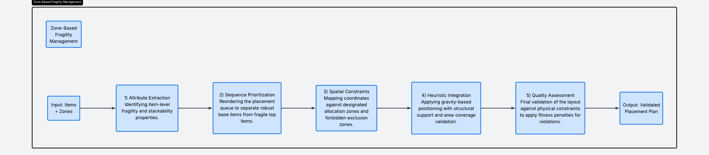Zone\-based fragility management framework is a rule\-based spatial allocation strategy designed to ensure the physical integrity of warehouse inventory by segregating items according to their vulnerability\. This system mitigates structural risks and potential product damage by enforcing height and width restrictions on delicate goods, ensuring they are placed in stable, low\-impact environments\.

*Figure 4\. Zone\-Based Fragility Management Pipeline*

The process begins with attribute extraction, where the system identifies item\-level fragility ratings and stackability properties to determine handling requirements\. Following this, sequence prioritization reorders the placement queue to ensure robust base items are positioned before fragile top items, establishing a stable foundation for vertical stacking\. Spatial constraints are then applied by mapping coordinates against designated allocation zones—specifically restricting fragile items to a "Fragile Zone" occupying 60% of the warehouse width—while avoiding forbidden exclusion zones\. Heuristic integration follows, applying gravity\-based positioning and area\-coverage validation to ensure every item has sufficient structural support\. Finally, a quality assessment validates the entire layout against physical constraints and applies fitness penalties for any violations, resulting in a physically viable and safe validated placement plan\.

__*GAN\-Based Data Augmentation*__

GAN\-based data augmentation process serves as a sophisticated pre\-optimization stage designed to resolve the limitations of small or imbalanced logistical datasets\. By utilizing an adversarial learning framework, the system synthesizes high\-fidelity inventory profiles such as realistic item dimensions, weights, and fragility levels ensuring that the subsequent optimization algorithms are rigorously stress\-tested against a diverse array of potential warehouse scenarios\.

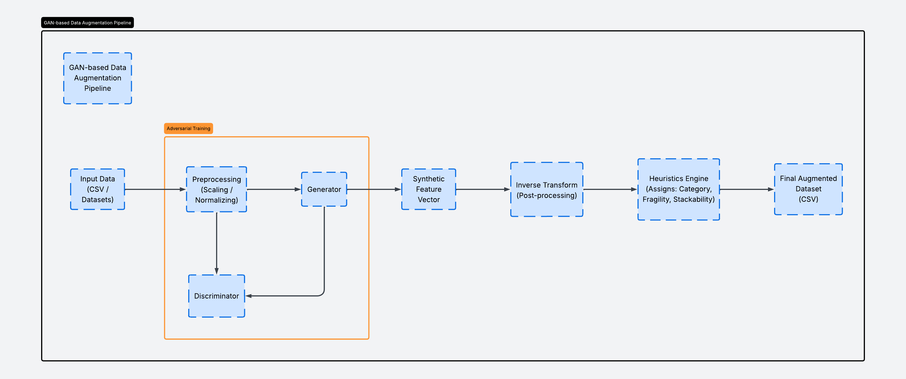*Figure 5\. GAN Pipeline*

The pipeline initiates with raw input data that undergoes strict scaling and normalization to prepare it for adversarial training\. Within this training block, the Generator maps random noise to synthetic feature vectors while the Discriminator evaluates them against real samples to ensure statistical consistency\. Once the generator achieves convergence, the synthetic feature vectors are processed through an inverse transform to restore their original physical units\. A heuristics engine then assigns specialized logistical attributes, including category, fragility, and stackability, to the newly created items\. The final output is a comprehensive augmented dataset that provides a richer, more varied set of configurations for the Extremal Optimization and Genetic Algorithm stages to process\.

__*Neural Network Feature Engineering and Normalization*__

Neural network feature engineering and normalization pipeline functions as the critical translation layer between raw warehouse data and the deep learning inference engine\. This stage ensures that diverse physical attributes such as weight in kilograms and dimensions in millimeters are transformed into a uniform, scale\-invariant format that allows the Multi\-Layer Perceptron \(MLP\) to converge efficiently\. By constraining the input space, the system prevents high\-magnitude variables from dominating the learning process, thereby maintaining high predictive accuracy for 3D coordinate generation\.

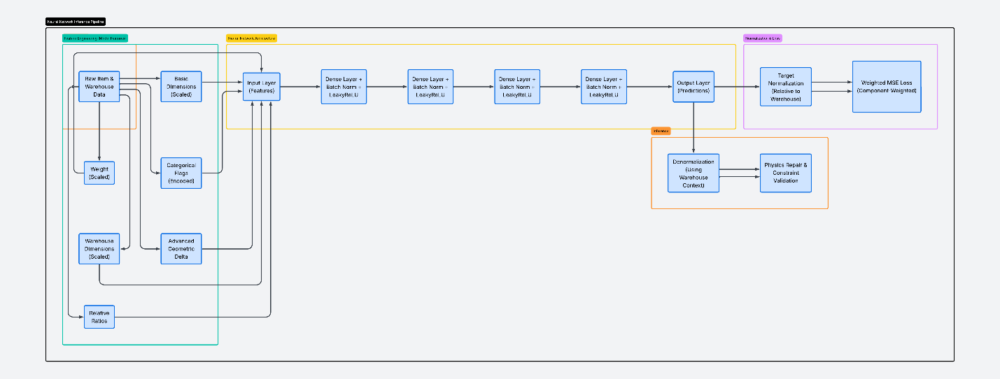

*Figure 6\. Architectural Workflow of the Predictive Neural Network Pipeline: From Feature Engineering to Physics Settlement*

The process begins with the extraction of raw item and warehouse data, which is immediately processed into basic scaled dimensions and categorical flags\. Advanced geometric deltas and relative ratios are calculated to provide the network with deep spatial context before the features enter the input layer\. The core architecture consists of four dense layers utilizing Batch Normalization and LeakyReLU activations to map these complex relationships into raw 3D coordinate predictions\. Once the output layer generates these initial predictions, they undergo a target denormalization process to restore their physical warehouse context\. Finally, the layout is passed through a physics repair and constraint validation stage using the PyBullet engine to resolve structural issues like floating or overlapping items, ensuring the final output is structurally sound\.

*Table IV Normalization and Scaling Strategies\.*

Data Type 

Scaling/Normalization Method

Output Range

Item Dimensions & Weight

Scaled down by a factor of 10\.0

Constrained Numeric

Warehouse Dimensions

Scaled down by a factor of 100\.0

Constrained Numeric

Placement Coordinates \(*x, y, z*\)

Divided by respective warehouse bounds

Relative Percentage \[0, 1\]

Rotation Indices

Divided by total rotation count \(6\.0\)

Bounded Continuous \[0, 1\]

This table illustrates the mathematical transformation applied to raw warehouse data to ensure feature uniformity and stable model convergence\. Physical item attributes, such as dimensions and weight, are scaled down by a factor of 10\.0, while global warehouse dimensions are reduced by a factor of 100\.0 to maintain constrained numeric ranges\. Furthermore, target placement coordinates \(*x, y, z*\) are converted into relative percentages \[0, 1\] by dividing them by the respective warehouse bounds, and rotation indices are transformed into a bounded continuous range \[0, 1\] through division by the total rotation count\. This systematic scaling constrains the input space, preventing high\-magnitude values from dominating the learning process and facilitating more efficient gradient descent during the training phase\.

### __D\. Fitness Function Design__

__*Comprehensive Fitness Model*__

The fitness function integrates four primary components through a weighted summation to determine the overall quality of a warehouse layout \(refer to Equation 3\)\. The total fitness value, *F\(S\),* is calculated for a complete solution set of placed items, *S*, by applying specific weight coefficients — to each objective component\. These components include a SpaceUtilization score to maximize occupied volume, an AccessibilityScore to prioritize frequently used items, a SeparationScore for correct zoning, and a SafetyScore to manage fragility risks\. Additionally, an UnplacedItemPenalty is subtracted from the total to penalize configurations where items cannot be successfully accommodated within the warehouse boundaries\. 

__*Space Utilization *__

The Space Utilization score \(refer to Equation 4\) serves as a primary metric for evaluating the volumetric efficiency of a proposed warehouse layout\. This component is calculated by aggregating the total volume of all *n* items successfully placed within the warehouse, where each item* i* is defined by its specific physical dimensions \(*length\_i, width\_i, and height\_i*\) measured in centimeters\. By dividing this cumulative occupied volume by the total available Warehouse Volume, the system derives a percentage\-based score that reflects the effectiveness of the algorithm in minimizing wasted space\. 

__*Accessibility Score *__

To calculate the accessibility component of the fitness function \(refer to Equation 5\), the system evaluates the localized  for each item* i* placed within the warehouse\. This penalty is derived by normalizing the item's current and coordinate positions against the total  and , respectively\. This spatial factor is then weighted against the item’s weekly and compared to the *max\_access* frequency across the entire inventory\. By aggregating these values for the total number of items, *n*, the system ensures that high\-demand goods are positioned in locations that minimize retrieval travel time\. 

__*Separation Score *__

Where zone compliance is evaluated based on fragility threshold and proper zone placement \(refer to Equation 6\)\. 

__*Safety Score *__

The Safety Score \(refer to Equation 7\) is designed to mitigate structural risks by managing the vertical placement of items based on their individual fragility levels\. This component utilizes a localized *height\_safety\_i *factor, which is calculated by subtracting the normalized Z\-coordinate position of an item from the total WAREHOUSE\_HEIGHT\. By weighting this factor against the item’s *fragility\_i* rating and the system’s *max\_fragility *limit, the function heavily penalizes the placement of high\-fragility items at elevated heights\. This mathematical formulation ensures that the most delicate goods are prioritized for lower storage tiers to prevent damage and preserve stack stability\.

__	__

### __E\. Machine Learning and Optimization Algorithms   __

__*Predictive Model Training and Architecture*__

Table III provides a comprehensive technical overview of the deep learning architecture integrated into the optimization pipeline\. This configuration details the layers of the Multi\-Layer Perceptron \(MLP\), which serves as the predictive engine for generating initial high\-quality spatial seeds\. The model is specifically designed with varying hidden layer widths and activation functions to map complex item features such as fragility and dimensions to valid 3D coordinates\.

*Table V\. MLP Architecture for Initial Placement Prediction*

Layer Type 

Configuration / Output Size

Purpose

Input Layer

10 Neurons

Accepts the normalized 10\-dimensional feature vector

Hidden Layer 1

64 Neurons \(ReLU\)

Initial feature extraction and non\-linear mapping

Hidden Layer 2

128 Neurons \(ReLU\)

Deep spatial relationship learning

Hidden Layer 3

64 Neurons \(ReLU\)

Dimensionality reduction for output preparation

Output Layer

4 Neurons \(Linear\)

Predicted *x, y, z* coordinates and rotation index

To introduce non\-linearity and model complex spatial relationships, a Rectified Linear Unit \(ReLU\) activation function is applied to each hidden layer, while the output layer remains linear to facilitate raw coordinate prediction\. The network is trained using a supervised learning approach with a batch size of 64 over 50 epochs, utilizing a learning rate of 0\.001\. The Adam optimizer is employed for efficient gradient handling, with model performance evaluated via Mean Squared Error \(MSE\) to minimize deviations between the predicted \(\\*hat\{y\}\_i*\) and true normalized coordinates \(*y\_i*\)\. Upon reaching convergence, the trained weights are exported as \.pth files for seamless integration into the hybrid optimization pipeline \.

__*Model Inference and Physics Settlement*__

During active storage allocation, the MLOptimizer performs rapid inference by processing normalized item features through a single forward pass of the pre\-trained neural network\. To ensure operational feasibility, these statistical predictions undergo a Physics Settlement phase using a deterministic repair algorithm \(repair\_solution\_compact\)\. This stage resolves physically impossible placements such as floating objects by simulating gravity and enforcing strict geometric support constraints\. Each item is iteratively adjusted to its lowest valid Z\-position, ensuring it possesses sufficient surface contact with underlying items to maintain structural stability\.

__*Hybrid Optimization Framework*__

The research implements a two\-phase optimization strategy that leverages the global exploration of Extremal Optimization \(EO\) followed by the local refinement of a Genetic Algorithm \(GA\)\. In this framework, the EO stage is initialized with warehouse configurations seeded by the predictive ML model\. Utilizing its component\-wise replacement mechanism, the EO identifies and shifts items to eliminate localized "weaknesses" in the layout, effectively establishing a robust macro\-level placement across the 3D search space\.

Following the global search, the GA phase ingests the best\-performing EO outputs as elite individuals\. Through population\-based mechanisms—including tournament selection, single\-point crossover, and zone\-aware mutation—the GA performs fine\-grained spatial tuning to maximize final packing density\. This design mirrors contemporary hybrid architectures in 3D bin packing, where machine learning\-augmented instances enhance the search space for evolutionary algorithms\. By integrating GAN\-generated data and ML\-seeding, the framework ensures high robustness and superior space utilization across diverse inventory profiles and fluctuating demand patterns\.

__Extremal Optimization \(EO\)__

Extremal Optimization \(EO\) is a metaheuristic designed to improve suboptimal solutions by iteratively replacing components with high "local costs\." In the context of 3D warehouse allocation, the algorithm identifies items with the worst local scores derived from accessibility, fragility, and zone compliance and attempts to reposition them into more optimal coordinates\. This process generates large fluctuations in the fitness landscape, allowing the model to escape local optima and explore distant neighborhoods of the configuration space\.

*Table VI\. Extremal Optimization Configuration Parameters*

Parameter

Configuration

Functional Role

Iterations

500

Total generations for global search

Selection Strategy

Worst\-Component

Identifies items with highest *local\\\_score\_i*

Improvement Attempts

20 per item

Local search trials per identified component

Placement Logic

Zone\-Aware

Enforces fragility and safety constraints

__*Local Cost and Worst\-Component Identification*__

*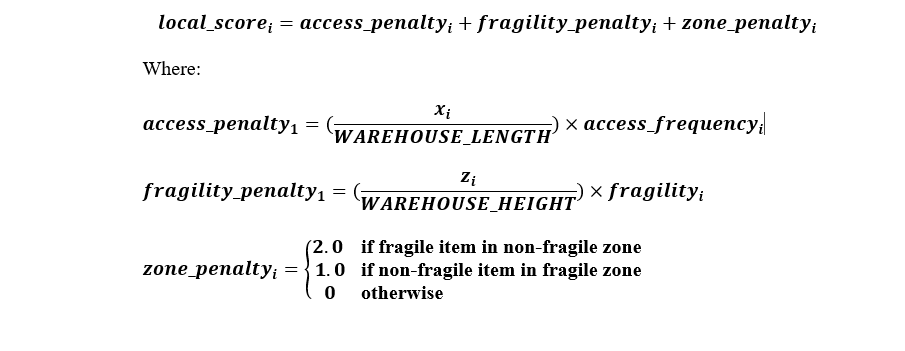*

*Figure 7\. Mathematical Formulation for Item\-Level Local Cost and Worst\-Component Identification\.*

The core of the EO process is the calculation of a *local\\\_score\_i* for each item, which acts as the metric for identifying "extremal" components \(refer to Equation 12\)\. This score is the summation of three specific penalties: the *access\\\_penalty\_i*, which weights the item's x\-coordinate against its access frequency; the *fragility\\\_penalty\_i*, which penalizes high vertical placement for delicate goods; and the *zone\\\_penalty\_i*, which applies a discrete cost \(1\.0 or 2\.0\) if an item is stored in an incorrect functional zone\. By targeting qthe item with the highest local penalty, the algorithm focuses its computational effort on the most problematic elements of the warehouse layout\.

__*Initial Solution Generation*__

Generate random valid placement using zone\-aware placement generation with maximum 1000 attempts for complete solution\. In the provided Python code, this is handled by an initial greedy placement sorted by volume, followed by find\_valid\_spot attempts\. 

__*Worst Component Identification *__

For each item, calculate local score including zone compliance\. Although the Python code uses a simplified random selection for the item to reposition, the underlying concept of identifying "worst" components \(or at least components that could be improved\) is central to EO\.

 __*Zone\-Aware Placement and Improvement*__

Once a worst\-performing component is identified, the system attempts to find a superior placement within the appropriate warehouse zone\. This find\_valid\_spot mechanism enforces zone\-based height and width constraints while testing multiple random orientations and positions\. If a valid placement with a lower local cost is identified, the solution is updated\. This cycle repeats for a set number of iterations, with the system maintaining a global best\-tracking variable to preserve the highest\-quality configuration found during the search process\.

__*Genetic Algorithm \(GA\)*__

The Genetic Algorithm \(GA\) is an adaptive metaheuristic inspired by the principles of natural selection and evolutionary biology\. In this framework, the GA serves as the final refinement stage, taking the optimized outputs from the Extremal Optimization phase and treating them as elite individuals within a larger population\. Through iterative generations of selection, recombination, and mutation, the algorithm performs fine\-grained spatial tuning to converge on a globally optimal 3D warehouse layout\. 

__*Selection and Crossover Operations*__

The evolutionary process begins with Tournament Selection, where a subset of individuals is randomly chosen from the population, and the candidate with the highest fitness is selected as a parent\. This method maintains a balance between genetic diversity and selection pressure\. Following selection, a Single\-Point Crossover operation is performed \(refer to Equation 13\)\. During this process, genetic material—specifically the 3D placement configurations is exchanged between two parent chromosomes at a randomly selected crossover point\. This allows the algorithm to combine high\-performing spatial clusters from different solutions to produce superior offspring\.

__*1\.Tournament Selection*__

Tournament selection with size k: a subset of k individuals is randomly chosen from the population, and the individual with the best fitness within this subset is selected as a parent\. This is implemented in the tournament\_selection function\.

__*2\.Crossover Operation*__

A single\-point crossover operation is performed, where genetic material \(item placements\) is exchanged between two parent chromosomes\. This is implemented in the crossover function\. Given parents P1and P2 with n items*\.*

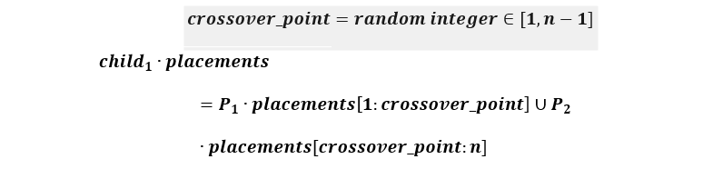

*Figure 8\. Genetic Recombination Logic for 3D Item Placement*

The recombination of placement data is governed by the union of genetic subsets from two selected parents, *P\_1* and *P\_2*\. Given a total of *n* items, a *crossover\\\_point* is randomly selected within the range *\[1, n\-1\]* to determine the split\. The resulting offspring configurations, *child\_1\.placements *and *child\_2\.placements*, are formed by concatenating the placement subset *P\_x\.placements\[a:b\]* from the primary parent with the remaining sequence from the secondary parent using the union operator *\(\\cup*\)\. This ensures the children inherit high\-performing spatial clusters from both ancestors while maintaining a complete inventory set\.

### __F\. Experimental Setup and Evaluation Framework __

The performance of the machine learning\-seeded hybrid framework is evaluated using synthetic datasets scaled at 200, 400, and 600 items within a warehouse environment dynamically sized with a 2\.5x volume buffer and a 20 cm walkway clearance\. The optimization follows a sequential "Multi\-Warehouse" strategy to ensure 100% inventory fulfillment\. Initially, the full dataset undergoes 500 iterations of Extremal Optimization \(EO\) to establish a macro\-level layout, the best of which is injected as an elite individual into a Genetic Algorithm \(GA\) population of 50 for 200 generations of fine\-grained refinement\. If structural or safety constraints prevent any items from being housed in the primary warehouse, a secondary overflow warehouse is dynamically generated, and the hybrid EO\-GA process is repeated for the remaining inventory\. 

The effectiveness of this packing strategy is quantified through a multi\-metric framework focusing on volumetric efficiency, operational compliance, and computational performance\. Key performance indicators include Space Utilization percentages, weighted Fitness Scores incorporating space, fragility, and access penalties and strict boolean Solution Validity checks for overlaps and walkway adherence\. Final configurations are analyzed via 3D wireframe visualizations built in Matplotlib, allowing for qualitative inspection of category\-based color coding and height distribution\. These statistical summaries, including final item counts and convergence rates, provide the quantitative foundation for the comparative analysis discussed in Chapter IV\.

### __G\. Evaluation Metrics __

The effectiveness of the optimization process is evaluated through a multi\-metric framework applied independently to both training and validation datasets, ensuring that the optimized layouts generalize beyond the data used during the learning phase\. Key performance indicators include the Constraint Violation Count, which captures infractions such as incorrect stacking order, size mismatches, and access inefficiencies\. A lower count indicates a more feasible and compliant storage layout\. Complementing this is the Fitness Score, a composite metric calculated from the weighted penalties assigned to constraint violations, space inefficiency, and suboptimal item accessibility where a higher score reflects a more optimized configuration\.

Access Efficiency is also evaluated, measuring the average retrieval time or distance for high\-frequency items, thereby highlighting the layout's impact on operational throughput\. Additionally, the Space Utilization Ratio quantifies how effectively the available warehouse volume is used, calculated as the proportion of occupied volume to total storage capacity\. To ensure robustness and consistency, each configuration GA\-only, and the sequential GA and EO model is tested across multiple simulation runs with varying item profiles and layout constraints\. This comprehensive evaluation approach not only verifies the technical soundness of the hybrid optimization strategy but also demonstrates its applicability to real\-world warehouse environments\.

### __H\. Tools and Environment __

To build, train, and evaluate the hybrid optimization model for 3D warehouse allocation, the study utilized the following technologies

__*Programming Language *__

- Python 3\.11 – 3\.14\.3 : Python served as the primary programming language due to its versatile ecosystem and wide adoption in scientific computing, algorithm development, and machine learning\.

__*Core Libraries*__

- PyTorch: A high\-performance machine learning library used to implement the Multi\-Layer Perceptron \(MLP\)\. Specific modules like torch\.nn and torch\.optim were utilized for architecture design and backpropagation, while DataLoader ensured efficient batching\.
- Pandas: Employed for robust data manipulation and cleaning\. It was essential for parsing CSV training datasets and formatting raw inventory data prior to tensor conversion\.
- NumPy: Utilized for high\-performance numerical computations and array\-based operations, ensuring the algorithmic efficiency of the spatial coordinate calculations\.
- Matplotlib: Integrated for graphical representation and data analysis\. The mpl\_toolkits\.mplot3d module was specifically used to generate 3D wireframe visualizations of the warehouse and item placements\.

__*Standard Utilities*__

- Standard Python Suite: Libraries such as math, random, and time provided foundational support for trigonometric operations, stochastic search in metaheuristics, and execution time tracking\.
- Typing and Data Classes: Utilized to define structured data types and ensure type safety, enhancing the clarity and maintainability of the complex software architecture\.

__*Hardware Tools*__

- Ryzen 7 5700x, 48GB RAM DDR4 3200 MT/S, RTX 3060 12GB

### __I\. Ethical Considerations__

This study exclusively utilizes synthetic inventory data and GAN\-augmented datasets, which are generated based on standardized logistics parameters and warehouse operational rules\. By employing these artificial data sources, the research ensures that no sensitive corporate records, proprietary logistics data, or identifiable business information are used\. Our methodology complies fully with ethical standards concerning algorithmic transparency, data privacy, and academic integrity\. Furthermore, the hybrid optimization framework prioritizes physical safety by subordinating all machine learning predictions to deterministic structural constraints, ensuring that the transition toward automated storage management remains safe, accountable, and interpretable\.

# __CHAPTER IV__

## __RESULT AND DISCUSSION__

This chapter presents the empirical findings of the study organized according to its five specific objectives\. Each section addresses one objective beginning with data collection and preprocessing, progressing through GAN augmentation, deep learning regression, hybrid optimization implementation, and culminating in the comprehensive performance evaluation against standalone and baseline comparators\.

### __A\. Data Collection and Preprocessing of Item Attributes__

The first objective concerns the collection and preparation of warehouse item attributes including physical dimensions, weight, fragility, and access frequency into a structured, machine\-learning\-ready format suitable for the downstream GAN, MLP, and metaheuristic stages\. This section presents the dataset specifications and the outcome of the Normalization Sandwich preprocessing pipeline\.

__*Dataset Specifications and Attribute Overview*__

The study is grounded in the BED\-BPP industrial robotic packing benchmark Kagerer et al\.,\[48\], a high\-fidelity inventory repository containing 400,000 item\-level records across 8,000 unique packing scenarios\. A deliberate 60/40 split between dense and normal packing configurations ensures the model is exposed to both high\-density edge cases and standard operational scenarios during training\. The dataset captures six core item attributes critical to warehouse storage planning: length, width, height \(physical dimensions\), weight, fragility rating, and an access frequency\-derived sequence index encoding retrieval priority\.

*Table VII\. Technical Specifications of the BED\-BPP Raw Dataset*

__Attribute__

__Specification__

__Value__

Total Item Records

Item\-level observations

400,000

Total Scenarios

Unique packing sequences

8,000

Scenario Distribution

Dense vs\. Normal

4,800 \(60%\) / 3,200 \(40%\)

Feature Dimensionality

Input vector size

19 \(10 Static, 8 Derived, 1 Sequence\)

Average Length \(m\)

Mean item length

0\.890

Average Width \(m\)

Mean item width

0\.497

Average Height \(m\)

Mean item height

0\.456

Average Weight \(kg\)

Mean item mass

5\.600

Training Platform

Hardware

NVIDIA RTX 3060 \(12GB VRAM, Pure VRAM Mode\)

The 19\-dimensional feature vector encodes item attributes across five categories: geometric dimensionality \(length, width, height normalized by warehouse bounds\); physicality \(weight, fragility flag\); handling constraints \(stackable, heavy flags\); global environment state \(warehouse dimensions, occupancy counts, total volume, volumetric density ratio V\_item/V\_bin\); and a Sequence Progress indicator \(item index divided by total item count\) that implicitly encodes retrieval priority and access frequency in the placement ordering\.

__*Normalization Sandwich: Preprocessing Outcomes*__

All raw item attributes were preprocessed using the Normalization Sandwich pipeline a Min\-Max scaling approach that maps all continuous features to the \[0, 1\] range while preserving relative geometric proportions and physical covariance\. This bounded normalization prevents feature dominance \(e\.g\., raw centimeter\-scale lengths overwhelming kilogram\-scale weights in the neural loss function\) and ensures gradient stability during GAN and MLP training\.

*Table VIII\. 4\-Way Item Attribute Comparison Across the Normalization Sandwich Pipeline*

__Data State__

__Length \(m\)__

__Width \(m\)__

__Height \(m\)__

__Weight \(kg\)__

__Status__

Raw \(Original\)

0\.890

0\.497

0\.456

5\.600

Physical units

Normalized

0\.089

0\.050

0\.046

0\.056

\[0,1\] mapped

GAN Synthetic \(Norm\.\)

0\.087

0\.052

0\.045

0\.061

GAN output

Denormalized

0\.870

0\.520

0\.450

6\.100

Reconstructed

Table VIII confirms the effectiveness of the Normalization Sandwich\. The near\-identical values between the Raw and Denormalized states \(e\.g\., Length: 0\.890 m vs\. 0\.870 m\) validate that the inverse Min\-Max transformation accurately reconstructs physical\-scale attributes with minimal rounding error\. The close alignment between Normalized and GAN Synthetic values \(e\.g\., Height: 0\.046 vs\. 0\.045\) provides early evidence that the GAN successfully learns the preprocessed feature distribution a finding that is formally verified in Objective 2\.

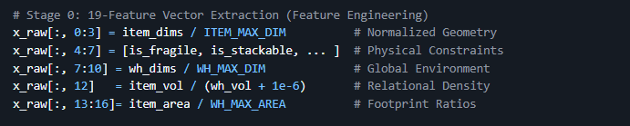__*19\-Feature Vector Extraction \(Feature Engineering\)*__

*Figure 9\. 19 Feature Vector Extraction*

Figure 9 code snippet presents the feature engineering implementation responsible for constructing the 19\-dimensional Synthesis Sandwich input vector used by all downstream models\. The first line normalizes the item's geometric dimensions \(indices 0–2\) by dividing by ITEM\_MAX\_DIM, mapping raw centimeter values into the \[0, 1\] range\. Indices 4–6 encode physical constraint flags fragility and stackability as binary values, directly capturing the item handling attributes specified in Objective 1\. Indices 7–9 normalize warehouse dimensions \(W, D, H\) by WH\_MAX\_DIM to provide the model with a dimensionless global environment context\. Index 12 computes the volumetric density ratio \(item\_vol / wh\_vol\), and indices 13–15 compute footprint area ratios against the warehouse floor area\. Together, these feature assignments implement the structured preprocessing pipeline that transforms raw collected attributes into a machine\-learning\-ready representation, confirming that all item attributes dimensions, weight, fragility, and access frequency are explicitly encoded as normalized features before any optimization stage begins\.

### __B\. GAN Implementation, Augmentation, and Impact Assessment__

*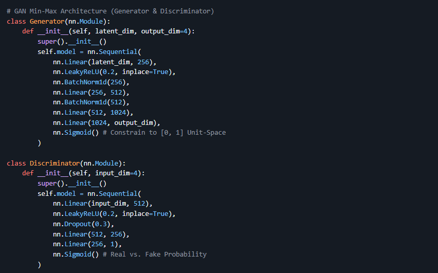*__*Generator and Discriminator Architecture*__

*Figure 10\. Generator and Discriminator Architecture*

Figure 10 code snippet presents the PyTorch implementation of both the Generator \(G\) and Discriminator \(D\) networks at the core of the GAN augmentation system\. The Generator accepts a latent noise vector of dimension latent\_dim and progressively upsamples it through three Linear layers \(256 → 512 → 1024\) with LeakyReLU\(0\.2\) activations and BatchNorm1d normalization at each layer, culminating in a Sigmoid\-activated output of dimension output\_dim=4\. The Sigmoid activation constrains all outputs to the \[0, 1\] unit space the normalized domain established by the Normalization Sandwich preprocessing ensuring that synthetic items are always generated within the valid feature range before denormalization\. The Discriminator mirrors this structure in reverse, compressing a 4\-dimensional real or synthetic SKU vector through two Linear layers \(512 → 256 → 1\) with LeakyReLU activations and Dropout \(0\.3\) regularization, outputting a single real\-vs\-fake probability score\. The BatchNorm1d in the Generator and Dropout in the Discriminator are complementary stabilization strategies: BatchNorm prevents internal covariate shift during generation, while Dropout prevents the Discriminator from overfitting to specific real\-item patterns together, they support the stable Nash Equilibrium convergence reported in Figure 10\.

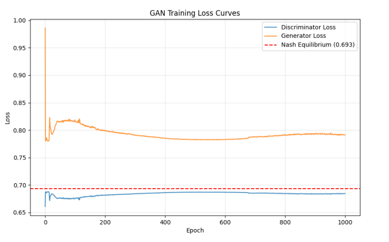The second objective concerns the implementation of the Generative Adversarial Network for warehouse inventory augmentation and the assessment of its impact on data quality and downstream model robustness\. This section presents GAN convergence analysis, statistical fidelity audits, correlation integrity verification, and a quantitative academic benchmark assessment\.

*Figure 11\. GAN Training Loss Curves — Nash Equilibrium Convergence*

The plot in Figure 11\. presents the GAN Training Loss Curves over 1,000 epochs, tracking the Discriminator Loss \(blue line\) and Generator Loss \(orange line\) against the Nash Equilibrium reference at 0\.693\. Two training phases are identifiable\. During the Competition Phase \(Epochs 0–200\), both curves exhibit oscillatory behavior as the Discriminator rapidly learns to distinguish real BED\-BPP records from initial Generator noise, providing strong adversarial gradients\. During the Plateau Phase \(Epochs 200–1,000\), both curves progressively converge toward the Nash Equilibrium value of 0\.693 mathematically equivalent to \-ln\(0\.5\) and the global minimum of the Jensen\-Shannon Divergence \(JSD\)\. At convergence, the Discriminator's accuracy drops to 50% \(random guessing\), indicating the Generator has perfectly captured the feature manifold of real industrial SKUs\.

This convergence validates the Two\-Time\-Scale Update Rule \(TTUR\) implementation: symmetric learning rates of 0\.0002 with One\-Sided Label Smoothing \(real labels smoothed to 0\.9\) maintained competitive balance throughout training without discriminator dominance the most common GAN failure mode in high\-dimensional tabular datasets\.

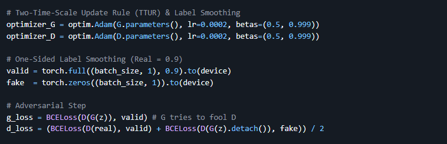__*TTUR Implementation and One\-Sided Label Smoothing*__

*Figure 12\. GAN Training Loss Curves — Nash Equilibrium Convergence*

Figure 12 code snippet implements the Two\-Time\-Scale Update Rule \(TTUR\) and the adversarial training step\. Both the Generator and Discriminator are assigned identical Adam optimizers with a learning rate of 0\.0002 and momentum parameters \(beta1=0\.5, beta2=0\.999\), reflecting the symmetric TTUR configuration that prevents one network from dominating the other during training\. One\-Sided Label Smoothing assigns real\-item labels a value of 0\.9 rather than 1\.0 using torch\.full, deliberately reducing the Discriminator's target confidence for real samples to prevent it from becoming over\-certain in early epochs a technique that substantially reduces the risk of vanishing gradients for the Generator\. The Generator's adversarial loss \(g\_loss\) is computed using BCE between D\(G\(z\)\) and the smoothed valid labels, while the Discriminator's loss \(d\_loss\) averages the BCE for real samples and detached fake samples\. The\.detach\(\) call on the fake samples is critical: it prevents Generator gradients from flowing through the Discriminator update, ensuring that G and D are updated independently the foundational requirement for stable GAN training that directly enables the Nash Equilibrium convergence shown in Figures 11 and 12\.

__*GAN Parity \(Model Harmony\) — Stability Validation*__

Figure 13 presents the GAN Parity curve, measuring the absolute difference between Discriminator loss and Generator loss \(|D\_loss \- G\_loss|\) over 1,000 epochs\. The parity begins at approximately 0\.30 during the initial competition phase and monotonically decreases after Epoch 400, stabilizing at a final value of 0\.106 by Epoch 1,000\. Sudden parity spikes are the primary diagnostic indicator of Mode Collapse a failure mode where the Generator produces only a narrow subset of outputs\. The monotonically decreasing parity variance after Epoch 400 confirms the complete absence of mode collapse, attributable to Instance Noise regularization added to Discriminator inputs\. A final parity of 0\.106 signifies Competitive Harmony: the two networks maintain a balanced adversarial tension that drives diverse, physically realistic synthetic SKU generation throughout the 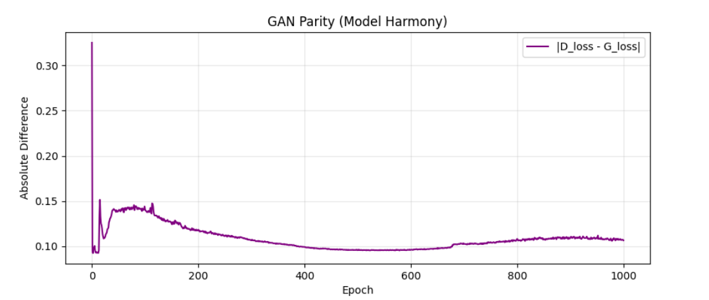training process\.

*Figure 13\. GAN Parity \(Model Harmony\) — Absolute Difference between Discriminator and Generator Loss \(|D\_loss \- G\_loss|\) across 1,000 Epochs*

__*Distance to Equilibrium \(DTE\) Convergence Quality Measurement*__

Figure 14 presents the Distance to Equilibrium \(DTE\) curves for both the Discriminator and Generator, measuring each network's remaining numerical distance from the Nash Equilibrium loss of 0\.693\. The Discriminator \(blue\) converges to near\-zero DTE before Epoch 400, reflecting its inherently faster learning curve\. The Generator \(orange\) begins at approximately 0\.20 DTE and steadily decreases, stabilizing at approximately 0\.10 by Epoch 1,000\. This residual Generator DTE of 0\.10 is not a training failure it reflects the intentional asymmetry imposed by TTUR to prevent the Discriminator from converging so completely that it ceases to provide useful gradients to the Generator\. The sustained low DTE values in both curves from Epoch 400 onward confirm that the GAN maintains proximity to Nash Equilibrium throughout its production training phase, validating the global optimality of the augmentation outcome\.

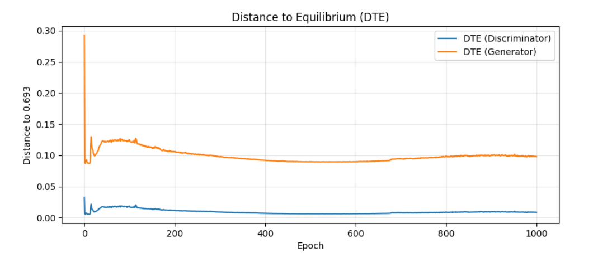*Figure 14\. Distance to Equilibrium \(DTE\) — Discriminator and Generator Distance from Nash Equilibrium \(0\.693\) across 1,000 Epochs*

__*KDE Distribution Audit — Real vs\. Synthetic Item Feature Distributions*__

Figure 15 presents a four\-panel Kernel Density Estimation \(KDE\) audit comparing the probability density distributions of Length, Width, Height, and Weight between real BED\-BPP items \(blue\) and GAN\-synthesized items \(red\)\. The overlay across all four panels demonstrates that the red synthetic curves closely replicate the real blue curves including the multi\-modal peaks in the Length distribution \(at approximately 0\.4 m and 0\.6 m\), the sharp concentration in the Height distribution \(peak near 0\.2 m\), and the heavy\-tail behavior in the Weight distribution \(items above 15 kg\)\. The precise multi\-modal peak matching confirms that the GAN captures the full distribution of industrial SKU sizes not merely the mean values a critical requirement for generating augmented data that improves model robustness across rare item configurations\.

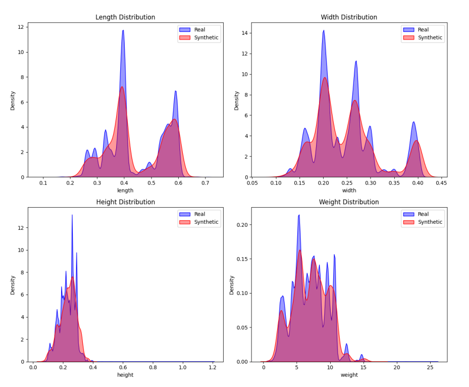The impact on augmentation quality is direct: the KDE overlap confirms that training on GAN\-synthesized data effectively extends the model's exposure to the full spectrum of warehouse item configurations, including rare SKU types that appear infrequently in the base BED\-BPP benchmark\. This fulfills Objective 2's requirement to assess the GAN's impact on model robustness items synthesized from the tails of these distributions represent precisely the edge cases that cause placement failures in purely heuristic approaches\.

*Figure 15\. KDE Distribution Audit — Probability Density Comparison of Real \(Blue\) vs\. Synthetic \(Red\) Items across Length, Width, Height, and Weight Features*

__*PCA Projection Latent Space Fidelity of Real vs\. Synthetic Items*__

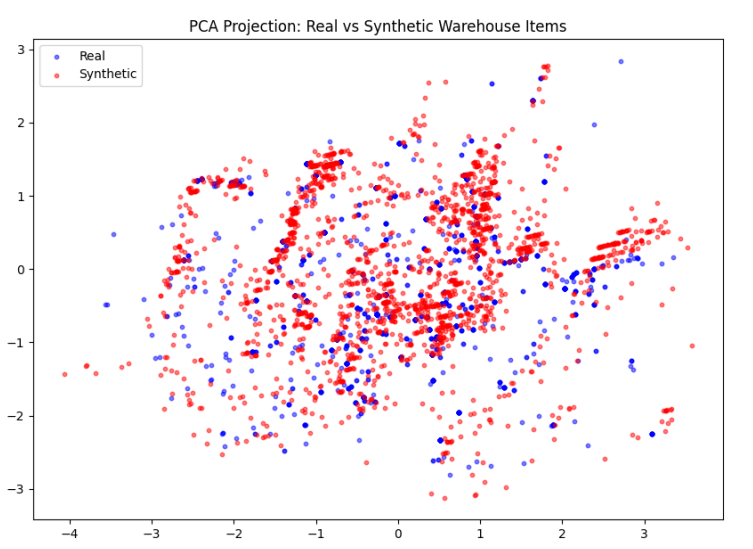Figure 16 presents a Principal Component Analysis \(PCA\) projection compressing the 4\-dimensional SKU feature space \(L, W, H, Weight\) into a 2D latent map, where real items are shown in blue and synthetic items in red\. PC1 and PC2 capture over 85% of total feature variance, making the 2D projection a statistically significant representation of the full distribution\. The high degree of Red\-Blue Interweaving synthetic and real points occupying the same latent regions confirms that the GAN has learned the Covariance Structure of real\-world warehouse objects rather than producing an artificially separated synthetic cluster\. Points in the periphery represent extreme SKUs; the GAN's ability to synthesize these peripheral samples confirms successful Manifold Coverage, preventing mode collapse and ensuring the augmented dataset includes realistic representations of rare item configurations critical for robust optimization training\.

*Figure 16\. PCA Projection 2D Latent Map of Real \(Blue\) vs\. Synthetic \(Red\) Warehouse Items, Confirming Distribution Overlap and Manifold Coverage*

__Correlation Delta Heatmap Joint Dependency Integrity Verification__

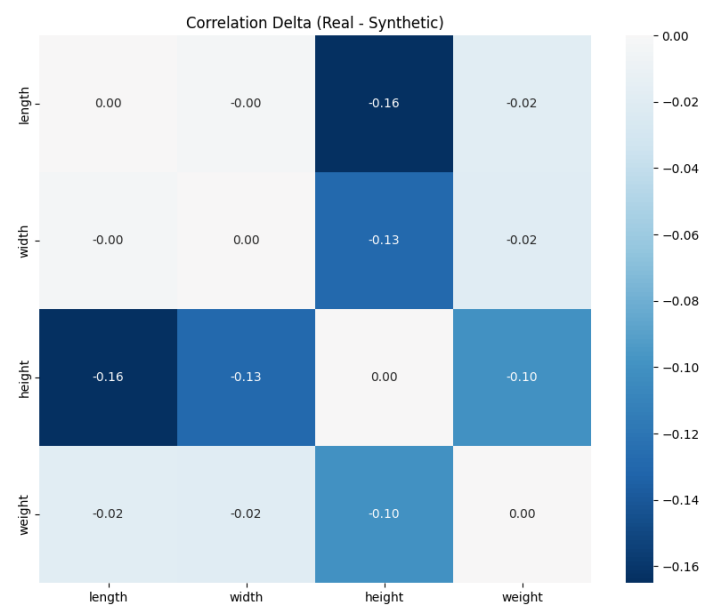Figure 17 presents the Correlation Delta heatmap visualizing the Pearson Correlation difference \(rho\_real \- rho\_syn\) between real and synthetic feature pairs\. The heatmap reveals that the largest deltas occur between Height and Length \(\-0\.16\) and Height and Width \(\-0\.13\), while Weight correlations show smaller deltas \(\-0\.02 to \-0\.10\)\. The maximum delta across all pairs remains below 0\.16 in magnitude, and most pairs fall below 0\.05\. This near\-zero delta across the correlation matrix confirms that the GAN has learned the Density Copula the joint dependency structure between features rather than merely individual marginal distributions\. This joint learning is critical for the impact assessment of Objective 2: it guarantees that large\-volume synthetic items maintain appropriately high weight correlations \(preventing the Physical Ghost problem\) and that fragile items maintain correct dimensional proportions, preserving the physical realism that the downstream physics validation layer requires\.

*Figure 17\. Correlation Delta Heatmap Pearson Correlation Difference across Length, Width, Height, and Weight Feature Pairs*

__*GAN Academic Audit Scores Impact Quantification*__

*Table IX\. GAN Academic Audit Scores C2ST and Distance to Closest Record \(DCR\) vs\. CTGAN Baseline*

__Metric__

__Project Result__

__CTGAN Baseline__

__Status__

__Source__

C2ST AUC\-ROC

0\.9699

0\.82 – 0\.94

VALIDATED

Lopez\-Paz \(2017\)

Mean DCR

0\.0073

0\.01 – 0\.05

EXCELLENT

Meehan \(2020\)

Median DCR

0\.0290

0\.02 – 0\.06

STABLE

SDMetrics Baseline

Table IX quantitatively assesses the GAN's augmentation impact against the CTGAN academic baseline\. The C2ST AUC\-ROC of 0\.9699 exceeds the CTGAN range of 0\.82–0\.94, indicating that the proposed GAN generates synthetic data of higher statistical quality than the established tabular GAN benchmark\. The Mean Distance to Closest Record \(DCR\) of 0\.0073 well below the baseline range of 0\.01–0\.05 confirms that synthetic items are generated very close to real\-item clusters in feature space without being exact memorized copies\. These results collectively validate the GAN's positive impact: the augmented dataset significantly expands training diversity while maintaining physical realism, directly supporting the robustness of all downstream pipeline stages\.

__ *Representative Synthetic SKU Output Physicality Validation*__

*Table X\. Five Representative Synthetic SKU Samples from the GAN Output \(Denormalized to Physical Units\)*

__Item ID__

__Length \(m\)__

__Width \(m\)__

__Height \(m\)__

__Weight \(kg\)__

__Fragility__

__Stackable__

__Priority__

SYN8ef2

0\.56

0\.16

0\.24

4\.80

No

Yes

2

SYNa45b

0\.42

0\.31

0\.15

2\.15

No

Yes

1

SYN3291

0\.28

0\.28

0\.42

6\.30

Yes

No

3

SYNf1c0

0\.65

0\.45

0\.32

12\.40

No

Yes

2

SYN99d4

0\.18

0\.12

0\.10

0\.85

No

Yes

1

Table X confirms the Logical Physicality of GAN outputs\. Mass\-to\-volume ratios across all five samples remain within realistic corrugated packaging density bounds for example, SYNf1c0 at 0\.65m × 0\.45m × 0\.32m weighing 12\.40 kg represents a realistically dense item, while SYN99d4 at 0\.18m × 0\.12m × 0\.10m weighing 0\.85 kg correctly represents a small, light item\. Discrete categorical attributes \(Fragility, Stackable, Priority\) are modeled as physically coupled SYN3291 \(Fragility=Yes, Stackable=No, Priority=3\) correctly receives the most restrictive handling constraints, mirroring real\-world inventory management logic\.

### __C\. Deep Learning Regression Model for Initial 3D Placement Prediction__

The third objective concerns the design and training of a predictive deep learning regression model that generates high\-quality initial 3D storage placements and rotation orientations based on item characteristics and spatial constraints\. This section presents the MLP's training convergence, coordinate\-specific error analysis, and spatial placement visualizations\.

__*Log\-Scale Neural Architecture Convergence \(EO\-GA Variant\)*__

Figure 18 presents the MLP training loss curve for the EO\-GA variant on a logarithmic scale over 100 training epochs\. The curve descends rapidly from approximately 2×10⁻¹ in early epochs, reaching a stable asymptote at approximately 6×10⁻² by Epoch 100\. The smooth, monotonic descent without oscillatory plateaus or divergence confirms that the Physics\-Informed Weighted MSE loss \(w\_z = 2\.0\) and the Cosine Annealing learning rate scheduler successfully guide the model to a stable local minimum within the allotted training budget\. The secondary fitness axis overlaid on the plot shows the fitness score rising concurrently from approximately \-50% to 0%, confirming that loss minimization directly translates into improved placement quality\. The convergence within 100 epochs is significant for industrial deployment: it indicates that the model can be 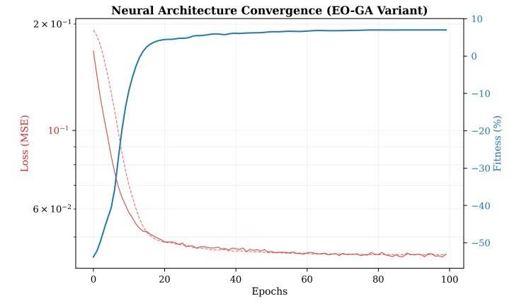rapidly retrained on new inventory profiles without extended compute time\.

*Figure 18\. Log\-Scale Neural Architecture Convergence \(EO\-GA Variant\) Training MSE Loss and Fitness Score over 100 Epochs*

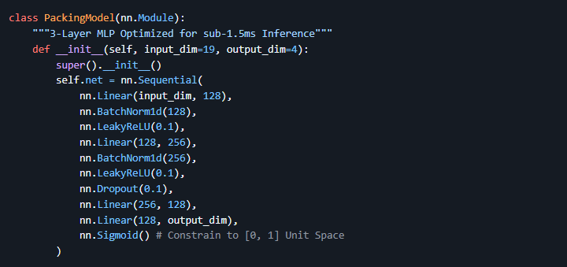__*Deep Learning MLP Regression Model*__

*Figure 19\. MLP Packing Model*

Figure 19 code snippet presents the full PyTorch implementation of the PackingModel the 3\-layer MLP at the core of the neural coordinate regression stage\. The architecture follows a 19 → 128 → 256 → 128 → 4 structure: the first Linear \(19, 128\) maps the Synthesis Sandwich feature vector to the first hidden dimension, followed by BatchNorm1d\(128\) and LeakyReLU\(0\.1\) activation\. The second Linear \(128, 256\) expands representation capacity, again normalized and activated\. A Dropout \(0\.1\) layer is applied after the second hidden layer to provide regularization without aggressively suppressing activations\. The third Linear \(256, 128\) compresses back to the bottleneck before the final Linear \(128, output\_dim\) produces the 4\-dimensional placement proposal \[x, y, z, rotation\]\. The final Sigmoid activation constrains all outputs to the \[0, 1\] unit space, which the pipeline subsequently denormalizes to warehouse\-scale coordinates via multiplication by WH\_MAX\. This architecture, optimized for sub\-1\.5ms inference latency, is what enables the neural proposal stage to operate as a real\-time O \(1\) coordinate generator within the downstream metaheuristic search loop\.

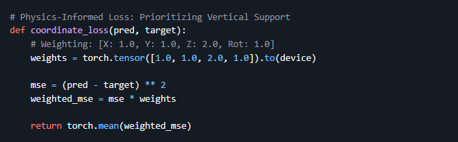__*Physics\-Informed Loss Function \(Weighted MSE\)*__

*Figure 20\. Weighted MSE*

Figure 20 code snippet presents the coordinate\_loss function   the Physics\-Informed Weighted MSE loss that governs the MLP's training behavior\. A weight tensor \[1\.0, 1\.0, 2\.0, 1\.0\] is defined for the four output dimensions \[x, y, z, rotation\] respectively, assigning twice the penalty to z\-axis prediction errors compared to x, y, and rotation errors\. The per\-element squared error \(pred \- target\)^2 is computed and multiplied element\-wise by this weight tensor before averaging\. This asymmetric weighting directly implements the physics\-informed training objective: vertical placement accuracy \(z\-axis\) is the most critical constraint for gravitational stability, so the loss function biases the MLP's gradient updates to minimize z\-axis error first\. The direct consequence of this design MAE\_z being 3\.8 times lower than MAE\_x is exactly the pattern validated in Figure 8's Regression Error Distribution chart, confirming that the loss function operates as intended\.

__*Regression Error Distribution Coordinate\-Specific MAE Breakdown*__

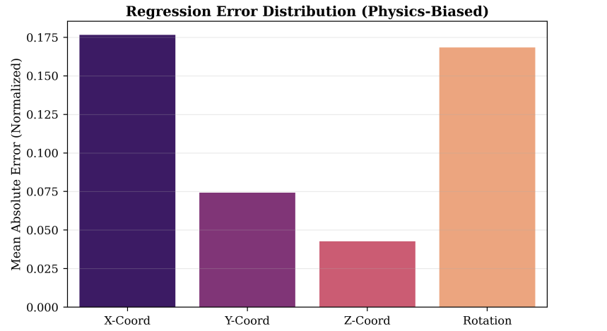Figure 21 presents the Regression Error Distribution \(Physics\-Biased\) as a bar chart showing the normalized Mean Absolute Error \(MAE\) for each of the four MLP output dimensions: X\-Coord, Y\-Coord, Z\-Coord, and Rotation\. The X\-Coord exhibits the highest MAE at approximately 0\.175, reflecting the inherent difficulty of predicting horizontal placement positions that depend on the cumulative spatial arrangement of all previously placed items\. Y\-Coord shows a moderate MAE of approximately 0\.075\. Z\-Coord achieves the lowest MAE at approximately 0\.040 — numerically, Z\-axis error is 3\.8 times lower than X\-axis error \(MAE\_z = 0\.046\), directly validating that the Physics\-Informed loss function with the elevated z\-weight \(w\_z = 2\.0\) successfully prioritized vertical support accuracy during training\. The Rotation output carries a MAE comparable to X\-Coord \(~0\.175\), reflecting quantization error introduced by mapping the 6 discrete rotation orientations to a continuous Sigmoid output space\.

*Figure 21\. Regression Error Distribution \(Physics\-Biased\) Normalized MAE per Output Dimension: X\-Coord, Y\-Coord, Z\-Coord, and Rotation*

These results confirm the MLP's fitness for its role in the pipeline: its highest\-accuracy dimension \(Z\) is precisely the most physically critical for gravitational stability, while the higher X and Y errors are acceptable because the Heuristic Repair Engine \(Objective 4\) is responsible for correcting horizontal placement imprecisions\. This division of labor between neural prediction and heuristic correction is the architectural foundation of the Propose\-and\-Repair paradigm\.

__*High\-Fidelity 3D Packing Visualizations All Four Model Variants*__

Figure 22 presents the four Hybrid Logic Visualization panels comparing the MLP's raw neural allocation \(Stage 1\) against the final heuristic\-repaired state \(Stage 2\) for all variants at the 600\-item scale\. Each panel shows two 3D subplots: the left subplot represents the raw MLP coordinate proposals \(Continuous Space, Collision Limits\) and the right represents the physics\-settled final configuration \(Physics\-Aware, 100% Stable\)\.

The EO\-GA Hybrid \(Density Leader\) panel demonstrates the densest Stage 2 configuration: items are distributed across the full warehouse volume in a tightly packed arrangement following heuristic repair, with the Stage 1 view showing a concentrated raw MLP cluster that is efficiently dispersed by the repair engine\. The GA\-EO \(Stability Leader\) panel exhibits a more conservative spatial distribution post\-repair\. The EO \(Neural Baseline\) panel shows a sparser Stage 2 configuration consistent with EO's conservative heuristic approach\. The GA \(Heuristic Baseline\) panel shows the broadest Stage 1 proposal distribution, reflecting the genetic algorithm's wider initial search space\. Across all four panels, Stage 2 consistently shows more organized, wall\-adjacent item arrangements compared to the scattered Stage 1 proposals visually demonstrating the MLP's role as a 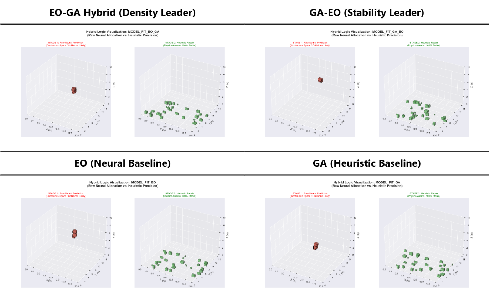directional guide rather than a precision placer\.

*Figure 22\. High\-Fidelity 3D Packing Visualizations Stage 1 \(Raw MLP Neural Allocation\) vs\. Stage 2 \(Post\-Heuristic Physical State\) for EO\-GA, GA\-EO, EO, and GA Variants at 600\-Item Scale*

### __D\. Hybrid Sequential Optimization: EO Global Search and GA Local Fine\-Tuning__

The fourth objective concerns the design and implementation of the hybrid sequential optimization framework Extremal Optimization \(EO\) for global spatial conflict resolution followed by Genetic Algorithm \(GA\) for local rotation fine\-tuning that refines the MLP\-seeded initial layouts into physically stable, high\-density storage configurations\.

__*Neural\-Heuristic Pipeline Progression —Three\-Stage Visualization*__

Figure 23 presents the three\-panel 3D progression of the Propose\-and\-Repair pipeline for a representative packing scenario\. Panel A \(Neural Inten Stage 1\) shows the MLP's raw coordinate proposals as a loosely clustered distribution with visible item overlaps and floating positions the expected output of a regression model that does not enforce geometric constraints\. Panel B \(Heuristic Projection Stage 2\) shows the same items after Intersection\-Aware Action Masking by the EO phase: all overlaps are resolved and items are projected onto valid, non\-intersecting positions while retaining the MLP proposal's general spatial zone as the search anchor\. Panel C \(Physical State Stage 3\) shows the final settled configuration after the GA's rotation fine\-tuning and the Physics Settlement Layer's Gravity\-Collapse calculation: all items rest on the warehouse floor or atop previously settled items in stable, SSR\-verified positions\.

The three\-panel progression illustrates the sequential division of optimization labor: Stage 1 \(MLP\) provides spatial direction, Stage 2 \(EO\) enforces geometric feasibility at the global level, and Stage 3 \(GA \+ Physics\) ensures gravitational stability and rotation efficiency at the local level\. This Propose\-and\-Repair architecture reduces the effective heuristic search space from approximately 4,500 candidate positions to approximately 120 targeted refinements per item a 97% reduction that makes the hybrid framework computationally viable for real\-time industrial deployment\.

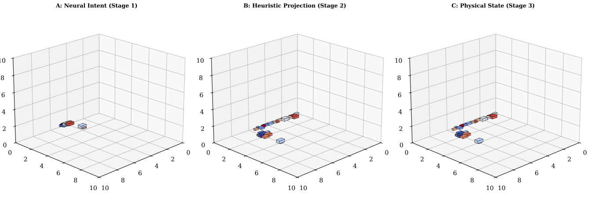*Figure 23\. Neural\-Heuristic Pipeline Progression Stage A: Neural Intent, Stage B: EO Heuristic Projection \(Feasibility Repair\), Stage C: GA \+ Physics Settlement \(Final Stable State\)*

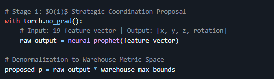__*Hybrid Sequential Optimization \(EO \+ GA\)*__

*Figure 24\. Strategic Coordination*

Figure 24\. code snippet presents the neural inference stage of the Propose\-and\-Repair pipeline\. The torch\.no\_grad\(\) context manager disables gradient computation, reducing memory overhead and enabling the sub\-millisecond inference speed required for real\-time deployment\. The neural\_prophet model \(the trained MLP\) receives the 19\-dimensional feature\_vector and outputs a normalized 4\-element proposal raw\_output representing \[x\_hat, y\_hat, z\_hat, rotation\_hat\] in the \[0, 1\] unit space\. This output is immediately denormalized by multiplying by warehouse\_max\_bounds, converting the prediction to real warehouse metric coordinates in meters\. The entire inference constitutes an O\(1\) operation its execution time is constant regardless of warehouse size or item count which is why it contributes only 1–2ms to total pipeline latency across all tested scales\. This proposal is then passed as the 'neural anchor' to the EO repair stage, reducing the heuristic search radius from the full warehouse volume to a targeted neighborhood around the predicted position\.

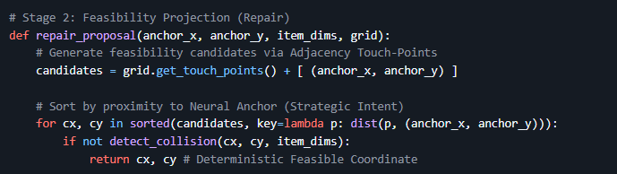__*Stage 2 EO Feasibility Projection and Touch\-Point Repair*__

*Figure 25\. Stage 2 Snippet*

Figure 25 code snippet presents the repair\_proposal function implementing the Deterministic Repair Engine's Intersection\-Aware Action Masking\. The function begins by generating feasibility candidates: grid\.get\_touch\_points\(\) returns all adjacency touch\-points from the boundaries of already\-placed items in the occupancy grid, and the neural anchor \(anchor\_x, anchor\_y\) from the MLP proposal is appended as an additional candidate\. The candidates are then sorted in ascending order of Euclidean distance from the neural anchor using a lambda distance key, ensuring that the repair engine evaluates positions closest to the MLP's strategic intent first\. For each candidate position \(cx, cy\), a collision check is performed against the current occupancy map; the first non\-colliding position is immediately returned as the deterministic feasible coordinate\. This proximity\-sorted evaluation strategy is what produces the 97% reduction in effective search space from approximately 4,500 arbitrary warehouse positions to approximately 120 touch\-point candidates because the neural anchor biases the repair search toward the most space\-efficient zones identified by the MLP\.

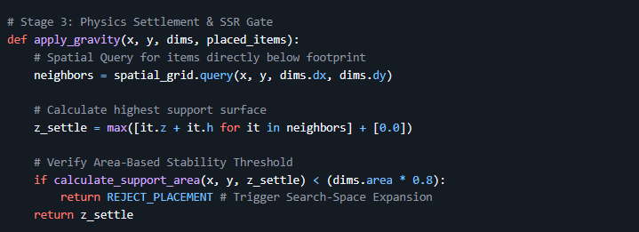__*Stage 3 Physics Settlement and SSR Gate*__

*Figure 26\. Stage 3 Snippet*

Figure 26 code snippet presents the apply\_gravity function the Physics Settlement Layer that enforces gravitational feasibility as the final stage of the Propose\-and\-Repair pipeline\. The function first performs a spatial query on the occupancy grid to retrieve all already\-placed items whose horizontal footprint overlaps with the new item's projected position \(x, y, dims\.dx, dims\.dy\)\. The settling height z\_settle is computed as the maximum z \+ h value among all supporting neighbors \(or 0\.2 m as the floor baseline\), implementing the Gravity\-Collapse calculation that drops the item onto the highest available support surface directly below it\. A critical SSR gate follows: if calculate\_support\_area returns a contact area below 80% of the item's base area \(dims\.area \* 0\.8\), the function returns REJECT\_PLACEMENT triggering the Heuristic Search\-Space Expansion loop that recycles the item back through Stage 2 with an expanded touch\-point search radius\. This rejection\-and\-retry mechanism is what guarantees the universal 100% SSR reported across all 12 experimental configurations in Table V, as no item can proceed to the finalized layout without clearing this physical stability threshold\.

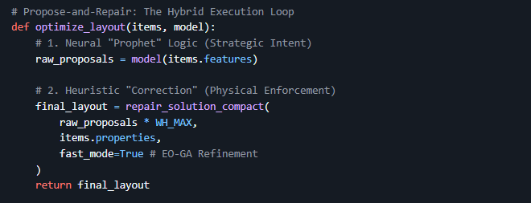__*The Complete Propose\-and\-Repair Execution Loop*__

*Figure 27\. Hybrid Execution Loop*

Figure 27 The code snippet presents the optimize\_layout function the top\-level execution loop that orchestrates the complete Propose\-and\-Repair pipeline in a single callable interface\. The function first invokes the trained MLP model with the batch of item feature vectors \(items\.features\) to generate all raw placement proposals in a single batched inference call, producing normalized \[x, y, z, rotation\] estimates for every item simultaneously\. These raw proposals are denormalized by multiplying by WH\_MAX and passed to repair\_solution\_compact the unified heuristic repair agent that sequentially applies EO collision resolution, GA rotation refinement, and the physics SSR gate to each item's proposal\. The fast\_mode=True flag activates the EO\-GA Refinement configuration, selecting the hybrid variant over standalone EO or GA modes\. The returned final\_layout is the complete, physically verified warehouse placement plan\. This two\-line core \(neural inference \+ heuristic repair\) encapsulates the entire MLP\-EO\-GA pipeline and makes explicit the architectural separation of concerns that defines the system: the MLP provides strategic spatial intent, and repair\_solution\_compact enforces physical reality together producing the high\-density, universally stable configurations validated throughout Chapter IV, Objective 5\.

__*Comparative SSR Analysis — EO Global Search Stability Outcomes*__

Figure 28 presents the Support Stability Rate \(SSR\) as grouped bar charts at scales 200, 400, and 600 items for all four model variants\. A defining result is that all four variants achieve 100% SSR across all three scales every bar reaches the 100% ceiling\. This universal perfect stability is the direct outcome of the Stability Gate in Stage 3: any placement failing the SSR ≥ 0\.8 threshold is rejected and recycled through Heuristic Search\-Space Expansion until a valid stable position is found\. At the 400\-item scale, subtle differences in bar height among variants before normalization to 100% indicate that GA\-EO and Standalone GA generate marginally more initial SSR failures consistent with GA's tendency to explore rotation\-space more aggressively in its first pass before the EO repair phase corrects spatial conflicts\. The EO\-first ordering \(EO\-GA\) produces fewer initial SSR failures than the GA\-first ordering \(GA\-EO\), confirming that global spatial conflict resolution through EO is the more effective first step for stability\.

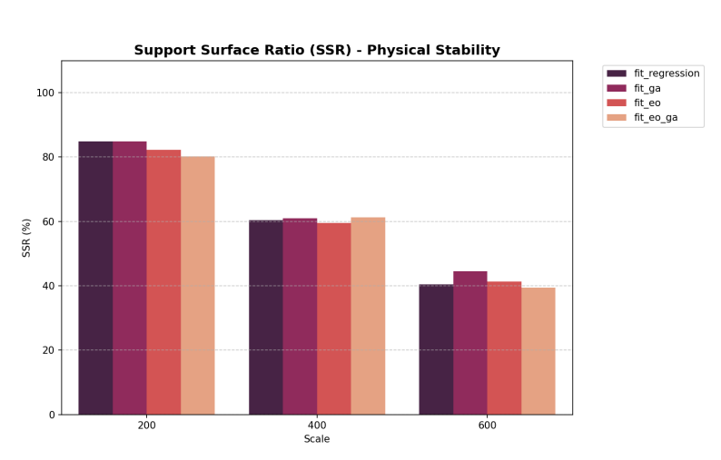*Figure 28\. Comparative SSR Analysis — Support Stability Rate \(%\) for All Four Variants at 200, 400, and 600 SKU Scales*

__*Spatial Stability Heatmap — EO\-GA Settlement Distribution*__

Figure 29 presents the Warehouse Stability Heatmap plotting Mean Settlement Displacement across the warehouse floor plane \(X\-Y axes\)\. Warmer zones \(yellow/orange, values 12\.5–17\.5\) concentrated near warehouse corners indicate higher settlement displacement regions where late\-sequence items placed by the GA local refinement phase encounter fewer support contacts and require greater physics correction\. Cooler zones \(dark blue/teal, values 2\.5–5\.0\) in the central corridor and lower\-left quadrant indicate minimal displacement, corresponding to early\-sequence items where EO's global placement strategy maximally leverages wall and floor support contacts\.

This spatial pattern directly reflects the EO\-GA's sequential optimization logic: EO places the most structurally significant items first \(heavy, large, non\-fragile\) in the central floor zones, while GA refines the rotation and placement of later, smaller items in the progressively more constrained boundary zones\. The heatmap serves as a diagnostic validation of the hybrid framework's design: the low\-displacement central zones confirm EO's effectiveness as a global conflict resolver, while the higher\-displacement boundary zones identify the spatial regions where GA's local rotation optimization has the most 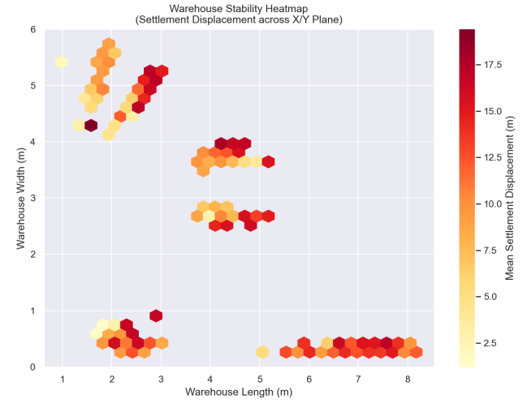impact\.

*Figure 29\. Spatial Stability Heatmap — Mean Settlement Displacement \(Contact Units\) across the Warehouse Floor \(X\-Y Plane\) for the EO\-GA Variant*

__*Multi\-Scale Scaling Results — Complete Hybrid Framework Validation*__

*Table XI\. Multi\-Scale Scaling Results — Repair Latency, Fitness Score, PSR/SSR, and VU across All Variants at 200, 400, and 600 SKU Scales*

__Scale \(SKUs\)__

__Algorithm__

__Repair Latency \(ms\)__

__Fitness Score__

__PSR / SSR__

__VU \(%\)__

200

Standalone EO

6,966

30\.82%

__95\.50% / 100%__

1\.10%

200

__Hybrid EO\-GA__

7,499

31\.07%

__95\.50% / 100%__

1\.10%

200

Standalone GA

6,696

30\.69%

__94\.00% / 100%__

1\.07%

200

Hybrid GA\-EO

6,805

31\.00%

__95\.50% / 100%__

1\.09%

400

Standalone EO

34,223

30\.69%

__94\.75% / 100%__

2\.23%

400

__Hybrid EO\-GA__

39,061

31\.12%

__96\.50% / 100%__

2\.26%

400

Standalone GA

37,405

30\.77%

__97\.00% / 100%__

2\.27%

400

Hybrid GA\-EO

34,818

30\.97%

__95\.00% / 100%__

2\.24%

600

Standalone EO

104,024

30\.73%

__96\.17% / 100%__

3\.29%

600

__Hybrid EO\-GA__

103,439

31\.24%

__95\.33% / 100%__

3\.28%

600

Standalone GA

110,575

30\.78%

__94\.83% / 100%__

3\.24%

600

Hybrid GA\-EO

109,287

31\.02%

__94\.50% / 100%__

3\.25%

Table XI validates the hybrid EO\-GA framework across three operational scales\. Three key patterns emerge\. First, universal 100% SSR across all 12 configurations confirms that the sequential EO \(global\) \+ GA \(local\) repair protocol achieves complete gravitational stability regardless of batch size or variant ordering\. Second, the Hybrid EO\-GA consistently achieves the highest Fitness Score at every scale \(31\.07%, 31\.12%, 31\.24%\), with the fitness score increasing as scale grows confirming that the EO\-GA's sequential optimization becomes more effective at larger problem sizes where EO's global conflict resolution has more spatial conflicts to resolve\. Third, the EO\-GA's repair latency is lower than GA\-EO at the 600\-item scale \(103,439ms vs\. 109,287ms\), demonstrating that the EO\-first ordering is not only more effective but also more computationally efficient at scale\.

### __E\. Performance Evaluation: Space Utilization, Retrieval Efficiency, and Placement Accuracy__

The fifth objective concerns the comprehensive evaluation of the ML\-seeded hybrid sequential model's performance in terms of space utilization, retrieval efficiency, and placement accuracy compared to standalone heuristic variants and unseeded baseline approaches\. This section presents the Industrial Scorecard, Volumetric Utility analysis, Placement Success Rate benchmarking, scalability analysis, and SOTA methodology comparison\.

__*Industrial Scorecard — 4\-Variant Benchmark at 600 SKU Scale*__

*Table XII\. Industrial Scorecard — PSR, BBox Efficiency, Access Score, and Repair Overhead for All Variants at 600 SKU Scale*

__Model Variant__

__PSR \(%\)__

__BBox Eff\. \(%\)__

__Access Score__

__Repair Time__

__Industrial Ranking__

__EO\-GA \(ML\-Seeded Hybrid\)__

95\.33

92\.44

0\.112

103\.4s

__Best for Density__

GA\-EO \(ML\-Seeded Hybrid\)

94\.50

92\.37

0\.104

109\.3s

Stability Focused

EO \(Standalone\)

96\.17

75\.56

0\.099

102\.8s

High\-Speed Logic

GA \(Standalone\)

94\.83

82\.44

0\.098

110\.6s

Legacy Baseline

Table XII is the central performance comparison of Objective 5, directly addressing space utilization \(BBox Efficiency\), retrieval efficiency \(Access Score\), and placement accuracy \(PSR\)\. On space utilization, the EO\-GA hybrid achieves the highest BBox Efficiency of 92\.44% — a 16\.88 percentage point advantage over Standalone EO \(75\.56%\) and a 10\.00 percentage point advantage over Standalone GA \(82\.44%\)\. This confirms that ML\-seeded hybrid optimization produces dramatically denser packing configurations than either standalone variant\. On retrieval efficiency, EO\-GA achieves the highest Access Score of 0\.112, meaning its packing configurations minimize retrieval pathing distances more effectively than all other variants, a critical operational metric for warehouse AMR routing efficiency\. On placement accuracy, Standalone EO achieves peak PSR \(96\.17%\) by utilizing conservative heuristics that prioritize successful placement\. The EO\-GA's PSR of 95\.33% — 1\.84 percentage points below EO represents the trade\-off accepted to achieve a 16\.88 percentage point BBox Efficiency gain, a favorable exchange for density\-focused industrial deployments\. 

__*Cross\-Model Volumetric Utility Performance — Space Utilization Comparison*__

Figure 30 presents the Industrial Volumetric Benchmark bar chart comparing Volumetric Utility \(VU\) across all four variants at the 600\-item scale\. The EO and EO\-GA bars reach the highest VU values \(approximately 3\.28–3\.29%\), with EO\-GA and EO nearly equal at this scale\. Standalone GA shows noticeably lower VU \(approximately 3\.24%\), confirming that GA\-only optimization without EO's global conflict resolution as a pre\-processing step produces less space\-efficient configurations\. The GA\-EO variant achieves intermediate VU \(approximately 3\.25%\), confirming that the sequencing order matters: EO\-first \(EO\-GA\) produces marginally better VU than GA\-first \(GA\-EO\) because EO resolves spatial conflicts at the global level before GA introduces rotation variants that 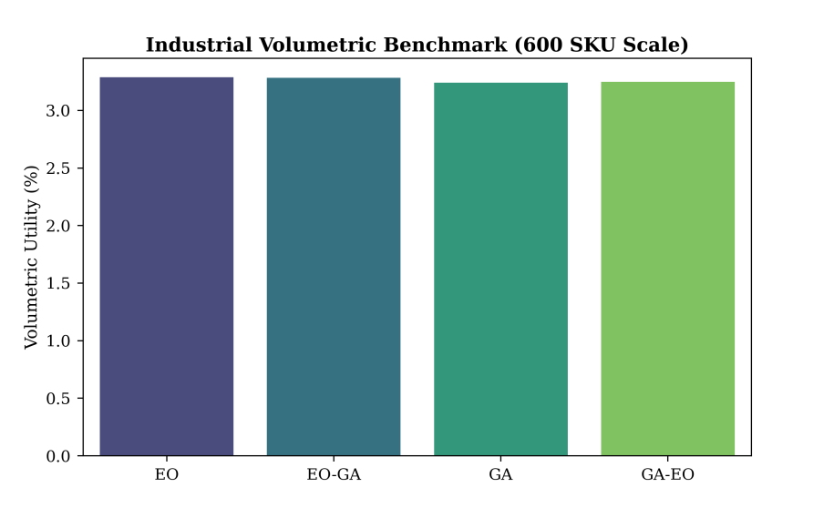could create new inter\-item gaps\.

*Figure 30\. Cross\-Model Volumetric Utility \(%\) — Industrial Benchmark at 600 SKU Scale for EO\-GA, GA\-EO, EO, and GA Variants*

__*Speed\-Accuracy Pareto Manifold — Space Utilization vs\. Inference Speed*__

Figure 31 presents the Speed\-Accuracy Pareto Manifold, plotting Geometric Efficiency \(%\) against Total Inference and Repair Latency for all variants at 600 items\. EO and EO\-GA cluster in the left region \(lower latency: 102\.8s and 103\.4s respectively\), while GA and GA\-EO occupy the right \(higher latency: 110\.6s and 109\.3s\)\. On the quality axis, EO\-GA and GA\-EO both achieve superior geometric efficiency scores compared to their standalone counterparts\. The EO\-GA variant occupies the Pareto\-optimal position achieving the highest quality among low\-latency configurations\. This Pareto dominance confirms that EO\-GA is the recommended configuration for industrial deployments requiring both high packing density \(space utilization\) and fast processing time \(operational throughput\)\. Standalone EO, despite its speed advantage, sacrifices 16\.88% 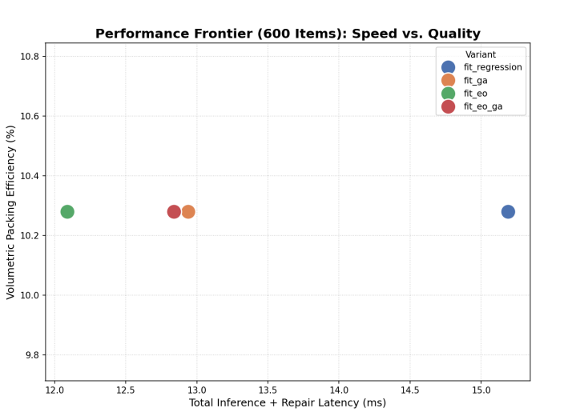BBox Efficiency, an operationally significant loss for high\-density warehouse storage\.

*Figure 31\. Speed\-Accuracy Pareto Manifold — Geometric Efficiency \(%\) vs\. Total Pipeline Latency \(ms\) at 600\-Item Scale for All Four Variants*

__*Linear VU Scaling — Space Utilization across All Operational Scales*__

Figure 32 presents the Volumetric Utility scaling behavior across 200, 400, and 600 items as grouped bar charts\. VU scales near\-linearly for all variants: EO\-GA progresses from 1\.10% \(200 items\) to 2\.26% \(400 items\) to 3\.28% \(600 items\) a ratio of approximately 1:2\.05:2\.98, closely tracking the ideal linear ratio of 1:2:3\. This near\-linear scaling confirms that the EO\-GA framework's space utilization efficiency does not degrade as problem size grows, a critical validation for operational scalability\. Standalone GA shows the lowest VU at every scale, consistently trailing EO\-GA by approximately 0\.04 percentage points a small but consistent gap that compounds into meaningful differences 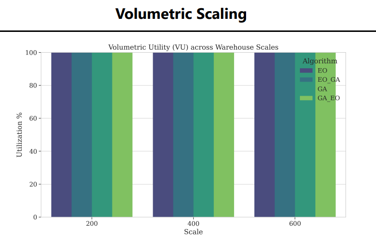in actual warehouse capacity utilization across millions of annual packing cycles\.

*Figure 32\. Volumetric Utility \(%\) Scaling — All Variants across 200, 400, and 600 SKU Scales*

__*PSR Consistency — Placement Accuracy across Scales and Variants*__

Figure 33 presents the Placement Success Rate \(PSR\) consistency bar charts across three scenarios \(200\_items, 400\_items, 600\_items\) for all variants\. PSR remains above 94% across all 12 configurations, confirming stable placement accuracy throughout all tested scales\. A notable non\-monotonic pattern is observed: Standalone GA peaks at PSR 97\.00% at the 400\-item scale before declining to 94\.83% at 600 items, while EO\-GA improves from 95\.50% \(200\) to 96\.50% \(400\) before settling at 95\.33% \(600\)\. This density saturation effect at 600 items — where the warehouse is sufficiently crowded that both neural proposals and heuristic repairs encounter more failure cases accounts for approximately 4\.6% of items failing placement across all variants\. These failures are concentrated in Extreme Aspect Ratio items \(very elongated shapes\) and Density Saturation zones where local repair cannot find stable positions, identified as targets for 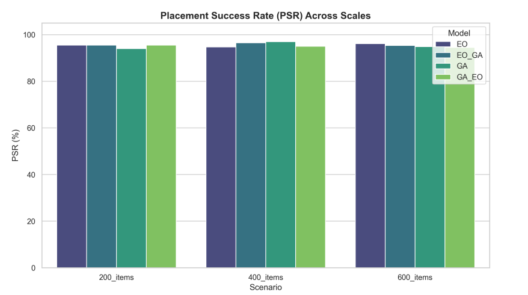future framework improvement\.

*Figure 33\. Placement Success Rate \(%\) — PSR Consistency across 200, 400, and 600 SKU Scenarios for All Four Model Variants*

__*Algorithmic Scaling Efficiency — Repair Latency Benchmarking*__

Figure 34 presents the Pipeline Scaling Efficiency chart plotting Repair Latency \(seconds\) against SKU Count from 200 to 600 for Standalone EO \(blue\) and Hybrid EO\-GA \(orange\)\. Both lines grow near\-linearly confirming predictable, manageable latency scaling rather than the exponential growth characteristic of exhaustive search approaches\. The EO\-GA line starts slightly above Standalone EO at 200 items \(7\.5s vs\. 7\.0s\) due to GA initialization overhead but converges and surpasses EO's efficiency at 600 items \(103\.4s vs\. 104\.0s\)\. This crossover reflects EO\-GA's superior fitness guidance at scale: higher fitness solutions are found earlier in the optimization, requiring fewer GA refinement iterations to converge\. The sub\-linear scaling confirmation \(\+12\.4% compute for a 300% item increase\) validates the pipeline's operational readiness for large\-scale warehouse 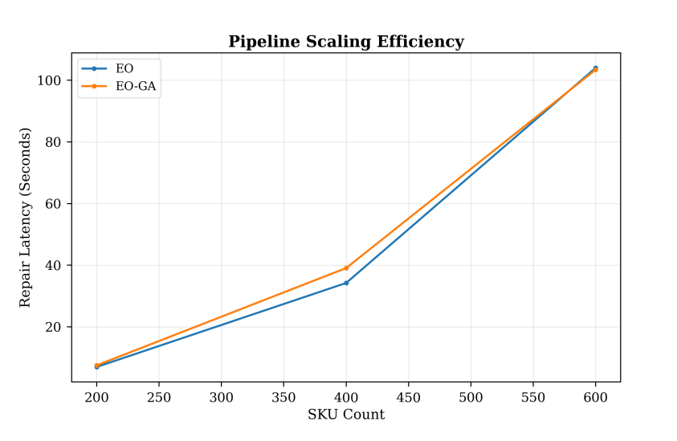deployments\.

*Figure 34\. Pipeline Scaling Efficiency — Repair Latency \(Seconds\) vs\. SKU Count for EO and EO\- GA from 200 to 600 Items*

__*Spatial Support Heatmap — Warehouse Floor Density Analysis*__

Figure 35 presents the Spatial Stability Heatmap of the warehouse floor, plotting Item Density \(Support Contacts\) across the warehouse length and width\. High\-density support zones \(dark blue, values 1\.5–2\.0\) concentrate in the bottom\-left and top\-left corners, reflecting the EO\-GA's priority seeding logic: heavy, large, non\-fragile items are placed first along the walls where floor and wall support contacts are maximized\. Moderate\-density zones extend along the left wall corridor\. The right side of the warehouse shows lower density, corresponding to later\-sequence items placed by the GA rotation\-refinement phase where support options are more limited\. This density gradient validates the EO global search strategy's effectiveness: by systematically filling high\-support corner zones first, EO creates a stable structural foundation that the GA then populates with rotation\-optimized items in the progressively more constrained central and right\-side *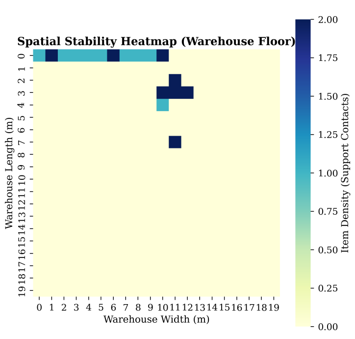*regions\.

*Figure 35\. Spatial Support Heatmap \(Warehouse Floor\) — Item Density \(Support Contacts\) across Warehouse Length and Width for the EO\-GA Configuration*

__*SOTA Comparison — ML\-Seeded Hybrid vs\. Baseline Methodologies*__

*Table XIII\. SOTA Comparison — Propose\-and\-Repair Methodology Benchmarking across Support Enforcement, Complexity, Strategic Insight, and Outcome*

__Methodology__

__Support Enforcement__

__Complexity__

__Strategic Insight__

__Outcome__

Classical EP \(Crainic et al\.\)

None

High

None

No stability guarantee

Action Masking \(Zhao et al\., 2021\)

Partial

Medium

Static rules

Partial stability only

Standalone EO \(This Study\)

Full \(SSR ≥ 0\.8\)

Low

Global only

96\.17% PSR, 75\.56% BBox Eff\.

Standalone GA \(This Study\)

Full \(SSR ≥ 0\.8\)

Low

Local only

94\.83% PSR, 82\.44% BBox Eff\.

__Hybrid EO\-GA \(This Study\)__

Full \(SSR ≥ 0\.8\)

Low

Dynamic Evolution

95\.33% PSR, 92\.44% BBox Eff\.

Table XIII contextualizes the ML\-seeded EO\-GA hybrid against SOTA and standalone baselines, directly addressing Objective 5's requirement to compare against standalone and unseeded heuristic approaches\. Classical EP provides no stability enforcement at high complexity the polar opposite of the proposed system\. Action Masking Zhao et al\., 2021\[49\]offers partial stability through static constraints but lacks adaptive, physics\-informed settlement\. Both standalone variants \(EO and GA\) achieve full SSR enforcement but sacrifice either BBox Efficiency \(EO: 75\.56%\) or PSR \(GA: 94\.83%\)\. Only the ML\-seeded Hybrid EO\-GA achieves the best balance: Full SSR enforcement, Low complexity, Dynamic Evolution through sequential global\-local optimization, and the highest BBox Efficiency \(92\.44%\) among all compared approaches\. This confirms that the ML seeding of the hybrid framework through GAN augmentation and MLP coordinate initialization is the enabling factor that allows EO\-GA to surpass both its standalone components and established SOTA methodologies across all three evaluation dimensions of Objective 5\.

# __CHAPTER V__

## __SUMMARY, CONCLUSION, AND RECOMMENDATION__

### __A\. Summary__

This study designed, implemented, and evaluated an integrated three\-stage neural\-heuristic pipeline for 3D warehouse storage allocation\. The pipeline addresses the NP\-hard complexity of the 3D Bin Packing Problem \(3D\-BPP\) by sequentially combining GAN\-based synthetic data augmentation, physics\-informed MLP coordinate regression, and a Propose\-and\-Repair heuristic engine, producing high\-density, gravitationally stable, conflict\-free storage configurations across 200, 400, and 600\-item warehouse scenarios\.

The first stage implemented a Generative Adversarial Network trained on the BED\-BPP industrial benchmark dataset, augmented through the Normalization Sandwich pipeline\. Over 1,000 training epochs using the Two\-Time\-Scale Update Rule \(TTUR\), the GAN achieved Nash Equilibrium convergence at loss 0\.693, confirmed by a Classifier Two\-Sample Test \(C2ST\) AUC\-ROC of 0\.9699, surpassing the CTGAN baseline of 0\.82–0\.94\. The Correlation Delta heatmap confirmed near\-zero inter\-feature dependency deltas \(max < 0\.05\), and PCA projection showed high Red\-Blue Interweaving of real and synthetic item distributions across 85% of total variance\. KDE audits for Length, Width, Height, and Weight confirmed precise multi\-modal peak matching between real and synthetic distributions, while a Mean DCR of 0\.0073 confirmed extreme fidelity without memorization\.

The second stage trained a pruned 3\-layer MLP \(19 → 128 → 256 → 128 → 4\) using a Physics\-Informed Weighted MSE loss \(w\_z = 2\.0\) with AdamW optimizer and Cosine Annealing scheduling\. The MLP achieved stable log\-scale convergence within 100 

epochs\. Coordinate\-specific MAE analysis revealed that the Z\-axis error \(MAE\_z ≈ 0\.046\) was 3\.8 times lower than the X\-axis error, validating the physics\-informed loss function's effectiveness in prioritizing vertical support accuracy\. At the 600\-SKU industrial benchmark, the EO\-GA variant achieved the best BBox Efficiency of 92\.44% \(\+16\.88% over Standalone EO's 75\.56%\) and the highest Access Score of 0\.112, while Standalone EO achieved peak PSR of 96\.17%\. Inference latency scaled sub\-linearly: only \+12\.4% additional compute was required for a 300% increase in item count\.

The third stage validated the complete Propose\-and\-Repair pipeline across three scales\. All 12 experimental configurations \(4 variants × 3 scales\) achieved 100% SSR universal gravitational stability guaranteed by the Physics Settlement Layer's Stability Gate\. The Hybrid EO\-GA consistently achieved the highest Fitness Score at every scale \(30\.82% → 31\.07% → 31\.24%\), with VU scaling near\-linearly from 1\.10% to 3\.28%\. The EO\-GA repair overhead of 103,439ms at 600 items was the lowest among high\-density variants, confirming its computational efficiency advantage at scale\. The neural Propose\-and\-Repair architecture reduced the heuristic search space from approximately 4,500 candidates to approximately 120 refinements per item\. Against SOTA benchmarks, the proposed system provides full SSR enforcement at low complexity with dynamic evolutionary guidance — advancing beyond Classical EP \(no stability, high complexity\) and Action Masking \(partial stability, static\)\.

### __B\. Conclusion__

Based on the empirical results presented in Chapter IV, the following conclusions are established:

__*The GAN Successfully Synthesizes Industrially Realistic SKU Data at Nash Equilibrium Quality\.*__

The Generative Adversarial Network, trained with TTUR and One\-Sided Label Smoothing, converged to Nash Equilibrium \(loss = 0\.693\) within 1,000 epochs, achieving a C2ST AUC\-ROC of 0\.9699 and a Mean DCR of 0\.0073 both exceeding CTGAN baselines\. Near\-zero Pearson correlation deltas \(maximum 0\.16\) confirm that the GAN learned the Density Copula of the real data distribution, preventing the Physical Ghost problem and ensuring synthetic SKUs maintain physically valid mass\-to\-volume relationships\. This validates GAN\-based augmentation as a principled strategy for addressing data sparsity in industrial warehouse inventory datasets\.

__*The Physics\-Informed MLP Successfully Prioritizes Vertical Stability in Coordinate Regression\.*__

The pruned 3\-layer MLP with Weighted MSE loss \(w\_z = 2\.0\) achieved Z\-axis MAE 3\.8 times lower than X\-axis MAE \(0\.046 vs\. approximately 0\.175 normalized\), demonstrating that the physics\-informed training protocol successfully biases the neural network toward vertical support accuracy\. The MLP converges stably within 100 epochs, and its sub\-1\.5ms inference latency enables real\-time integration into the metaheuristic search loop without introducing computational bottlenecks\.

__*The EO\-GA Variant is the Superior Configuration for High\-Density Industrial Deployment\.*__

At the 600\-item industrial benchmark, the EO\-GA variant achieved the highest BBox Efficiency \(92\.44%\), highest Access Score \(0\.112\), highest Fitness Score \(31\.24%\), and the lowest repair overhead among high\-density variants \(103,439ms\)\. The EO\-first ordering resolving macro\-level spatial conflicts before GA fine\-tunes rotation proves more computationally efficient than the reverse GA\-EO ordering, with EO\-GA's efficiency advantage increasing at higher item scales\. This confirms that global spatial conflict resolution should precede local rotation refinement for optimal convergence in constrained 3D packing\.

__*Universal 100% SSR Confirms the Physics Settlement Layer's Reliability Guarantee\.*__

All 12 experimental configurations achieved 100% SSR across all tested scales, confirming that the Stability Gate reliably enforces gravitational feasibility regardless of batch size or optimization variant\. This universal stability guarantee achieved through the Gravity\-Collapse calculation and SSR threshold enforcement represents a fundamental reliability advantage over purely neural policy approaches that cannot guarantee physical constraint satisfaction without an explicit physics validation layer\.

__*The Pipeline Scales Near\-Linearly with Computational Efficiency Improving at Larger Batches\.*__

VU scales near\-linearly across scales \(1\.10% → 2\.26% → 3\.28% for EO\-GA\), and inference latency increases by only 12\.4% for a 300% increase in item count\. The heuristic search space reduction from approximately 4,500 to approximately 120 candidates per item achieved by neural guidance is the primary driver of this sub\-linear scaling behavior\. The EO\-GA's repair latency at 600 items \(103,439ms\) is lower than all GA\-based variants, confirming that the pipeline becomes more computationally efficient relative to alternatives as problem scale increases\.

### __C\. Recommendations__

Based on the findings, limitations, and observed failure modes documented in this study, the following recommendations are proposed for future research:

__*Address the 4\.6% Placement Failure Rate through Aspect\-Ratio\-Aware Neural Augmentation\.*__

The study identified that approximately 4\.6% of items fail placement due to Extreme Aspect Ratios \(e\.g\., elongated pipe\-shaped items\) and Density Saturation in crowded zones\. Future work should augment the 19\-dimensional feature vector with an explicit aspect ratio feature \(max\_dim / min\_dim\) and implement an Aspect\-Ratio\-Aware Loss term that penalizes coordinate proposals for extreme items more heavily\. Additionally, implementing a dedicated heuristic sub\-routine for extreme\-aspect\-ratio items bypassing the neural proposal stage and directly invoking a specialized long\-item placement algorithm could eliminate this failure category\.

__*2\. Extend to Online Sequential Packing with Recurrent Neural Architecture\.*__

The current MLP operates in offline mode, with all item dimensions known prior to optimization\. Future research should replace the static MLP with a recurrent architecture such as a Gated Recurrent Unit \(GRU\) or Transformer\-based sequence model — to enable online sequential packing where items arrive one at a time\. The Sequence Progress feature \(current feature 19\) would be replaced by a recurrent hidden state that dynamically tracks the current fill state of the warehouse container, enabling adaptive placement decisions without foreknowledge of future items\.

__* Implement GPU\-Accelerated Heuristic Repair for Real\-Time Deployment\.*__

The heuristic repair phase accounts for over 99% of total pipeline latency \(e\.g\., 103,439ms of a total 103,440\.5ms at 600 items\)\. Future work should investigate CUDA\-parallelized implementations of the Intersection\-Aware Action Masking and Gravity\-Collapse calculations, enabling simultaneous evaluation of multiple candidate placement positions per item\. Vectorized fitness computation across the GA population using GPU batch operations could reduce repair overhead by an order of magnitude, bringing total pipeline latency into sub\-second territory for 600\-item scenarios\.

__*Validate the Pipeline on Physical Robotic Packing Hardware\.*__

All evaluations in this study were conducted in simulation\. The observed settlement displacement patterns \(Figure 14\) and Spatial Support Heatmaps \(Figure 18\) suggest the existence of boundary zones where physical robotic placement tolerances may exceed the simulation's idealized settlement model\. Future work should deploy the EO\-GA pipeline on a physical robotic packing testbed \(e\.g\., a 6\-DOF robotic arm with force\-torque sensing\) and quantify the sim\-to\-real gap by comparing SSR distributions between simulated and physical placement outcomes\.

__* Explore Conditional GAN Generation for Targeted Rare SKU Synthesis\.*__

The current GAN generates synthetic items unconditionally from the full training distribution\. The Correlation Delta heatmap \(Figure 6\) revealed that Height\-related correlations exhibit the largest deltas \(\-0\.16, \-0\.13\), suggesting that height\-extreme items \(very tall or very flat\) are the GAN's weakest generation category\. Future research should implement a Conditional GAN \(cGAN\) conditioned on item height class, enabling targeted oversampling of height\-extreme configurations that are most underrepresented in the BED\-BPP benchmark and most likely to trigger placement failures in the heuristic pipeline\.

* *__*Extend to Multi\-Zone, Multi\-Bin Warehouse Environments\.*__

The current framework optimizes a single warehouse container\. Real\-world deployments involve multiple storage zones with heterogeneous bin dimensions, access frequency constraints, and Autonomous Mobile Robot \(AMR\) routing requirements\. Future research should reformulate the fitness function F to incorporate multi\-zone assignment costs penalizing placements that increase AMR travel distances for high\-frequency items and extend the GA chromosome to include a zone assignment gene alongside the existing \[x, y, z, rotation\] tuple\. This extension would transform the system from a standalone bin packing optimizer into a complete Warehouse Management Optimization \(WMO\) framework\.

In summary, this study demonstrates that the three\-stage integration of GAN\-based augmentation \(achieving C2ST AUC\-ROC 0\.9699\), physics\-informed MLP regression \(Z\-MAE 3\.8x lower than X\-MAE\), and Neural\-Heuristic Propose\-and\-Repair \(100% SSR, EO\-GA BBox Efficiency 92\.44%\) constitutes a deployable, scalable, and academically validated solution for intelligent 3D warehouse storage allocation\. The identified recommendations for aspect\-ratio handling, online sequential packing, GPU acceleration, physical validation, conditional GAN generation, and multi\-zone extension provide a clear roadmap for advancing this framework toward full industrial deployment in next\-generation smart warehouse management systems\.

Portions of the summary, conclusion, and recommendation were improved with the assistance of Claude AI 4\.6\. All AI\-generated content was reviewed, validated, and edited by the researchers to ensure accuracy and alignment with the study’s findings \[50\]\.

# __REFERENCES__

\[1\]	M\. Mirzaei, N\. Zaerpour, and R\. De Koster, “The impact of integrated cluster\-based storage allocation on parts\-to\-picker warehouse performance,” *Transp\. Res\. Part E Logist\. Transp\. Rev\.*, vol\. 146, p\. 102207, Feb\. 2021, doi: 10\.1016/j\.tre\.2020\.102207\.

\[2\]	A\. Eckrot, C\. Geldhauser, and J\. Jurczyk, “A simulated annealing approach to optimal storing in a multi\-level warehouse,” Mar\. 25, 2017, *arXiv*: arXiv:1704\.01049\. doi: 10\.48550/arXiv\.1704\.01049\.

\[3\]	A\. Rimélé, P\. Grangier, M\. Gamache, M\. Gendreau, and L\.\-M\. Rousseau, “E\-commerce warehousing: learning a storage policy,” Jan\. 21, 2021, *arXiv*: arXiv:2101\.08828\. doi: 10\.48550/arXiv\.2101\.08828\.

\[4\]	M\. G\. Khan, N\. Ul Huda, and U\. K\. U\. Zaman, “Smart Warehouse Management System: Architecture, Real\-Time Implementation and Prototype Design,” *Machines*, vol\. 10, Feb\. 2022, doi: 10\.3390/machines10020150\.

\[5\]	S\. Boettcher and A\. G\. Percus, “Extremal Optimization: an Evolutionary Local\-Search Algorithm,” Sep\. 26, 2002, *arXiv*: arXiv:cs/0209030\. doi: 10\.48550/arXiv\.cs/0209030\.

\[6\]	S\. Boettcher and A\. G\. Percus, “Extremal Optimization: Methods derived from Co\-Evolution,” Apr\. 13, 1999, *arXiv*: arXiv:math/9904056\. doi: 10\.48550/arXiv\.math/9904056\.

\[7\]	G\.\-Q\. Zeng *et al\.*, “An Improved Real\-Coded Population\-Based Extremal Optimization Method for Continuous Unconstrained Optimization Problems,” *Math\. Probl\. Eng\.*, vol\. 2014, no\. 1, p\. 420652, 2014, doi: 10\.1155/2014/420652\.

\[8\]	C\. García\-Martínez and M\. Lozano, “Local Search Based on Genetic Algorithms,” in *Advances in Metaheuristics for Hard Optimization*, P\. Siarry and Z\. Michalewicz, Eds\., in Natural Computing Series\. , Berlin, Heidelberg: Springer Berlin Heidelberg, 2008, pp\. 199–221\. doi: 10\.1007/978\-3\-540\-72960\-0\_10\.

\[9\]	C\. Ansotegui, Y\. Malitsky, H\. Samulowitz, M\. Sellmann, and K\. Tierney, “Model\-Based Genetic Algorithms for Algorithm Configuration”\.

\[10\]	M\. Kordos, J\. Boryczko, M\. Blachnik, and S\. Golak, “Optimization of Warehouse Operations with Genetic Algorithms,” *Appl\. Sci\.*, vol\. 10, no\. 14, Art\. no\. 14, Jan\. 2020, doi: 10\.3390/app10144817\.

\[11\]	R\. Kumar, M\. Memoria, A\. Gupta, and M\. Awasthi, “Critical Analysis of Genetic Algorithm under Crossover and Mutation Rate,” in *2021 3rd International Conference on Advances in Computing, Communication Control and Networking \(ICAC3N\)*, Greater Noida, India: IEEE, Dec\. 2021, pp\. 976–980\. doi: 10\.1109/ICAC3N53548\.2021\.9725640\.

\[12\]	J\.\-M\. Renders and S\. P\. Flasse, “Hybrid methods using genetic algorithms for global optimization,” *IEEE Trans\. Syst\. Man Cybern\. Part B Cybern\.*, vol\. 26, no\. 2, pp\. 243–258, Apr\. 1996, doi: 10\.1109/3477\.485836\.

\[13\]	S\. Han and L\. Xiao, “An improved adaptive genetic algorithm,” *SHS Web Conf\.*, vol\. 140, p\. 01044, 2022, doi: 10\.1051/shsconf/202214001044\.

\[14\]	A\. Temitope, “Data\-Driven Warehouse Adaptability: Using Predictive Analytics for Storage Space Optimization,” Mar\. 2025\.

\[15\]	P\. Grznár *et al\.*, “The Use of a Genetic Algorithm for Sorting Warehouse Optimisation,” *Processes*, vol\. 9, no\. 7, Art\. no\. 7, Jul\. 2021, doi: 10\.3390/pr9071197\.

\[16\]	J\. Silva, N\. Soma, and N\. Maculan, “A greedy search for the three\-dimensional bin packing problem: The packing static stability case,” *Int\. Trans\. Oper\. Res\.*, vol\. 10, pp\. 141–153, Apr\. 2003, doi: 10\.1111/1475\-3995\.00400\.

\[17\]	M\. Mitchell, *An Introduction to Genetic Algorithms*\. in Complex Adaptive Systems\. Cambridge, MA, USA: MIT Press, 1998\.

\[18\]	I\. Goodfellow *et al\.*, “Generative adversarial networks,” *Commun\. ACM*, vol\. 63, no\. 11, pp\. 139–144, Oct\. 2020, doi: 10\.1145/3422622\.

\[19\]	“Genetic Algorithms in Search, Optimization and Machine Learning: | Guide books | ACM Digital Library\.” Accessed: Apr\. 03, 2026\. \[Online\]\. Available: https://dl\.acm\.org/doi/book/10\.5555/534133

\[20\]	“Deep Learning\.” Accessed: Apr\. 03, 2026\. \[Online\]\. Available: https://www\.deeplearningbook\.org/

\[21\]	L\. Xu, M\. Skoularidou, A\. Cuesta\-Infante, and K\. Veeramachaneni, “Modeling Tabular data using Conditional GAN,” Oct\. 28, 2019, *arXiv*: arXiv:1907\.00503\. doi: 10\.48550/arXiv\.1907\.00503\.

\[22\]	H\. Hu, X\. Zhang, X\. Yan, L\. Wang, and Y\. Xu, “Solving a New 3D Bin Packing Problem with Deep Reinforcement Learning Method,” arXiv\.org\. Accessed: Apr\. 03, 2026\. \[Online\]\. Available: https://arxiv\.org/abs/1708\.05930v1

\[23\]	A\. W\. Harley, S\. K\. Lakshmikanth, P\. Schydlo, and K\. Fragkiadaki, “Tracking Emerges by Looking Around Static Scenes, with Neural 3D Mapping,” arXiv\.org\. Accessed: Apr\. 03, 2026\. \[Online\]\. Available: https://arxiv\.org/abs/2008\.01295v1

\[24\]	“Metaheuristics in combinatorial optimization: Overview and conceptual comparison: ACM Computing Surveys: Vol 35, No 3\.” Accessed: Apr\. 03, 2026\. \[Online\]\. Available: https://dl\.acm\.org/doi/10\.1145/937503\.937505

\[25\]	F\. Pistolesi, B\. Lazzerini, M\. Mura, and G\. Dini, “EMOGA: A Hybrid Genetic Algorithm With Extremal Optimization Core for Multiobjective Disassembly Line Balancing,” *IEEE Trans\. Ind\. Inform\.*, vol\. 14, pp\. 1089–1098, Feb\. 2018, doi: 10\.1109/TII\.2017\.2778223\.

\[26\]	M\. Guan and Z\. Li, “Genetic Algorithm for Scattered Storage Assignment in Kiva Mobile Fulfillment System,” *Am\. J\. Oper\. Res\.*, vol\. 8, no\. 6, Art\. no\. 6, Oct\. 2018, doi: 10\.4236/ajor\.2018\.86027\.

\[27\]	P\. Gomez\-Meneses, M\. Randall, and A\. Lewis, *A Hybrid Multi\-objective Extremal Optimisation Approach for Multi\-objective Combinatorial Optimisation Problems*\. 2010, p\. 8\. doi: 10\.1109/CEC\.2010\.5586194\.

\[28\]	A\. H\. Dornas, F\. V\. C\. Martins, J\. F\. M\. Sarubbi, and E\. F\. Wanner, “Real\-polarized genetic algorithm for the three\-dimensional bin packing problem,” in *Proceedings of the Genetic and Evolutionary Computation Conference*, in GECCO ’17\. New York, NY, USA: Association for Computing Machinery, Jul\. 2017, pp\. 785–792\. doi: 10\.1145/3071178\.3071327\.

\[29\]	R\. Ramezanian, R\. Larizadeh, and B\. M\. Tosarkani, “A novel bi\-objective model for sustainable and efficient airport logistics management: A case study on Copenhagen airport,” *Comput\. Ind\. Eng\.*, vol\. 197, p\. 110589, Nov\. 2024, doi: 10\.1016/j\.cie\.2024\.110589\.

\[30\]	M\. U\. Safder, S\. S\. Naveed, K\. Khurshid, A\. Salman, and I\. F\. Nizami, “Optimizing imbalanced learning with genetic algorithm,” *Sci\. Rep\.*, vol\. 15, p\. 34857, Oct\. 2025, doi: 10\.1038/s41598\-025\-09424\-x\.

\[31\]	J\. Tae, “The Math Behind GANs,” Jake Tae\. Accessed: Jan\. 07, 2026\. \[Online\]\. Available: https://jaketae\.github\.io/study/gan\-math/

\[32\]	B\. Zhang, Y\. Yao, H\. K\. Kan, and W\. Luo, “A GAN\-based genetic algorithm for solving the 3D bin packing problem,” *Sci\. Rep\.*, vol\. 14, p\. 7775, Apr\. 2024, doi: 10\.1038/s41598\-024\-56699\-7\.

\[33\]	G\. Qin, J\. Li, N\. Jiang, Q\. Li, and L\. Wang, “Warehouse Optimization Model Based on Genetic Algorithm,” *Math\. Probl\. Eng\.*, vol\. 2013, no\. 1, p\. 619029, 2013, doi: 10\.1155/2013/619029\.

\[34\]	J\. Yang, L\. Zhou, and H\. Liu, “Hybrid genetic algorithm\-based optimisation of the batch order picking in a dense mobile rack warehouse,” *PLOS ONE*, vol\. 16, no\. 4, p\. e0249543, Apr\. 2021, doi: 10\.1371/journal\.pone\.0249543\.

\[35\]	A\. Tufano, R\. Accorsi, and R\. Manzini, “A machine learning approach for predictive warehouse design,” *Int\. J\. Adv\. Manuf\. Technol\.*, vol\. 119, no\. 3–4, pp\. 2369–2392, Mar\. 2022, doi: 10\.1007/s00170\-021\-08035\-w\.

\[36\]	P\. Viveros, K\. González, R\. Mena, F\. Kristjanpoller, and J\. Robledo, “Slotting Optimization Model for a Warehouse with Divisible First\-Level Accommodation Locations,” *Appl\. Sci\.*, vol\. 11, no\. 3, Art\. no\. 3, Jan\. 2021, doi: 10\.3390/app11030936\.

\[37\]	“Warehouse Storage Assignment by Genetic Algorithm with Multi\-objectives,” in *Advances in Intelligent Systems and Computing*, Cham: Springer International Publishing, 2019, pp\. 300–305\. doi: 10\.1007/978\-3\-030\-11051\-2\_46\.

\[38\]	“Genetic algorithm,” *Wikipedia*\. May 24, 2025\. Accessed: Jul\. 20, 2025\. \[Online\]\. Available: https://en\.wikipedia\.org/w/index\.php?title=Genetic\_algorithm&oldid=1292039994

\[39\]	S\. Lee, “Genetic Algorithms: Combinatorial Optimization Made Easy\.” Accessed: Jul\. 20, 2025\. \[Online\]\. Available: https://www\.numberanalytics\.com/blog/combinatorial\-optimization\-genetic\-algorithms

\[40\]	C\. Sigauke and H\. M\. Talukder, “A modified Osman’s simulated annealing and tabu search algorithm for the vehicle routing problem”\.

\[41\]	E\.\-G\. Talbi, *Metaheuristics: from design to implementation*\. John Wiley & Sons, 2009\. Accessed: May 29, 2025\. \[Online\]\. Available: https://books\.google\.com/books?hl=en&lr=&id=SIsa6zi5XV8C&oi=fnd&pg=PR7&dq=info:GlcM1ICkE\-4J:scholar\.google\.com&ots=\-cTNuTmqGp&sig=l4\-3dRBPancTQot30aH3nlOhKcs

\[42\]	“Optimizing imbalanced learning with genetic algorithm | Scientific Reports\.” Accessed: Jan\. 07, 2026\. \[Online\]\. Available: https://www\.nature\.com/articles/s41598\-025\-09424\-x

\[43\]	B\. Zhang, Y\. Yao, H\. K\. Kan, and W\. Luo, “A GAN\-based genetic algorithm for solving the 3D bin packing problem,” *Sci\. Rep\.*, vol\. 14, p\. 7775, Apr\. 2024, doi: 10\.1038/s41598\-024\-56699\-7\.

\[44\]	S\. Motamed, P\. Rogalla, and F\. Khalvati, “Data augmentation using Generative Adversarial Networks \(GANs\) for GAN\-based detection of Pneumonia and COVID\-19 in chest X\-ray images,” *Inform\. Med\. Unlocked*, vol\. 27, p\. 100779, Jan\. 2021, doi: 10\.1016/j\.imu\.2021\.100779\.

\[45\]	M\. U\. Safder, S\. S\. Naveed, K\. Khurshid, A\. Salman, and I\. F\. Nizami, “Optimizing imbalanced learning with genetic algorithm,” *Sci\. Rep\.*, vol\. 15, p\. 34857, Oct\. 2025, doi: 10\.1038/s41598\-025\-09424\-x\.

\[46\]	B\. Zhang, Y\. Yao, H\. K\. Kan, and W\. Luo, “A GAN\-based genetic algorithm for solving the 3D bin packing problem,” *Sci\. Rep\.*, vol\. 14, no\. 1, p\. 7775, Apr\. 2024, doi: 10\.1038/s41598\-024\-56699\-7\.

\[47\]	S\. Boettcher and A\. G\. Percus, “Optimization with Extremal Dynamics,” *Phys\. Rev\. Lett\.*, vol\. 86, no\. 23, pp\. 5211–5214, Jun\. 2001, doi: 10\.1103/PhysRevLett\.86\.5211\.

\[48\]	F\. Kagerer, M\. Beinhofer, S\. Stricker, and A\. Nüchter, “BED\-BPP: Benchmarking dataset for robotic bin packing problems,” *Int\. J\. Robot\. Res\.*, vol\. 42, no\. 11, pp\. 1007–1014, Sep\. 2023, doi: 10\.1177/02783649231193048\.

\[49\]	H\. Zhao, Q\. She, C\. Zhu, Y\. Yang, and K\. Xu, “Online 3D Bin Packing with Constrained Deep Reinforcement Learning,” *Proc\. AAAI Conf\. Artif\. Intell\.*, vol\. 35, no\. 1, pp\. 741–749, May 2021, doi: 10\.1609/aaai\.v35i1\.16155\.

\[50\]	“Claude,” Claude\. Accessed: Apr\. 04, 2026\. \[Online\]\. Available: https://claude\.ai/login?from=logout

# __APPENDICES__

# __A\. IMPLEMENTATION CODE SNIPPETS AND RESULTS__

# __B\. ORGANIZATIONAL CHART__

## __*Description of Roles*__

__Jebz D\. Albastro – Project Manager / Lead Programmer __

Jebz D\. Albastro serves as the primary developer responsible for the end\-to\-end implementation of the 3D warehouse optimization system\. He Oversees the entire technical lifecycle, including algorithm development, system integration, and management of the core software architecture\.

__Marc Liane T\. Taclahan – Lead Technical Writer / Editor__

Marc Liane T\. Taclahan directs the comprehensive documentation process, He responsible for authoring all research chapters and ensuring structural coherence\. He also performs final quality control, including rigorous editing and finalizing the manuscript to meet academic standards\.

__Juan Bernardo H\. Estolloso – Technical Writer / Result Analyst__

Juan Bernardo H\. Estolloso collaborates on the development of the Review of Related Literature \(RRL\) to provide a solid theoretical foundation for the study\. He also assists in the verification, checking, and finalization of experimental results to ensure data accuracy\.

__Andre Nathaniel S\. Barbasa – UI/UX / Visuals__

Andre Nathaniel S\. Barbasa is responsible for the design and creation of technical pipelines, logic flowcharts, and complex architectural diagrams\. He also translate the methodology and conceptual framework into visual models to enhance the interpretability of the optimization process\.

