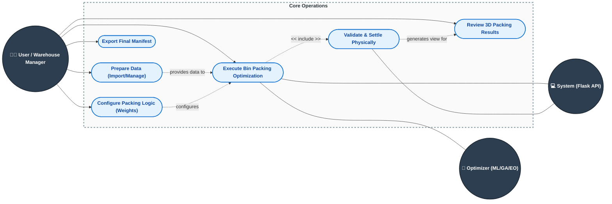

# Bin Packing Optimization System - Core Use Cases

This document outlines the core system use cases and interactions for the Bin Packing Optimization System, focusing on the high-level flow of the application.

## Use Case Diagram

## Actor Descriptions

1. **User / Warehouse Manager**: Responsible for supplying warehouse and item data, starting optimization jobs, and reviewing final packing plans.
2. **System (Flask API)**: Acts as the middleman to handle the HTTP requests, interact with the sqlite database, coordinate the optimization threads, and apply physical simulations.
3. **Optimizer (ML/GA/EO)**: The computational engine responsible for calculating the multi-objective fitness metrics and exploring spatial layouts for maximum efficiency.

## Core System Operations

* **Prepare Data (Import/Manage)**: The user manages the layout of the warehouse and populates the items to pack, taking advantage of automated CSV importing or generation capabilities provided by the backend.
* **Configure Packing Logic**: Setting the parameters (e.g. generations or iterations limits) and deciding the fitness weights favoring space, accessibility, or stability prior to running the model.
* **Execute Bin Packing Optimization**: The core process where the system bridges the active warehouse configuration to the Optimizer thread, running models over many generations to discover the best subset of geometric item coordinates.
* **Validate & Settle Physically**: Ensures the selected solution passes the Pybullet gravity rules, removing clipping conflicts and securing items based on physics rules before locking the layout into the database.
* **Review 3D Packing Results**: The system outputs a visual mapping utilizing `three.js`, giving the user a 3D perspective on their finalized packing plan.
* **Export Final Manifest**: After validation and review, the user can download a serialized CSV sequence directing physical warehouse workers exactly where to place each parcel for maximum calculated efficiency.
