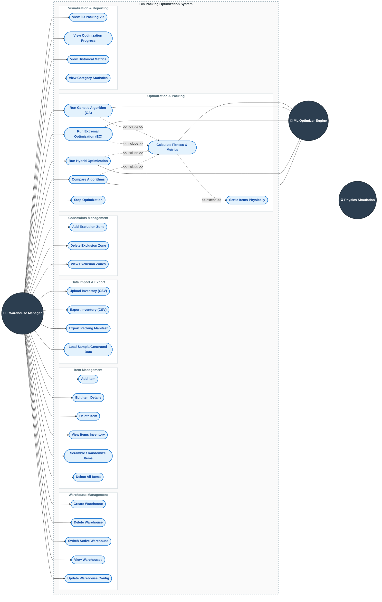

# Bin Packing Optimization System - Use Case Diagram

This document contains a detailed use case diagram and descriptions for the Bin Packing Optimization System.

## Use Case Diagram

## Actor Descriptions

1. **Warehouse Manager / User**: The primary human actor interacting with the web application to manage warehouse dimensions, upload items, configure optimization weights, and trigger bin packing optimizations.
2. **ML Optimizer Engine**: The internal backend system utilizing machine learning models and optimization heuristical algorithms (Genetic Algorithm, Extremal Optimization, Hybrid) to process data and yield the best packing spatial configurations.
3. **Physics Simulation Engine**: The physical integration (PyBullet) that ensures items are mathematically settled and do not clip into each other or float in space, ensuring realistic packing logic.

## Use Case Descriptions

### Warehouse Management
* **Create Warehouse**: Allows users to define a new warehouse layout, specifying dimensions (length, width, height) and access areas (doors).
* **View Warehouses**: View the list of all available warehouse definitions in the system.
* **Switch Active Warehouse**: Switch the current contextual workspace to a different warehouse to manage its items and run specific visualizations.
* **Update Warehouse Configuration**: Adjust spatial logic of an existing warehouse, such as dimensions, layers, or door positioning.
* **Delete Warehouse**: Remove an obsolete warehouse layout from the system along with its associated items.

### Item Management
* **Add Item**: Add a specific parcel or box into the current warehouse inventory by specifying spatial dimensions, weight, fragility, and priority.
* **Edit Item Details**: Modify properties of an existing item inside the warehouse.
* **Delete Item**: Remove a specific item from the inventory.
* **View Items Inventory**: Review the list of all configured items meant for packing in the active warehouse.
* **Scramble / Randomize Items**: Automatically generate random item dimensions and placements inside the warehouse for testing the optimizer's capability.
* **Delete All Items**: Quickly clear the entire data repository of items within the active warehouse instance.

### Data Import & Export
* **Upload Inventory (CSV)**: Import bulk item definitions from an external `.csv` file into the warehouse.
* **Export Inventory (CSV)**: Export the current list of items in the warehouse along with their current (or unoptimized) coordinate geometries to a `.csv` file.
* **Export Packing Manifest**: Generate a finalized, logically sequenced manifest of all packed items with their resultant X, Y, Z locations and rotations after a successful optimization operation.
* **Load Sample/Generated Data**: Seed the warehouse with default or randomly generated datasets for immediate trial and demonstration purposes.

### Constraints Management
* **Add Exclusion Zone**: Define 3D areas within the warehouse (such as pillars, walkways, or blocked sectors) where items cannot be placed.
* **Delete Exclusion Zone**: Remove a previously defined exclusion zone.
* **View Exclusion Zones**: Render and review current restricted geometries inside the active warehouse.

### Optimization & Packing
* **Run Genetic Algorithm (GA) Optimization**: Invoke the evolution-based ML optimizer with specific generation limits to find a viable spatial packing solution.
* **Run Extremal Optimization (EO)**: Invoke the local-search heuristic optimizer to settle packing solutions dynamically based on item fitness levels.
* **Run Hybrid Optimization**: Invoke sequential executions of ML GA and EO to compensate for respective algorithm weaknesses and achieve complex packing efficiency.
* **Compare Optimization Algorithms**: Trigger a benchmarking process to evaluate all available optimization methods sequentially and compare their resultant metrics.
* **Stop Optimization**: Send a halt signal to interrupt the currently running optimization thread.
* **Calculate Fitness & Metrics**: Evaluate candidate packing solutions against multi-objective properties including space utilization, stability, accessibility, and grouping logic.
* **Settle Items Physically (PyBullet)**: Attempt to process final coordinate positions against a gravitational physics engine to eliminate logical floating or clipping.

### Visualization & Reporting
* **View 3D Packing Visualization**: Interact with a WebGL/Three.js rendering of the active warehouse and its current item packing solution state.
* **View Optimization Progress**: Monitor the timeline, current generation/iteration count, and real-time fitness scores of an active optimization cycle.
* **View Historical Metrics & Solutions**: Retrieve insights down historical iterations of optimizations to track parameter tweaks and resulting efficiency trends over time.
* **View Category Statistics**: Analyze distributions of item properties natively per grouping schemas (e.g. quantity by category, total weight distribution).
