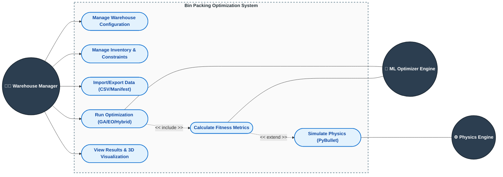

# Bin Packing Optimization System - Use Case Diagram

This document contains a simplified use case diagram and descriptions for the Bin Packing Optimization System.

## Use Case Diagram

## Actor Descriptions

1. **Warehouse Manager / User**: The primary user who manages layouts, imports items, configures optimization, and views results.
2. **ML Optimizer Engine**: The backend module that uses algorithmic models (GA, EO, Hybrid) to calculate spatial packing arrangements.
3. **Physics Engine**: The physical simulation (PyBullet) that mathematically settles the placed objects.

## Use Case Descriptions

* **Manage Warehouse Configuration**: Allows users to create, view, switch, and update the geometric constraints and layouts of warehouses.
* **Manage Inventory & Constraints**: Allows users to add, edit, or delete items within a warehouse, and define physical exclusion zones where items cannot be packed.
* **Import/Export Data**: Facilitates the bulk uploading of `.csv` inventories, loading of sample data, and the export of completed packing manifests.
* **Run Optimization**: Triggers the machine learning heuristic algorithms (Genetic Algorithm, Extremal Optimization, or Hybrid models) to generate packing solutions.
* **Calculate Fitness Metrics**: Evaluates a packing solution according to its space utilization, grouping, accessibility, and stability attributes. Included as part of the optimization process.
* **Simulate Physics (PyBullet)**: An optional extension of the fitness calculation that resolves clipping and settles items gravitationally.
* **View Results & 3D Visualization**: Provides the user with an interactive 3D WebGL rendering of the packing configuration alongside performance analytics.
